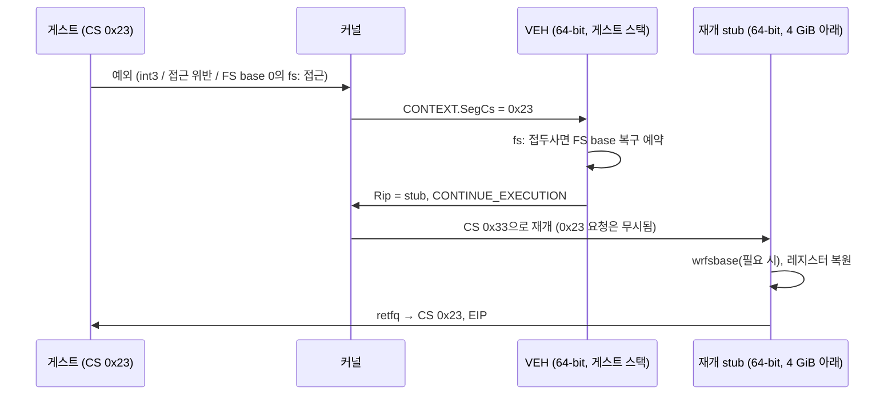

# Windows x64 프로세스 안의 compatibility mode / Compatibility mode inside a Windows x64 process

일반 64비트 Windows 프로세스(WOW64 아님)가 CS `0x23`으로 32비트 코드를 직접 실행할 때의 동작을 정리한다. 모든 항목은 작업 452 probe(`src/platform/windows/x64/native_compat_mode_probe.cpp`)를 Windows 11 25H2(빌드 26200), Intel Core Ultra 5 225H에서 실행해 얻었다. 다른 Windows 빌드나 CPU에서는 확인하지 않았다. Linux와의 비교는 [Linux x86-64 compatibility mode](linux-x86-64-compatibility-mode.md)를 본다.

*This records how a plain 64-bit Windows process (not WOW64) behaves when it runs 32-bit code directly in CS `0x23`. Everything here comes from running the task 452 probe (`src/platform/windows/x64/native_compat_mode_probe.cpp`) on Windows 11 25H2 (build 26200) with an Intel Core Ultra 5 225H; other Windows builds and CPUs were not checked. For the Linux side see [Linux x86-64 compatibility mode](linux-x86-64-compatibility-mode.md).*

## 1. 전환 / Transitions — 확인됨 / confirmed

- 64→32: 게스트 스택(4 GiB 아래)으로 바꾼 뒤 `push 0x23; push eip; retfq`. 32→64: `jmp far 0x33:landing`(`EA`), 착지점은 4 GiB 아래. Linux와 같다.
- 64비트 사용자 모드의 selector는 CS `0x33`, DS/ES/SS `0x2B`, FS `0x53`이다. 호환 모드로 들어가도 FS selector는 `0x53` 그대로다.
- 하드웨어 shadow stack이 켜진 프로세스에서의 far return은 확인하지 않았다. probe는 `/CETCOMPAT:NO`로 링크했다(**미확정**).

*64→32: switch to the guest stack (below 4 GiB), then `push 0x23; push eip; retfq`; 32→64: `jmp far 0x33:landing` (`EA`) with the landing below 4 GiB, as on Linux. 64-bit user mode uses CS `0x33`, DS/ES/SS `0x2B` and FS `0x53`, and FS stays `0x53` in compatibility mode. Far returns under hardware shadow stacks were not checked; the probe links with `/CETCOMPAT:NO` (**unresolved**).*

## 2. FS와 TEB / FS and the TEB

| 관찰 / Observation | 상태 / Status |
| --- | --- |
| 일반 x64 프로세스의 FS base는 0이며, selector `0x53`을 다시 적재해도 0이다(WOW64 프로세스와 달리 32비트 TEB가 없음) | 확인됨 / confirmed |
| 그래서 호환 모드의 `fs:[0x18]`·`fs:[0]`은 주소 0x18·0에 접근해 접근 위반이 난다 | 확인됨 / confirmed |
| 사용자 모드 `rdfsbase`/`wrfsbase`가 허용된다(CPUID.7.EBX[0] = 1, `#UD` 없음) | 확인됨 / confirmed |
| `wrfsbase`로 쓴 값은 호환 모드에서 FS base로 쓰인다 | 확인됨 / confirmed |
| 그 값은 **문맥 전환 때 0으로 돌아간다**. `Sleep(25)` 뒤 20/20회 사라졌고, 시스템 호출 없이 부하 속에서 돌기만 해도 3초에 수백~천여 회, 첫 손실은 1 ms 이내였다 | 확인됨 / confirmed |
| 예외 왕복(`int3`, 접근 위반 → VEH → 재개)만으로는 사라지지 않았다 | 확인됨 / confirmed(관찰 2회) |
| LDT를 만드는 사용자 모드 API는 x64에 없다 | 추정 / inferred(probe에서 시도하지 않음) |

*A plain x64 process has FS base 0, still 0 after reloading selector `0x53` (no 32-bit TEB, unlike WOW64), so compatibility-mode `fs:[0x18]` and `fs:[0]` touch addresses 0x18 and 0 and fault. User-mode `rdfsbase`/`wrfsbase` are allowed (CPUID.7.EBX[0] = 1, no `#UD`), and a `wrfsbase` value serves as the FS base in compatibility mode, but it **returns to 0 on a context switch**: lost after `Sleep(25)` 20 of 20 times, and hundreds to over a thousand times in 3 seconds of plain spinning under load, the first loss within 1 ms. An exception round trip alone (`int3` or an access violation through the VEH and back) did not lose it, in two observations. No user-mode LDT API is known on x64 (inferred, not tried).*

**지연 복구 / Lazy repair — 확인됨 / confirmed:** FS base가 0으로 돌아가면 게스트의 다음 `fs:` 접근은 언제나 첫 64 KiB(Windows가 매핑하지 않는 영역)에서 접근 위반을 낸다. VEH가 그 명령에 FS 접두사(`0x64`)가 있는지 보고, 있으면 TEB를 다시 쓰고 같은 명령을 재시도한다. probe의 30억 회 읽기에서 잘못된 값은 0회였고, 복구는 초당 약 57~108회였다(28개 부하 스레드). 일반 null 역참조도 같은 영역에서 나므로 접두사 확인이 반드시 필요하다.

*Once the FS base is back to 0, the guest's next `fs:` access always faults in the first 64 KiB, which Windows never maps; the VEH checks the instruction for an FS prefix (`0x64`) and, if present, writes the TEB again and retries it. Across the probe's 3 billion reads no wrong value was seen, with about 57 to 108 repairs a second under 28 load threads. A plain null dereference faults in the same region, so the prefix check is essential.*

## 3. 예외 / Exceptions

- 호환 모드에서 난 예외는 64비트 VEH로 전달되고, `CONTEXT.SegCs`는 `0x23`, Rip·Rsp는 32비트 값이다. `int3`는 `EXCEPTION_BREAKPOINT`가 아니라 `STATUS_WX86_BREAKPOINT`(`0x4000001F`)로 오며, Rip은 `int3` 자신을 가리킨다. **확인됨.**
- VEH는 게스트 스택(4 GiB 아래)에서 돈다. 64비트 TEB의 스택 한계 밖이어도 전달 자체는 된다. 하지만 그 스택에서 프레임 검사(`__chkstk`)를 하는 host 코드(예: `printf`)는 TEB의 `StackLimit`부터 아래로 페이지를 건드리다 죽는 것으로 보인다. 게스트가 도는 동안 `NT_TIB.StackBase/StackLimit`를 게스트 스택으로 바꿔 두면 문제가 없었다. 전달은 **확인됨**, `__chkstk` 원인은 **추정**.
- `CONTEXT.SegCs = 0x23`인 채로 `EXCEPTION_CONTINUE_EXECUTION`을 돌려주면 커널은 **CS `0x33`(64비트)으로 재개**한다. 그래서 32비트 바이트가 64비트 코드로 실행되어 다시 죽는다. **확인됨.**
- 우회: VEH가 32비트 레지스터·EIP·ESP를 메모리에 두고, Rip을 4 GiB 아래의 64비트 stub으로 바꾼다. stub은 레지스터를 채운 뒤 `retfq`로 CS `0x23`에 들어간다. `int3`와 접근 위반 모두 이 방식으로 재개됐다. **확인됨.** EFLAGS(특히 TF single-step)까지 되돌리려면 `retfq` 대신 `iretq`가 필요할 것이다. **추정.**

*An exception raised in compatibility mode reaches the 64-bit VEH with `CONTEXT.SegCs` `0x23` and 32-bit Rip and Rsp; `int3` arrives as `STATUS_WX86_BREAKPOINT` (`0x4000001F`), not `EXCEPTION_BREAKPOINT`, with Rip on the `int3` itself (**confirmed**). The VEH runs on the guest stack below 4 GiB; dispatch works even outside the 64-bit TEB's stack limits, but host code there that probes its frame (`__chkstk`, as `printf` does) appears to die walking pages down from the TEB's `StackLimit`, and setting `NT_TIB.StackBase/StackLimit` to the guest stack while the guest runs avoided it (dispatch **confirmed**, the `__chkstk` cause **inferred**). Returning `EXCEPTION_CONTINUE_EXECUTION` with `CONTEXT.SegCs = 0x23` makes the kernel **resume in CS `0x33`** (64-bit), so the 32-bit bytes run as 64-bit code and crash again (**confirmed**). The workaround: the VEH stores the 32-bit registers, EIP and ESP in memory and points Rip at a 64-bit stub below 4 GiB, which loads the registers and enters CS `0x23` with `retfq`; both `int3` and an access violation resumed this way (**confirmed**). Restoring EFLAGS too, TF single-stepping in particular, would take `iretq` instead of `retfq` (**inferred**).*

## 4. Linux와의 차이 / Differences from Linux

| | Linux x86-64 | Windows x64 |
| --- | --- | --- |
| 게스트 FS | LDT descriptor(`modify_ldt`), 문맥 전환에도 유지 | `wrfsbase`, 문맥 전환 때 0으로 돌아가므로 VEH 지연 복구 필요 |
| 예외 전달 | signal, 64비트 rt frame | VEH, `SegCs = 0x23` |
| 게스트로 재개 | `rt_sigreturn`이 CS `0x23` 복원 | 커널이 CS `0x33`으로 바꿈, 64비트 stub이 필요 |
| host 측 주의 | 게스트 FS 동안 glibc TLS 불가 | 64비트 Windows 코드는 FS를 쓰지 않음(GS가 TEB). 대신 VEH가 게스트 스택에서 돌므로 TEB 스택 한계를 바꿔 둠 |

*Guest FS: an LDT descriptor (`modify_ldt`) surviving context switches on Linux, versus `wrfsbase` reset to 0 on a context switch and repaired lazily by the VEH on Windows. Exception delivery: a signal with a 64-bit rt frame, versus the VEH with `SegCs = 0x23`. Resuming the guest: `rt_sigreturn` restores CS `0x23`, versus the kernel switching to CS `0x33` and a 64-bit stub being needed. Host-side care: no glibc TLS while the guest FS is loaded on Linux; on Windows 64-bit code does not use FS (GS holds the TEB), but the VEH runs on the guest stack, so the TEB's stack limits are swapped.*

출처 / Sources: [Intel SDM](https://www.intel.com/content/www/us/en/developer/articles/technical/intel-sdm.html)(Vol. 1 §3.4.1.1, Vol. 2 RDFSBASE/WRFSBASE·IRET, Vol. 3A §5.8), [_readfsbase_u64 등 MSVC intrinsic](https://learn.microsoft.com/cpp/intrinsics/readfsbase-readgsbase-writefsbase-writegsbase), [AddVectoredExceptionHandler](https://learn.microsoft.com/windows/win32/api/errhandlingapi/nf-errhandlingapi-addvectoredexceptionhandler), [NT_TIB / TEB](https://learn.microsoft.com/windows/win32/api/winternl/ns-winternl-teb), [WOW64 implementation details](https://learn.microsoft.com/windows/win32/winprog64/wow64-implementation-details), [/CETCOMPAT](https://learn.microsoft.com/cpp/build/reference/cetcompat).
