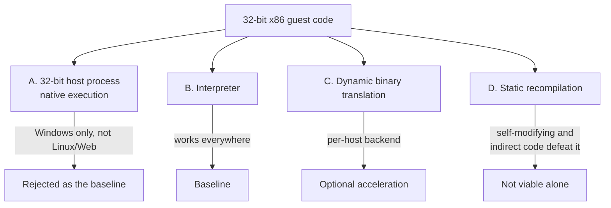

# 64비트·Web 호스트에서 32비트 게스트 실행 / Running a 32-bit Guest on 64-bit and Web Hosts

이 문서는 32비트 x86 게스트 코드를 64비트 Windows, Linux x86-64, WebAssembly에서 실행하는 선택지와 그 제약을 정리한다. re2DJ의 실행 backend 설계 근거다.

*This document records the options and constraints for running 32-bit x86 guest code on 64-bit Windows, Linux x86-64, and WebAssembly. It is the reasoning behind the re2DJ execution backend design.*

---

## 1. 문제의 형태 / Shape of the problem

rePIU는 32비트 Win32 프로세스 안에서 게스트 코드를 **호스트 CPU가 그대로 실행**하고, 환경 경계만 예외로 가로챈다. 그 방법이 성립하는 이유는 호스트 프로세스와 게스트가 같은 32비트 x86 실행 모드에 있기 때문이다.

re2DJ의 목표 호스트에는 그 조건이 없다.

*rePIU lets the **host CPU execute guest code directly** inside a 32-bit Win32 process and intercepts only the environment boundary with exceptions. That works because host process and guest share one 32-bit x86 execution mode. None of the re2DJ target hosts meet that condition.*

| 호스트 | 게스트와 같은 실행 모드인가 | 결론 |
| --- | --- | --- |
| 64-bit Windows (x64 프로세스) | 아니오 — long mode | 직접 실행 불가 |
| Linux x86-64 (64비트 프로세스) | 아니오 — long mode | 직접 실행 불가 |
| Web (WebAssembly) | 아니오 — 명령어 집합 자체가 다름 | 직접 실행 불가 |

x86-64는 32비트 코드를 compatibility mode로 실행할 수 있지만, 그것은 **프로세스 전체가 32비트일 때** 이야기다. 64비트 프로세스 안에서 임의로 32비트 코드로 넘어가는 것은 운영체제 지원 없이는 성립하지 않으며, 지원하더라도 이식 가능한 방법이 아니다.

*x86-64 can run 32-bit code in compatibility mode, but only when **the whole process is 32-bit**. Switching into 32-bit code from inside a 64-bit process is not viable without operating-system support, and even where such support exists it is not portable.*

---

## 2. 선택지 / Options

### A. 32비트 호스트 프로세스

가장 빠르지만 Linux와 Web 목표를 포기하게 된다. 프로젝트 목표가 세 호스트이므로 기준 경로가 될 수 없다. Windows 전용 가속 경로로는 나중에 검토할 수 있다.

*Fastest, but it abandons the Linux and Web goals, so it cannot be the baseline. It remains available later as a Windows-only acceleration path.*

### B. 인터프리터 — 기준 경로

명령어를 하나씩 디코드해 실행한다. 느리지만 세 호스트 어디에서나 같은 코드가 같은 결과를 낸다. 정확성 기준선 역할을 하므로 가속 backend가 생겨도 유지한다.

*Decodes and executes one instruction at a time. Slow, but the same code produces the same result on all three hosts. It stays as the correctness baseline even after accelerated backends exist.*

### C. 동적 이진 변환(DBT)

기본 블록 단위로 호스트 코드나 WebAssembly로 번역해 캐시한다. 인터프리터보다 훨씬 빠르지만 호스트마다 backend가 필요하고, 자기 수정 코드와 간접 분기 처리가 어렵다. 인터프리터가 먼저 정확하게 동작한 뒤에 붙인다.

*Translates basic blocks to host code or WebAssembly and caches them. Much faster than an interpreter but needs a backend per host, and self-modifying code and indirect branches are hard. It lands only after the interpreter is correct.*

### D. 정적 재컴파일

실행 전에 전체를 번역한다. 간접 분기 대상과 자기 수정 코드를 정적으로 알 수 없으므로 단독으로는 성립하지 않는다.

*Translates everything ahead of time. Indirect branch targets and self-modifying code cannot be known statically, so it does not stand on its own.*

---

## 3. 결론 / Conclusion

**인터프리터를 기준 backend로 두고, 호스트별 DBT를 같은 `ExecutionBackend` 인터페이스 뒤에 선택적으로 추가한다.**

이 결정은 rePIU와 re2DJ가 실행 구조에서 갈라지는 지점이다. 규칙과 문서 체계는 그대로 이어받되, 실행 계층은 처음부터 다르게 설계했다.

*The interpreter is the baseline backend, with per-host DBT added optionally behind the same `ExecutionBackend` interface. This is where re2DJ's execution structure diverges from rePIU's, even though the rules and documentation system carry over unchanged.*

---

## 4. 게스트 메모리 표현 / Representing guest memory

게스트 주소를 호스트 포인터로 노출하면 세 가지가 무너진다.

1. 64비트 호스트에서 32비트 주소를 포인터로 다루면 폭이 맞지 않는다.
2. 게스트 주소 산술이 호스트 주소 공간을 벗어나 침범할 수 있다.
3. WebAssembly의 선형 메모리 모델과 맞지 않는다.

따라서 게스트 주소는 `GuestAddress`(32비트 값 타입)로 다루고, 접근은 `Read8/16/32`, `Write8/16/32` 접근자만 사용한다. 이 규칙은 `docs/CODING_STYLE.md`의 이식성 규칙에 명시되어 있다.

*Exposing guest addresses as host pointers breaks three things: the widths do not match on a 64-bit host, guest address arithmetic could reach into the host address space, and it does not fit WebAssembly's linear memory model. Guest addresses are therefore a 32-bit `GuestAddress` value type accessed only through `Read8/16/32` and `Write8/16/32`, as stated in the portability rules of `docs/CODING_STYLE.md`.*

출처 / Sources:

* [Intel 64 and IA-32 Architectures Software Developer's Manuals](https://www.intel.com/content/www/us/en/developer/articles/technical/intel-sdm.html)
* [WebAssembly Specification — Memory](https://webassembly.github.io/spec/core/syntax/modules.html#memories)
