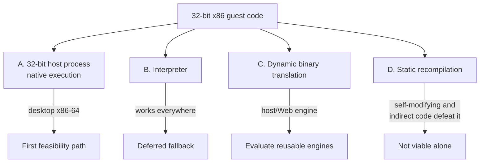

# 64비트·Web 호스트에서 32비트 게스트 실행 / Running a 32-bit Guest on 64-bit and Web Hosts

이 문서는 32비트 x86 게스트 코드를 64비트 Windows, Linux x86-64, WebAssembly에서 실행하는 선택지와 그 제약을 정리한다. re2DJ의 실행 backend 설계 근거다.

*This document records the options and constraints for running 32-bit x86 guest code on 64-bit Windows, Linux x86-64, and WebAssembly. It is the reasoning behind the re2DJ execution backend design.*

---

## 1. 문제의 형태 / Shape of the problem

rePIU는 32비트 Win32 프로세스 안에서 게스트 코드를 **호스트 CPU가 그대로 실행**하고, 환경 경계만 예외로 가로챈다. 그 방법이 성립하는 이유는 호스트 프로세스와 게스트가 같은 32비트 x86 실행 모드에 있기 때문이다.

re2DJ의 64비트 host process에는 그 조건이 없지만, x86-64 데스크톱 운영체제는 별도 32비트 프로세스를 제공할 수 있다. WebAssembly에는 그 경로가 없다.

*rePIU lets the **host CPU execute guest code directly** inside a 32-bit Win32 process and intercepts only the environment boundary with exceptions. A 64-bit re2DJ host process does not share that mode, but an x86-64 desktop operating system can provide a separate 32-bit process. WebAssembly cannot.*

| 호스트 | 게스트와 같은 실행 모드인가 | 결론 |
| --- | --- | --- |
| 64-bit Windows (x64 host) | 별도 x86 process는 가능 | WOW64/native helper 검증됨 |
| Linux x86-64 (64비트 host) | 별도 x86 process는 가능 | i386 native helper gate 검증됨 |
| Web (WebAssembly) | 아니오 — 명령어 집합 자체가 다름 | 직접 실행 불가 |

x86-64는 32비트 코드를 compatibility mode로 실행할 수 있지만, 그것은 **프로세스 전체가 32비트일 때** 이야기다. 64비트 프로세스 안에서 임의로 32비트 코드로 넘어가는 것은 운영체제 지원 없이는 성립하지 않으며, 지원하더라도 이식 가능한 방법이 아니다.

*x86-64 can run 32-bit code in compatibility mode, but only when **the whole process is 32-bit**. Switching into 32-bit code from inside a 64-bit process is not viable without operating-system support, and even where such support exists it is not portable.*

---

## 2. 선택지 / Options

### A. 32비트 호스트 프로세스

Windows x64의 WOW64와 Linux x86-64의 32비트 실행 환경을 이용하는 별도 helper 프로세스다. 두 host 모두 별도 x86 helper의 실제 gate 호출과 32/64비트 IPC가 검증되었다. Web에서는 사용할 수 없으며, Linux의 PE32 mapping과 두 desktop backend의 멀티스레드 제어는 별도로 확장해야 한다.

*A separate helper process can use WOW64 on Windows x64 or a 32-bit execution environment on Linux x86-64. Both hosts now have verified real x86 helper gate calls and 32/64-bit IPC. This cannot serve Web; Linux PE32 mapping and multithreaded control for both desktop backends still require separate expansion.*

### B. 인터프리터 — 후순위 fallback

명령어를 하나씩 디코드해 실행하므로 세 호스트에서 공통으로 사용할 수 있지만 구현 범위가 크다. Web을 지원할 적합한 재사용 엔진이 없을 때 직접 구현하는 fallback으로 미룬다.

*Decodes and executes one instruction at a time and can be shared across all three hosts, but its implementation scope is large. A custom interpreter is deferred as the fallback when no suitable reusable Web-capable engine exists.*

### C. 동적 이진 변환(DBT)

기본 블록 단위로 호스트 코드나 WebAssembly로 번역해 캐시한다. 직접 구현과 검증 비용이 크므로 허용 라이선스의 재사용 가능한 엔진이 있는지 먼저 조사한다. 자기 수정 코드와 간접 분기 지원은 필수 평가 항목이다.

*Translates basic blocks to host code or WebAssembly and caches them. Because implementing and validating it is expensive, reusable engines with permitted licenses are evaluated first. Self-modifying code and indirect-branch support are mandatory evaluation criteria.*

### D. 정적 재컴파일

실행 전에 전체를 번역한다. 간접 분기 대상과 자기 수정 코드를 정적으로 알 수 없으므로 단독으로는 성립하지 않는다.

*Translates everything ahead of time. Indirect branch targets and self-modifying code cannot be known statically, so it does not stand on its own.*

---

## 3. 결론 / Conclusion

**먼저 `ExecutionBackend` 경계를 고정하고 데스크톱 네이티브 helper를 검증한다. Web은 허용 라이선스의 재사용 실행 엔진을 우선 조사하며, 직접 인터프리터는 적합한 엔진이 없을 때 구현한다.**

Wine과 Proton은 동작 비교 기준으로 사용할 수 있지만 실행 경로의 소스나 필수 외부 환경으로 통합하지 않는다. backend가 달라도 원본 x86 코드가 게임 로직의 실행 주체라는 원칙은 유지한다.

*Fix the `ExecutionBackend` boundary first and validate a desktop native helper. For Web, evaluate reusable execution engines with permitted licenses before writing a custom interpreter; implement one only if no suitable engine exists. Wine and Proton may be behavioral references but are not integrated as source or required runtime environments. Original x86 code remains the executing game logic across backends.*

---

## 4. 게스트 메모리 표현 / Representing guest memory

게스트 주소를 호스트 포인터로 노출하면 세 가지가 무너진다.

1. 64비트 호스트에서 32비트 주소를 포인터로 다루면 폭이 맞지 않는다.
2. 게스트 주소 산술이 호스트 주소 공간을 벗어나 침범할 수 있다.
3. WebAssembly의 선형 메모리 모델과 맞지 않는다.

따라서 게스트 주소는 `GuestAddress`(32비트 값 타입)로 다루고, 접근은 `Read8/16/32`, `Write8/16/32` 접근자만 사용한다. 이 규칙은 `docs/CODING_STYLE.md`의 이식성 규칙에 명시되어 있다.

*Exposing guest addresses as host pointers breaks three things: the widths do not match on a 64-bit host, guest address arithmetic could reach into the host address space, and it does not fit WebAssembly's linear memory model. Guest addresses are therefore a 32-bit `GuestAddress` value type accessed only through `Read8/16/32` and `Write8/16/32`, as stated in the portability rules of `docs/CODING_STYLE.md`.*

출처 / Sources:

* [Intel 64 and IA-32 Architectures Software Developer's Manuals](https://www.intel.com/content/www/us/en/developer/articles/technical/intel-sdm.html)
* [WebAssembly Specification — Memory](https://webassembly.github.io/spec/core/syntax/modules.html#memories)
* [Microsoft WOW64 Implementation Details](https://learn.microsoft.com/windows/win32/winprog64/wow64-implementation-details)
* [WineHQ: About Wine](https://www.winehq.org/about/)
* [Valve Proton repository](https://github.com/ValveSoftware/Proton)
