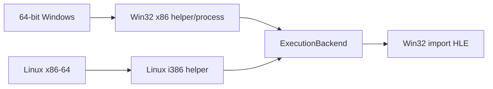

# 64비트 호스트에서 32비트 게스트 실행 / Running a 32-bit Guest on 64-bit Hosts

이 문서는 32비트 x86 게스트 코드를 64비트 Windows와 Linux x86-64에서 실행하는 선택지와 제약을 정리한다. WebAssembly 실행은 현재 프로젝트 지원 범위에서 제거했으므로 이 문서의 실행 전략에도 포함하지 않는다.

*This document records the options and constraints for running 32-bit x86 guest code on 64-bit Windows and Linux x86-64. WebAssembly execution was removed from the active project scope and is therefore not part of this execution strategy.*

## 1. 실행 모드 / Execution modes

rePIU는 32비트 Win32 프로세스 안에서 게스트 코드를 **호스트 CPU가 그대로 실행**하고, 환경 경계만 예외로 가로챈다. re2DJ의 64비트 host process에는 같은 실행 모드가 없지만, 두 데스크톱 운영체제는 별도 32비트 프로세스를 제공한다.

*rePIU lets the **host CPU execute guest code directly** inside a 32-bit Win32 process and intercepts only the environment boundary. A 64-bit re2DJ host process does not share that mode, but both desktop operating systems can provide a separate 32-bit process.*

| 호스트 | 게스트와 같은 실행 모드인가 | 결론 |
| --- | --- | --- |
| 64-bit Windows | 별도 x86 process는 가능 | WOW64/native helper 경로 검증됨 |
| Linux x86-64 | 별도 i386 process는 가능 | i386 native helper 경로 검증됨 |

64비트 프로세스 안에서 임의로 32비트 코드를 실행하는 것은 운영체제 지원 없이는 성립하지 않는다. 따라서 x86-64 host와 i386 helper를 `ExecutionBackend`와 IPC 경계로 분리한다.

*Running arbitrary 32-bit code inside a 64-bit process is not portable without operating-system support. The design therefore separates the x86-64 host and i386 helper behind `ExecutionBackend` and an IPC boundary.*

```mermaid
flowchart LR
    W["64-bit Windows"] --> H["Win32 x86 helper/process"]
    L["Linux x86-64"] --> I["Linux i386 helper"]
    H --> B["ExecutionBackend"]
    I --> B
    B --> G["Win32 import HLE"]
```

## 2. 후보와 선택 / Options and selection

### A. 32비트 호스트 프로세스 / 32-bit host process

Windows x64의 WOW64와 Linux x86-64의 32비트 실행 환경을 이용하는 별도 helper 프로세스다. 두 host 모두 실제 x86 gate 호출과 32/64비트 IPC가 검증되었다. 이 경로가 원본 x86 코드의 직접 실행을 보존하면서 host 서비스만 교체하는 현재 우선 경로다.

*This uses a separate helper process under WOW64 on Windows x64 or a 32-bit execution environment on Linux x86-64. Both hosts have verified real x86 gate calls and 32/64-bit IPC. It is the current first path because it preserves direct execution of original x86 code while replacing only host services.*

### B. 인터프리터와 동적 이진 변환 / Interpreter and DBT

명령어를 해석하거나 기본 블록을 host code로 번역하는 방식은 별도 CPU 실행 계층을 만든다. 구현·검증 범위가 크고 현재 desktop native helper 목표를 충족하는 데 필요하지 않으므로 현재 제품 범위에서 제외한다.

*Instruction interpretation and dynamic binary translation would create a separate CPU execution layer. Their implementation and validation scope is large and they are not required for the current desktop native-helper target, so they are outside the product scope.*

## 3. 결론 / Conclusion

**`ExecutionBackend` 경계를 고정하고 Windows/Linux 데스크톱 native helper를 확장한다.** 원본 x86 코드는 두 host의 실행 주체로 유지하며, 공용 HLE는 import thunk와 IPC 경계 뒤에 둔다.

***Fix the `ExecutionBackend` boundary and extend the Windows/Linux desktop native-helper paths.*** Original x86 code remains the executing subject on both hosts, while shared HLE stays behind import-thunk and IPC boundaries.

## 4. 게스트 주소 규칙 / Guest address rule

게스트 주소를 host pointer로 노출하면 64비트 host에서 폭이 맞지 않고, 게스트 주소 산술이 host 주소 공간을 침범할 수 있다. 따라서 게스트 주소는 `GuestAddress`(32비트 값 타입)로 다루고 `Read8/16/32`, `Write8/16/32` 접근자만 사용한다.

*Exposing guest addresses as host pointers gives the wrong width on a 64-bit host and can let guest arithmetic reach into host address space. Guest addresses are therefore a 32-bit `GuestAddress` value type accessed only through `Read8/16/32` and `Write8/16/32`.*

출처 / Sources:

* [Intel 64 and IA-32 Architectures Software Developer's Manuals](https://www.intel.com/content/www/us/en/developer/articles/technical/intel-sdm.html)
* [Microsoft WOW64 Implementation Details](https://learn.microsoft.com/windows/win32/winprog64/wow64-implementation-details)
* [WineHQ: About Wine](https://www.winehq.org/about/)
