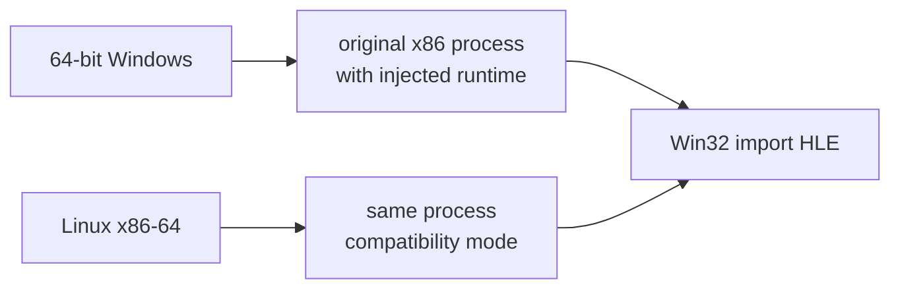

# 64비트 호스트에서 32비트 게스트 실행 / Running a 32-bit Guest on 64-bit Hosts

이 문서는 32비트 x86 게스트 코드를 64비트 Windows와 Linux x86-64에서 실행하는 선택지와 제약을 정리한다. WebAssembly 실행은 현재 프로젝트 지원 범위에서 제거했으므로 이 문서의 실행 전략에도 포함하지 않는다.

*This document records the options and constraints for running 32-bit x86 guest code on 64-bit Windows and Linux x86-64. WebAssembly execution was removed from the active project scope and is therefore not part of this execution strategy.*

## 1. 실행 모드 / Execution modes

rePIU는 32비트 Win32 프로세스 안에서 게스트 코드를 **호스트 CPU가 그대로 실행**하고, 환경 경계만 예외로 가로챈다. re2DJ의 64비트 host process에는 같은 실행 모드가 없지만, 두 데스크톱 운영체제는 별도 32비트 프로세스를 제공한다.

*rePIU lets the **host CPU execute guest code directly** inside a 32-bit Win32 process and intercepts only the environment boundary. A 64-bit re2DJ host process does not share that mode, but both desktop operating systems can provide a separate 32-bit process.*

| 호스트 | 게스트와 같은 실행 모드인가 | 결론 |
| --- | --- | --- |
| 64-bit Windows | 별도 x86 process는 가능 | 원본 PE32를 WOW64 x86 process로 실행하고 runtime을 주입함 |
| Linux x86-64 | 같은 프로세스의 compatibility mode 가능, 별도 i386 process도 가능 | 제품이 compatibility mode로 실행함(작업 353–357). i386 helper는 작업 379에서 제거 |

64비트 프로세스 안에서 32비트 코드를 실행하려면 운영체제가 32비트 code selector를 사용자 공간에 제공해야 한다. Linux x86-64는 `__USER32_CS`(`0x23`)를 제공하므로 far transition으로 같은 프로세스 안에서 실행할 수 있다([Linux x86-64 compatibility mode](linux-x86-64-compatibility-mode.md)). 2026-09-24 결정에 따라 Linux x64 제품 경로는 이 방식을 쓴다([작업 353 설계](../design/20260924-353-linux-x64-compat-mode-adapter.md)). 진단 fallback으로 남겼던 i386 helper IPC는 작업 379에서 제거했다. Windows는 원본을 WOW64 32비트 프로세스로 실행한다.

*Running 32-bit code inside a 64-bit process requires the operating system to expose a 32-bit code selector to user space. Linux x86-64 exposes `__USER32_CS` (`0x23`), so the code can run in the same process through far transitions ([Linux x86-64 compatibility mode](linux-x86-64-compatibility-mode.md)). Per the 2026-09-24 decision, the Linux x64 product path uses this approach ([Task 353 design](../design/20260924-353-linux-x64-compat-mode-adapter.md)); the i386 helper IPC kept as a diagnostic fallback was removed in Task 379. Windows runs the original as a WOW64 32-bit process.*

```mermaid
flowchart LR
    W["64-bit Windows"] --> H["original x86 process<br/>with injected runtime"]
    L["Linux x86-64"] --> I["same process<br/>compatibility mode"]
    H --> G["Win32 import HLE"]
    I --> G
```

## 2. 후보와 선택 / Options and selection

### A. 32비트 호스트 프로세스 / 32-bit host process

Windows x64의 WOW64와 Linux x86-64의 32비트 실행 환경을 이용하는 별도 helper 프로세스다. 두 host 모두 실제 x86 gate 호출과 32/64비트 IPC가 검증되었으나, Linux는 같은 프로세스 실행(C 절의 compatibility mode)으로 옮겼고 helper는 작업 379에서 제거했다.

*This uses a separate helper process under WOW64 on Windows x64 or a 32-bit execution environment on Linux x86-64. Both hosts verified real x86 gate calls and 32/64-bit IPC, but Linux moved to same-process execution (compatibility mode) and Task 379 removed the helpers.*

### B. 인터프리터와 동적 이진 변환 / Interpreter and DBT

명령어를 해석하거나 기본 블록을 host code로 번역하는 방식은 별도 CPU 실행 계층을 만든다. 구현·검증 범위가 크고 원본 x86 코드의 직접 실행 목표를 충족하는 데 필요하지 않으므로 현재 제품 범위에서 제외한다.

*Instruction interpretation and dynamic binary translation would create a separate CPU execution layer. Their implementation and validation scope is large and they are not required for the goal of executing the original x86 code directly, so they are outside the product scope.*

## 3. 결론 / Conclusion

**원본 x86 코드를 직접 실행한다. Windows는 원본을 WOW64 x86 process로 실행하고 runtime을 주입하며, Linux x64는 같은 프로세스의 compatibility mode를 쓴다.** 원본 x86 코드는 모든 host의 실행 주체로 유지하며, 공용 HLE는 import thunk 경계 뒤에 둔다.

***Execute the original x86 code directly: Windows runs the original as a WOW64 x86 process with an injected runtime, and Linux x64 uses same-process compatibility mode.*** Original x86 code remains the executing subject on every host, while shared HLE stays behind the import-thunk boundary.

## 4. 게스트 주소 규칙 / Guest address rule

게스트 주소를 host pointer로 노출하면 64비트 host에서 폭이 맞지 않고, 게스트 주소 산술이 host 주소 공간을 침범할 수 있다. 따라서 게스트 주소는 `GuestAddress`(32비트 값 타입)로 다루고 `Read8/16/32`, `Write8/16/32` 접근자만 사용한다.

*Exposing guest addresses as host pointers gives the wrong width on a 64-bit host and can let guest arithmetic reach into host address space. Guest addresses are therefore a 32-bit `GuestAddress` value type accessed only through `Read8/16/32` and `Write8/16/32`.*

출처 / Sources:

* [Intel 64 and IA-32 Architectures Software Developer's Manuals](https://www.intel.com/content/www/us/en/developer/articles/technical/intel-sdm.html)
* [Microsoft WOW64 Implementation Details](https://learn.microsoft.com/windows/win32/winprog64/wow64-implementation-details)
* [WineHQ: About Wine](https://www.winehq.org/about/)
