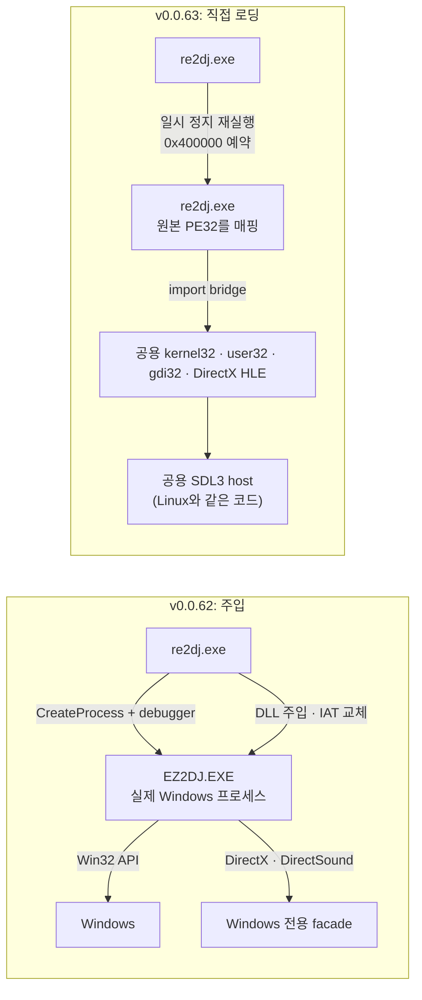
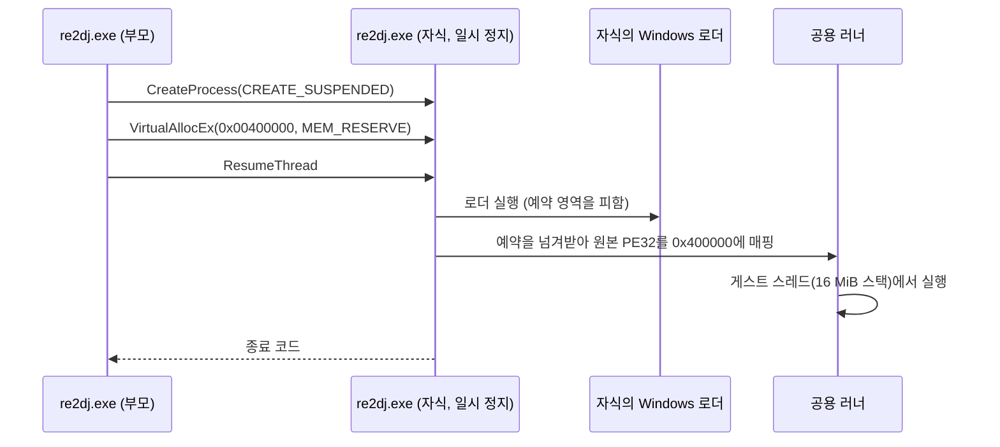
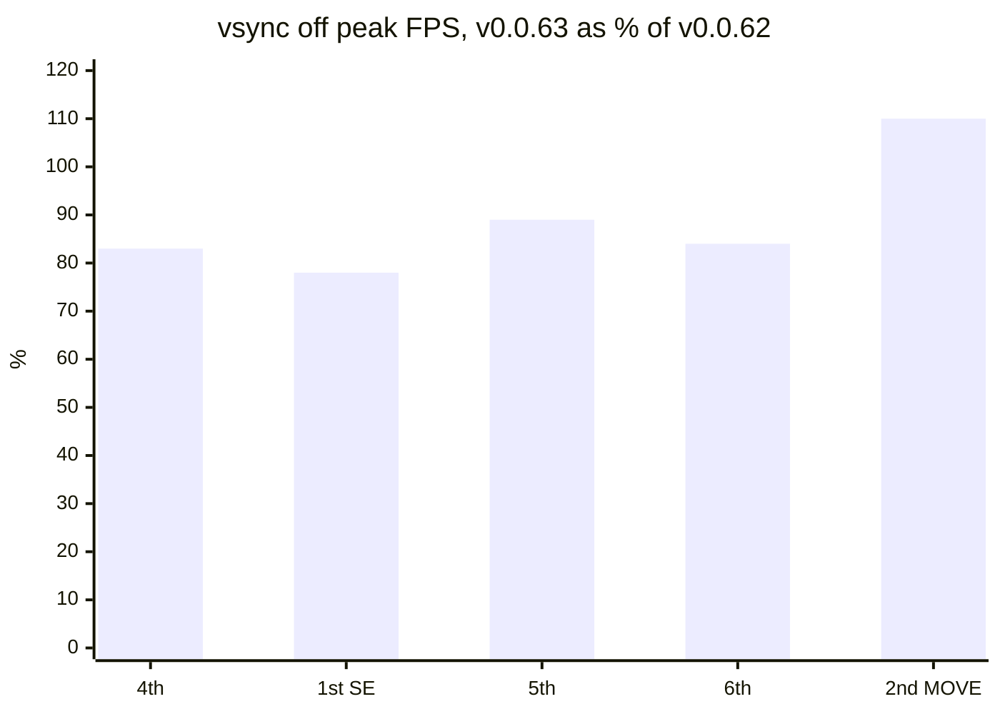

# Win32 실행을 주입에서 직접 로딩으로: 두 벌의 HLE를 하나로 (WIP)

범위: [`v0.0.62`부터 `v0.0.63`까지](https://github.com/nworkers/re2DJ/compare/v0.0.62...v0.0.63) (작업 446~453)

지금까지 re2DJ는 Windows와 Linux에서 원본 EZ2DJ 실행 파일을 서로 다른 방식으로 돌렸습니다. Windows는 원본 EXE를 **실제 Windows 프로세스**로 띄운 뒤 DLL을 주입했고, Linux는 re2dj **자기 프로세스 안에** PE32를 직접 매핑해 실행했습니다. 이번 작업은 Windows도 Linux와 같은 직접 로딩 방식으로 바꾸고 주입 경로를 지운 기록입니다. 그 결과 같은 HLE 코드 한 벌이 두 OS에서 돌고, 코드는 3만 5천 줄 줄었습니다.

## 주요 변경 사항

### 1. 왜 바꿨나 — 같은 게임을 두 벌의 HLE로

| | Windows (v0.0.62까지) | Linux |
| --- | --- | --- |
| 실행 주체 | 원본 EXE를 실제 Windows 프로세스로 | re2dj 자기 프로세스 안에 PE32를 매핑 |
| HLE 연결 | debugger로 멈춘 뒤 런타임 DLL 주입, IAT 교체 | import thunk → 공용 `ImportDispatcher` → `hle/modules` |
| 그래픽·소리 | Windows 전용 COM facade(Direct3D 3 facade만 4.5천 줄), 실제 Win32 창 | 공용 DirectX facade, SDL3 창·오디오 |
| 입력 | 런타임 DLL 안의 `GetAsyncKeyState` 폴링 | SDL 이벤트 → `HostInputState` |

Linux에서 고친 것이 Windows로 저절로 가지 않았습니다. 그 비용이 드러난 것이 작업 445입니다. 게임패드는 Linux에서 바로 동작했지만, Windows에서는 원본 프로세스 안의 SDL 포커스·스레드 문제에 막혀 원복해야 했습니다. 그래서 Windows 주입을 폐기하고 Linux 형태의 로더로 합치기로 했습니다.



### 2. 공용 러너를 OS 중립으로 꺼내기 (작업 446~447)

Linux 러너는 이미 세 층(거의 OS 중립인 층, 폭별 계약, Linux 구현)으로 나뉘어 있었습니다. 중립 층에 남은 OS 의존은 `mmap`·`mprotect`·`clock_nanosleep` 같은 몇 가지와, fault 종류를 **시그널 번호**로 비교하는 곳뿐이었습니다.

* 중립 층을 `src/platform/native/`로 옮기고, 메모리·시계·잠자기는 새 계약 `native_host_services.h` 뒤로 숨겼습니다. `grep`으로 이 디렉터리에 `mmap`·`<signal.h>`·`<unistd.h>` 같은 이름이 0건임을 확인했습니다.
* fault는 시그널 대신 `NativeFaultKind`(`kAccessViolation`, `kIllegalInstruction`, `kBreakpoint` …)로 판단합니다. Linux는 시그널을, Windows는 예외 코드를 이 값으로 바꿉니다.
* SDL 창·키보드·소리 host를 `src/platform/sdl/`로 옮겨 두 OS가 같은 코드를 씁니다.

### 3. Windows x86 backend (작업 448)

설계 단계에서는 "host 스레드의 실제 TEB를 그대로 게스트 TEB로 쓴다"였습니다. WOW64는 LDT를 주지 않아 FS 선택자를 바꿀 수 없기 때문입니다. 그런데 구현 전에 공용 HLE를 보니, HLE가 TLS 슬롯(TEB+0xE10), ClientId(+0x20), LastError(+0x34), `RtlUnwind`의 SEH 체인(+0)을 TEB에 직접 씁니다. 실제 TEB를 공유하면 SDL의 TLS 슬롯과 host의 `GetCurrentThreadId`가 깨집니다. 그래서 설계를 **그림자 TEB + fs:0 동기화**로 바꿨습니다.

| 계약 | Linux i386 | Windows x86 |
| --- | --- | --- |
| 게스트가 FS로 보는 TEB | 자체 TEB(`set_thread_area`) | host 스레드의 실제 TEB |
| HLE가 보는 TEB | 같은 TEB | 그림자 TEB. import bridge가 fs:0(SEH 체인)을 그림자 TEB와 오가며 맞춤 |
| fault | `sigaction` + `siglongjmp` | VEH → 스레드별 배달 스택(32 KiB)의 trampoline에서 게스트 SEH 배달 |
| 전환 코드 | GNU naked + AT&T asm | MSVC naked 인라인 asm |

VEH는 fault가 난 스레드의 스택, 게스트 ESP 바로 아래에서 돕니다. 공용 SEH 배달 코드는 그 자리에 예외 레코드를 쓰므로 VEH 안에서 바로 배달하면 VEH 자신의 스택을 덮습니다. 그래서 VEH는 게스트 레지스터만 담아 trampoline으로 돌려보내고, 실제 배달은 별도 스택에서 합니다.

### 4. 0x400000을 누가 먼저 차지하나 (작업 449)

원본 EZ2DJ는 재배치 정보 없이 0x00400000에 놓여야 합니다. re2dj.exe를 `/BASE:0x60000000`으로 옮겼는데도 첫 실행에서 게스트 이미지 매핑이 실패했습니다. 주소 배치를 찍어 보니 두 가지가 그 자리를 차지하고 있었습니다.

```text
1차: /STACK:16MB 로 링크한 주 스레드 스택  → 0x400000 빈자리에 놓임 (아래에서 위로 채움)
2차: 스택을 빼도, 로더가 시작 때 매핑하는 시스템 데이터 (MEM_MAPPED 0x31000)
     → 실행 파일의 TLS callback 에서 예약해도 이미 늦음 (ERROR_INVALID_ADDRESS 487)
```

프로세스 안에서는 어떻게 해도 로더보다 먼저 움직일 수 없었습니다. 그래서 re2dj.exe가 **자기 자신을 `CREATE_SUSPENDED`로 한 번 더 띄우고**, 자식의 로더가 돌기 전에 `VirtualAllocEx`로 0x00400000–0x04400000을 예약(MEM_RESERVE)한 뒤 재개합니다. 코드는 주입하지 않고 주소만 예약합니다. 부모는 Job 객체(`KILL_ON_JOB_CLOSE`)로 자식과 수명을 같이하고 자식의 종료 코드를 그대로 돌려줍니다. 게스트는 16 MiB 스택의 전용 스레드에서 돕니다.



### 5. 주입 경로 제거 (작업 450)

주입 runtime DLL, Windows 전용 COM facade(Direct3D 3·7, DirectDraw 7, DirectSound, DirectInput 7), 창·OSD·INI 경계, 진단 도구와 테스트 73개 파일을 지웠습니다. Windows 패키지에는 `re2dj.exe` 하나만 들어갑니다. 주입 경로에만 있던 `--demo-volume`, `--audio-volume-trace`, `--guest-wait-trace`, `--vsync`는 없앴습니다.

| 작업 | 추가 | 삭제 |
| --- | ---: | ---: |
| 446 공용 러너 추출 | 1,009 | 588 |
| 447 SDL host 공용화 | 115 | 81 |
| 448 Windows x86 backend | 2,222 | 41 |
| 449 Windows CLI 전환 | 992 | 261 |
| 450 주입 경로 제거 | 128 | 34,498 |
| **합계(446~450)** | **4,415** | **35,417** |

### 6. 실행 로그

6th를 띄운 Windows 실행입니다. 런처(`EZ2DJ.EXE`)와, 런처가 `CreateProcessA`로 띄운 자식(`EZ2DJ6TH.EXE`)이 각각 re2dj 프로세스로 시작하고, 둘 다 원본을 0x00400000에 직접 매핑합니다.

```text
[re2dj] re2DJ v0.0.63 (Win/x86 Release) starting
[re2dj] chd image   : ...\roms\ez2dj6th\6th.chd
[re2dj] executable      : EZ2DJ/EZ2DJ.EXE
[re2dj] image base      : 0x00400000
[re2dj] host audio      : SDL3_mixer, master gain 0.0 dB
[re2dj] re2DJ v0.0.63 (Win/x86 Release) starting
[re2dj] executable      : EZ2DJ/EZ2DJ6TH.EXE
[re2dj] image base      : 0x00400000
```

### 7. sample test 결과

| 검사 | 결과 |
| --- | --- |
| `re2dj_windows_native_in_process_probe` | 합성 PE32의 import·TLS callback, 동적 thunk(stdcall 7인자·ESP 보존), `ud2` fault, 게스트 스레드와 그 fault, 게스트 SEH(핸들러가 `ud2`와 널 읽기를 넘겨 두 번 재개), 그림자 TEB(run 뒤 host의 `GetCurrentThreadId`·`TlsGetValue` 그대로) 통과 |
| Windows 실게임(in-process) | 4th, 1st SE, 5th, 6th(런처 → 자식), EZ2Dancer 2nd MOVE |
| `--image-dump`(4th) | entry·resumed 각 7,446,528바이트, 2,314,361바이트가 달라 실행 중 복호화된 코드가 담김 |
| Linux x64·x86 | 빌드와 CTest 통과(공용 러너로 옮긴 뒤에도 동작 그대로) |

성능은 같은 PC에서 v0.0.62 주입 경로와 비교했습니다(작업 453). 기본 설정(vsync on)에서는 다섯 타깃 모두 60fps를 유지하고 CPU는 코어 하나 기준 2~4%p 늘었습니다. vsync를 끈 최대 처리량은 낮아졌습니다.



FPS로는 v0.0.62 → v0.0.63이 4th 796 → 657, 1st SE 1168 → 908, 5th 900 → 801, 6th 849 → 711, 2nd MOVE 1120 → 1231입니다. 이전에는 Windows가 직접 처리하던 kernel32·user32 호출이 이제 import bridge와 HLE를 지나기 때문으로 추정하며, 프로파일링은 다음 작업으로 남겼습니다. 자세한 표는 [성능 측정 문서](../analysis/windows-in-process-performance.md)에 있습니다.

### 알려진 것

* Windows 게임패드: SDL host를 함께 쓰게 되어 reader는 켜지지만, 실제 패드로 치는 확인은 아직입니다.
* 성능: vsync off 처리량이 10~20% 낮고 private bytes가 늘었습니다. 원인 분석은 TODO에 있습니다.
* GitHub의 v0.0.61 Windows 패키지는 이 PC에서 Windows Defender가 악성으로 판정해 격리했습니다. 주입이 없어져 그 원인으로 보이는 동작은 사라졌지만, v0.0.63 릴리스 패키지가 판정되지 않는지는 아직 확인하지 않았습니다.

## 사용된 기술 스택

### WOW64와 FS 선택자

64비트 Windows의 32비트 프로세스(WOW64)에서 FS는 그 스레드의 32비트 TEB를 가리키고, 사용자 코드가 LDT 항목을 만들어 FS를 바꿀 방법이 없습니다. 그래서 게스트가 FS로 보는 TEB는 host 스레드의 실제 TEB여야 하고, HLE가 따로 기록하는 값은 그림자 TEB에 둡니다. 둘 사이를 잇는 것이 fs:0(SEH 체인 머리)이며, import bridge가 게스트 → host 전환 때 fs:0을 떼어 두었다가 돌아갈 때 되돌립니다.

### Vectored Exception Handling

[VEH](https://learn.microsoft.com/windows/win32/debug/vectored-exception-handling)(`AddVectoredExceptionHandler`)는 프레임 기반 SEH보다 먼저 모든 예외를 받습니다. re2DJ는 게스트 코드에서 난 예외만 받아 instruction trace → legacy I/O(`STATUS_PRIVILEGED_INSTRUCTION`) → 게스트 SEH 배달 순으로 처리하고, host 코드(SDL, C++ 예외)에서 난 예외는 `EXCEPTION_CONTINUE_SEARCH`로 넘깁니다. Linux의 시그널 핸들러와 같은 순서입니다.

### 일시 정지 프로세스와 주소 예약

[`CreateProcess`](https://learn.microsoft.com/windows/win32/api/processthreadsapi/nf-processthreadsapi-createprocessa)에 `CREATE_SUSPENDED`를 주면 주 스레드가 로더 초기화 전에 멈춥니다. 이때 부모가 [`VirtualAllocEx`](https://learn.microsoft.com/windows/win32/api/memoryapi/nf-memoryapi-virtualallocex)로 자식의 주소 공간을 예약하면, 자식의 로더가 시스템 데이터를 놓을 때 그 영역을 피합니다. 프로세스 안에서는 TLS callback조차 로더보다 늦다는 것이 이번에 확인한 사실입니다. 부모와 자식의 수명은 [Job 객체](https://learn.microsoft.com/windows/win32/procthread/job-objects)의 `JOB_OBJECT_LIMIT_KILL_ON_JOB_CLOSE`로 묶었습니다.

## English

# Win32 Execution from Injection to Direct Loading: Two HLEs Become One (WIP)

Range: [`v0.0.62` to `v0.0.63`](https://github.com/nworkers/re2DJ/compare/v0.0.62...v0.0.63) (tasks 446–453)

Until now re2DJ ran the original EZ2DJ executables differently on Windows and Linux. Windows started the original EXE as a **real Windows process** and injected a DLL into it; Linux mapped the PE32 **into re2dj's own process** and ran it there. This work moves Windows to the same direct loading and removes the injection path. One set of HLE code now runs on both OSes, and the code base is 35 thousand lines smaller.

## Main changes

### 1. Why — two HLEs for the same game

On Windows (through v0.0.62) the original EXE ran as a real process, the HLE arrived through a runtime DLL injected behind a debugger with its IAT swapped, graphics and sound went through Windows-only COM facades (4,500 lines for the Direct3D 3 facade alone) in a real Win32 window, and input was `GetAsyncKeyState` polling inside the DLL. On Linux the PE32 was mapped into re2dj, import thunks reached the shared `ImportDispatcher` and `hle/modules`, and the window, sound and input were SDL3. A Linux fix never reached Windows by itself. Task 445 showed the cost: gamepads worked at once on Linux but had to be reverted on Windows, blocked by SDL focus and threading inside the original process. So Windows injection was retired in favour of the Linux-style loader (see the diagram above).

### 2. Pulling the shared runner out as OS-neutral (tasks 446–447)

The Linux runner was already layered: a nearly OS-neutral layer, per-width contracts and the Linux implementations. The neutral layer's remaining OS ties were a few calls such as `mmap`, `mprotect` and `clock_nanosleep`, plus places comparing fault kinds as **signal numbers**.

* The neutral layer moved to `src/platform/native/`, with memory, clocks and sleeping behind a new contract, `native_host_services.h`; `grep` finds no `mmap`, `<signal.h>` or `<unistd.h>` there.
* Faults are judged by `NativeFaultKind` (`kAccessViolation`, `kIllegalInstruction`, `kBreakpoint` …) instead of signals, Linux translating signals and Windows exception codes into it.
* The SDL window, keyboard and sound hosts moved to `src/platform/sdl/`, one code base for both OSes.

### 3. The Windows x86 backend (task 448)

The design first said "use the host thread's real TEB as the guest TEB", since WOW64 grants no LDT and the FS selector cannot change. Before implementing, though, a look at the shared HLE showed it writing the TLS slots (TEB+0xE10), ClientId (+0x20), LastError (+0x34) and `RtlUnwind`'s SEH chain (+0) straight into the TEB; sharing the real TEB would break SDL's TLS slots and the host's `GetCurrentThreadId`. The design became a **shadow TEB kept in step through fs:0**: the guest sees the real TEB through FS, the HLE sees the shadow, and the import bridge moves fs:0 (the SEH chain) between them. Faults go to a VEH, which hands the guest registers to a trampoline that delivers guest SEH on a per-thread 32 KiB stack — the VEH runs on the faulting thread's stack just below the guest ESP, where the shared delivery code writes its exception record, so delivering inside the VEH would overwrite its own stack. Transitions are MSVC naked inline asm.

### 4. Who takes 0x400000 first (task 449)

The original EZ2DJ must sit at 0x00400000 without relocations. Even with re2dj.exe moved to `/BASE:0x60000000`, the first run failed to map the guest image. A dump of the address layout showed two occupants: first the main thread's stack, linked with `/STACK:16MB` and placed in that hole by bottom-up allocation; then, without it, system data the loader maps at start (MEM_MAPPED, 0x31000 bytes), already there when the executable's TLS callback tried to reserve (ERROR_INVALID_ADDRESS 487). Nothing inside the process moves before the loader, so re2dj.exe now **starts itself again with `CREATE_SUSPENDED`**, reserves 0x00400000–0x04400000 (MEM_RESERVE) in the new process with `VirtualAllocEx` before its loader runs, and resumes it — reserving addresses only, injecting no code. A job object (`KILL_ON_JOB_CLOSE`) ties the two lifetimes, the parent returns the child's exit code, and the guest runs on a dedicated thread with a 16 MiB stack (see the sequence diagram above).

### 5. Removing the injection path (task 450)

The injected runtime DLL, the Windows-only COM facades (Direct3D 3 and 7, DirectDraw 7, DirectSound, DirectInput 7), the window, OSD and INI boundaries, and their diagnostic tools and tests — 73 files — are gone; the Windows package holds only `re2dj.exe`. `--demo-volume`, `--audio-volume-trace`, `--guest-wait-trace` and `--vsync`, which only the injection path had, were removed. Across tasks 446 to 450: 4,415 lines added and 35,417 deleted, 34,498 of them in task 450 alone.

### 6. Run log

A Windows 6th run: the launcher (`EZ2DJ.EXE`) and the child it starts with `CreateProcessA` (`EZ2DJ6TH.EXE`) each start as a re2dj process, and both map the original directly at 0x00400000 (log above).

### 7. Sample test results

`re2dj_windows_native_in_process_probe` passes: a synthetic PE32's imports and TLS callback, dynamic thunks (stdcall with seven arguments and ESP preserved), a `ud2` fault, a guest thread and its fault, guest SEH (a handler stepping over a `ud2` and a null read resumes twice), and the shadow TEB (the host's `GetCurrentThreadId` and `TlsGetValue` unchanged after the run). On Windows, 4th, 1st SE, 5th, 6th (launcher → child) and EZ2Dancer 2nd MOVE run in-process; `--image-dump` on 4th writes entry and resumed dumps of 7,446,528 bytes each, 2,314,361 bytes apart, the code decrypted while running. The Linux x64 and x86 builds and CTest pass, unchanged by the move to the shared runner.

Performance was compared on one PC against the v0.0.62 injection path (task 453). At the default (vsync on) all five targets hold 60 fps, with CPU up 2 to 4 points of one core. Peak throughput with vsync off dropped (chart above, v0.0.63 as a percentage of v0.0.62): 4th 796 → 657 FPS (−17%), 1st SE 1168 → 908 (−22%), 5th 900 → 801 (−11%), 6th 849 → 711 (−16%), and 2nd MOVE 1120 → 1231 (+10%). The likely cause is that kernel32 and user32 calls Windows used to serve now cross the import bridge and the HLE; profiling is left for later work. The full tables are in the [performance document](../analysis/windows-in-process-performance.md).

### Known

* Windows gamepads: with the shared SDL host the reader starts, but playing with a real pad has not been checked yet.
* Performance: vsync-off throughput is 10 to 20% lower and private bytes grew; the analysis is in the TODO.
* On this PC Windows Defender quarantined `re2dj.exe` from the v0.0.61 Windows package on GitHub as malicious. Without injection the behaviour that likely caused it is gone, but whether the v0.0.63 release package passes has not been checked yet.

## Technology used

### WOW64 and the FS selector

In a 32-bit process on 64-bit Windows (WOW64), FS points at the thread's 32-bit TEB, and user code has no way to create an LDT entry and change FS. The TEB the guest sees through FS must therefore be the host thread's real TEB, while the values the HLE keeps go into a shadow TEB. fs:0, the head of the SEH chain, links the two: the import bridge lifts it off on the guest → host transition and puts it back on return.

### Vectored Exception Handling

[VEH](https://learn.microsoft.com/windows/win32/debug/vectored-exception-handling) (`AddVectoredExceptionHandler`) sees every exception before frame-based SEH. re2DJ takes only exceptions raised in guest code, handling them in the order instruction trace → legacy I/O (`STATUS_PRIVILEGED_INSTRUCTION`) → guest SEH delivery, and passes exceptions from host code (SDL, C++ exceptions) on with `EXCEPTION_CONTINUE_SEARCH` — the same order as the Linux signal handler.

### Suspended processes and address reservation

With `CREATE_SUSPENDED`, [`CreateProcess`](https://learn.microsoft.com/windows/win32/api/processthreadsapi/nf-processthreadsapi-createprocessa) stops the main thread before loader initialization; a parent reserving the child's address space then with [`VirtualAllocEx`](https://learn.microsoft.com/windows/win32/api/memoryapi/nf-memoryapi-virtualallocex) makes the child's loader place its system data elsewhere. That even a TLS callback runs too late inside the process is what this work established. The two lifetimes are tied with `JOB_OBJECT_LIMIT_KILL_ON_JOB_CLOSE` on a [job object](https://learn.microsoft.com/windows/win32/procthread/job-objects).
