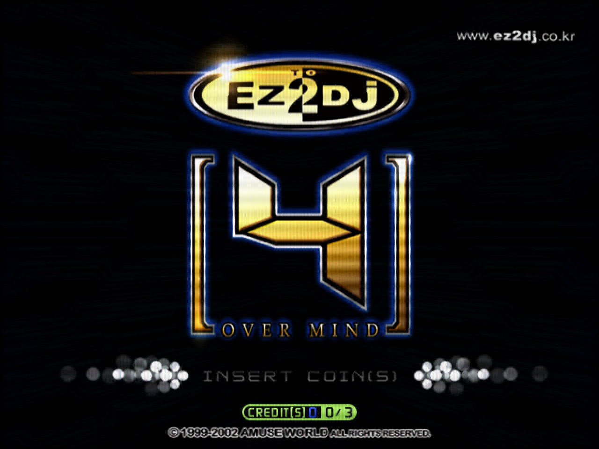
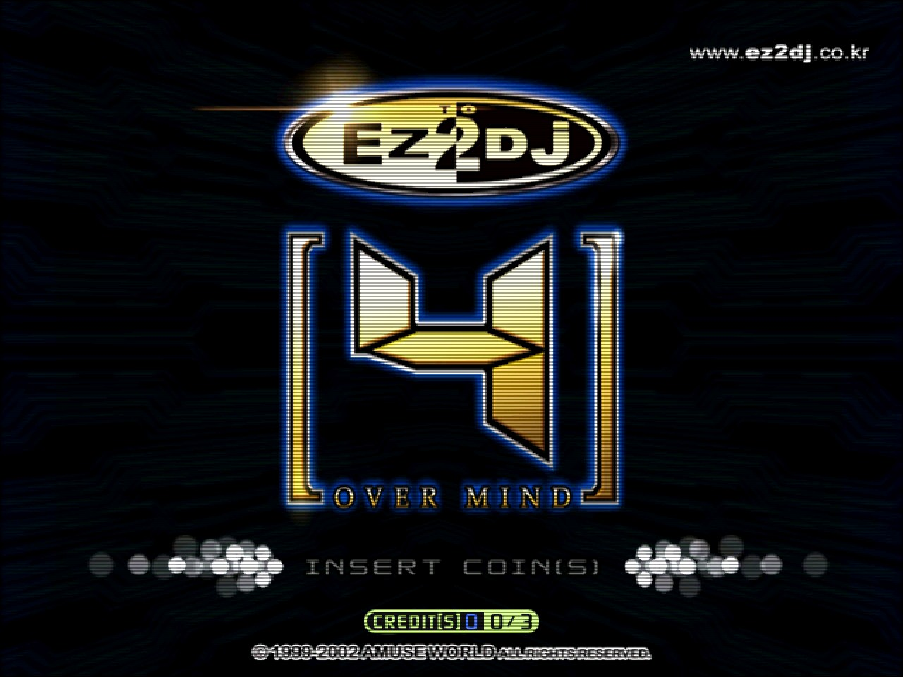
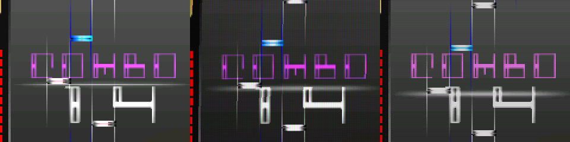
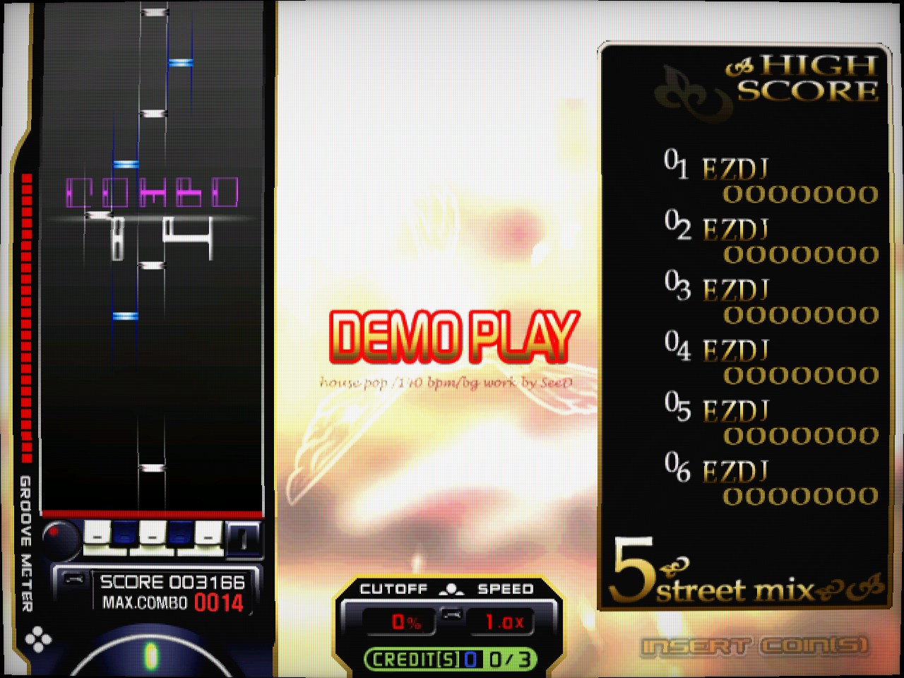
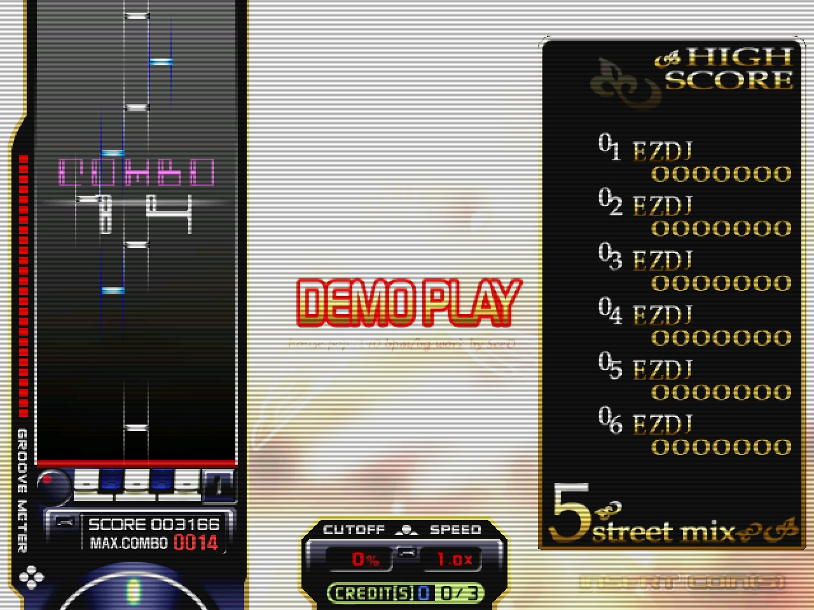
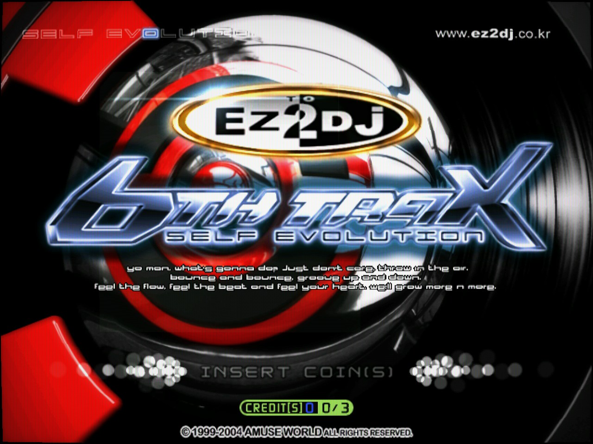
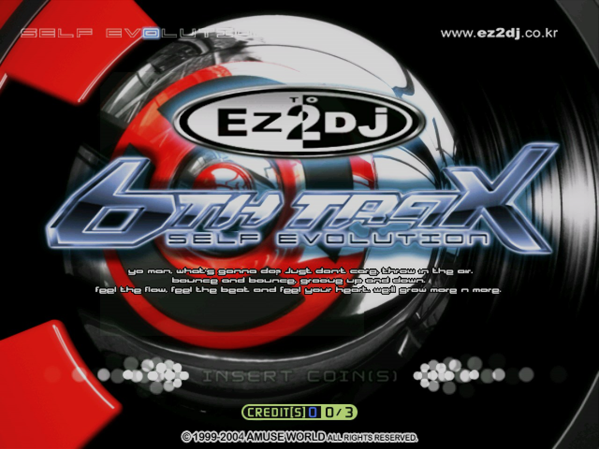
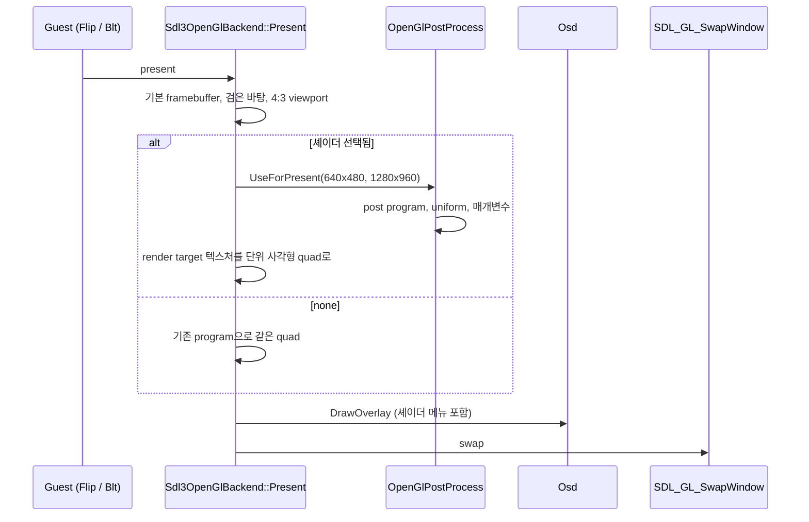
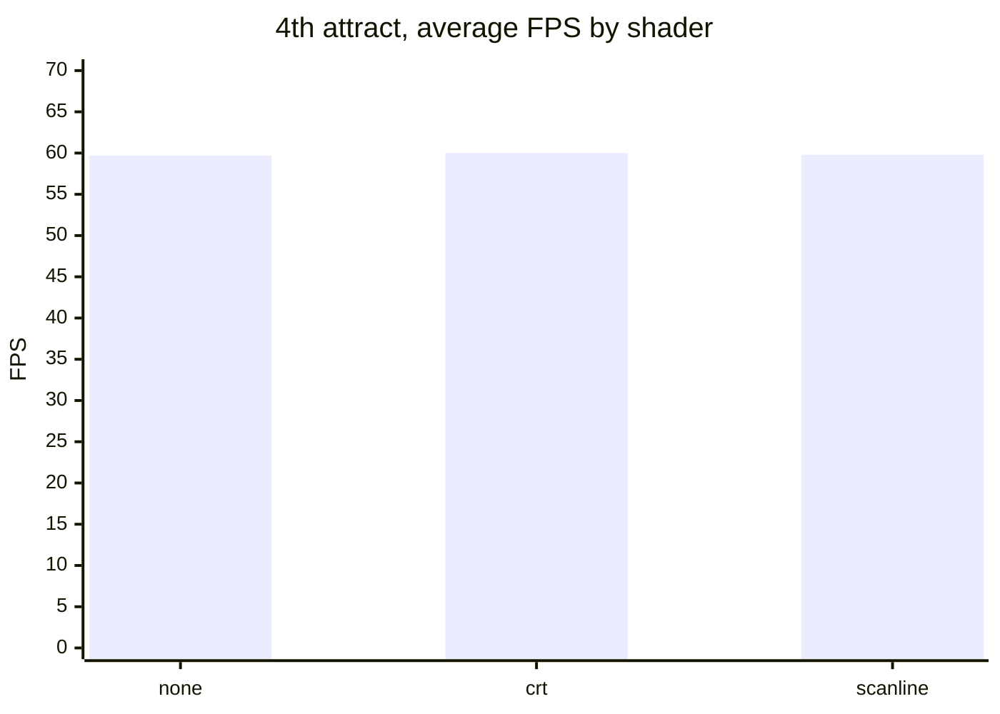

# 화면 후처리 셰이더: 원본 640x480 화면 위의 아케이드 모니터 (WIP)

범위: [`v0.0.63`부터 `v0.0.64`까지](https://github.com/reexec/re2DJ/compare/v0.0.63...v0.0.64) (작업 455~456)

EZ2DJ 기판은 640x480 화면을 아케이드 CRT 모니터로 내보냈습니다. re2DJ는 그 화면을 현대 모니터의 창에 2배로 그리는데, 정확할수록 오히려 "그 시절 화면"과 멀어집니다. 이번 작업은 게임이 다 그린 프레임 위에 **표시 단계에서만** CRT 모니터 느낌을 입히는 후처리 셰이더를 넣은 기록입니다. 같은 저작자의 rePIU에 먼저 들어간 기능(rePIU 작업 768)을 같은 형식으로 가져왔고, 게스트가 보는 화면은 한 바이트도 바뀌지 않습니다.

## 주요 변경 사항

### 1. 화면에서 본 결과

4th와 6th를 같은 시점까지 어트랙트로 돌려 `none`, `crt`, `scanline`을 차례로 찍었습니다. 모두 Windows x86 Release, RTX 4090, 기본 2배 창(1280x960)입니다. 주사선은 출력 픽셀 단위 무늬라 이미지를 줄이면 사라지므로, 아래 띠는 같은 부분을 1:1로 잘라 나란히 놓은 것입니다(왼쪽부터 `none`, `crt`, `scanline`).

**4th 타이틀**


| `crt` | `scanline` |
| :---: | :---: |
|  |  |

**4th 데모 플레이** (세 번의 실행이 몇 프레임씩 어긋나 노트 위치가 조금 다릅니다)



| `crt` | `scanline` |
| :---: | :---: |
|  |  |

**6th 타이틀**


| `crt` | `scanline` |
| :---: | :---: |
|  |  |

비교용 `none` 원본은 [`docs/screenshots/shaders/`](../screenshots/shaders/)에 같은 이름(`*-none.jpg`)으로 있습니다.

* **`crt`** — 휜 화면(곡률 기본 0.01), 밝을수록 넓어지는 가우시안 빔 주사선, aperture grille 마스크, 약한 비네트. 계산은 선형 광(linear light)에서 합니다. 매개변수 6개.
* **`scanline`** — 줄의 뒤쪽 절반을 어둡게 하는 단순한 주사선. 매개변수 2개.

### 2. 어디에 끼웠나 — rePIU와 달리 복사가 없다

rePIU는 게임이 창 해상도의 back buffer에 직접 그리므로, swap 직전에 back buffer를 텍스처로 복사한 뒤 셰이더로 다시 그립니다. re2DJ는 구조가 다릅니다. 게임은 **논리 해상도(640x480)의 render target**에 그리고, `Present`가 그 텍스처를 창 안의 4:3 사각형에 quad 하나로 그립니다. 그래서 re2DJ는 그 마지막 quad를 후처리 program으로 바꿔 그리기만 하면 됩니다.



* **복사 없음.** 셰이더의 입력은 게임이 그린 render target 텍스처 그 자체입니다. 프레임당 추가 비용은 program 전환과 fragment 계산뿐이고, `none`이면 분기 하나에 GL 호출은 0개입니다.
* **크기가 libretro 의미 그대로.** 텍스처가 곧 논리 해상도라 `InputSize`·`TextureSize`는 640x480, `OutputSize`는 창 안 그림 크기입니다. rePIU는 텍스처가 창 크기라서 일부러 논리 해상도를 알려야 했습니다.
* **배열은 그대로.** 기존 Present의 꼭짓점 배열(attribute 0·1·2)을 그대로 쓰고, 셰이더 program은 링크 전에 `VertexCoord`=0, `COLOR`=1, `TexCoord`=2로 묶습니다.
* **상태는 Present가 다시 정한다.** Present는 매 프레임 자기 상태를 정하고 `Draw`는 그릴 때마다 자기 program을 쓰므로, 후처리 뒤에는 기본 program만 되돌립니다. GL probe가 셰이더 뒤 게스트의 다음 그리기가 그대로인지 확인합니다.
* **실패는 `none`으로.** 컴파일·링크가 실패하면 그 셰이더를 선택하지 않은 것으로 하고 이유를 로그와 OSD에 보입니다.

### 3. 고르는 곳 세 군데

| 방법 | 지속 | 예 |
| --- | --- | --- |
| 명령행 | 그 실행(환경 변수보다 우선) | `re2dj ez2dj4th --post-shader crt` |
| 환경 변수 | 그 실행 | `RE2DJ_POST_SHADER=scanline` |
| 실행 중 백틱 OSD | 그 실행만 | Screen shader 콤보, Reload, 매개변수 슬라이더 |

rePIU에는 런처 ini가 있지만 re2DJ는 명령행이 설정 경로라 `--post-shader`를 두었습니다. 6th처럼 런처가 자식을 띄우는 타깃은 자식이 부모의 명령행과 환경을 물려받아 같은 셰이더로 열립니다. `shaders/`에 libretro 단일 pass 형식의 `.glsl`을 넣으면 목록에 함께 나오고, 게임을 켠 채 파일을 고치고 OSD의 **Reload**를 누르면 바로 다시 컴파일됩니다. 형식은 [후처리 셰이더 가이드](../guides/post-process-shaders.md)에 있습니다.

### 4. 실행 로그

6th를 `--post-shader crt`로 띄운 실행의 핵심 줄입니다. 런처(`EZ2DJ.EXE`)와 자식(`EZ2DJ6TH.EXE`)이 모두 crt를 받았고, 화면을 연 자식에서 매개변수 6개로 적용됐습니다.

```text
[re2dj] executable      : EZ2DJ/EZ2DJ.EXE
[re2dj] post shader     : crt
[re2dj] executable      : EZ2DJ/EZ2DJ6TH.EXE
[re2dj] post shader     : crt
[re2dj] presentation: post shader crt (6 parameters)
```

없는 id는 경고를 남기고 `none`으로 실행합니다.

```text
[re2dj] post shader     : nope
[re2dj] presentation: post shader 'nope' not applied: no shader named 'nope' in shaders or built in
```

### 5. sample test 결과

| 검사 | Windows x86 | Linux (WSL) |
| --- | --- | --- |
| 단위 테스트(조립·매개변수·형식 오류·내장·목록·선택 우선순위) | 통과 | x64 clang·gcc, x86 통과 |
| GL `re2dj_opengl_post_shader_probe` | 12/12 (RTX 4090) | 12/12 (llvmpipe) |
| 실제 게임 | 4th `--post-shader`·환경 변수·사용자 파일·없는 id, 6th 런처 → 자식 | 4th `--post-shader crt` |

GL probe는 64x48 화면을 128x96 창에 그려 `scanline`(강도 1)에서 밝은 행 48개와 어두운 행 48개가 번갈아 나오는지, `crt`(곡률 0.3)의 모서리가 검고 가운데가 밝은지, 없는 셰이더가 `none`으로 남는지, 셰이더 뒤 게스트의 빨간 그리기가 그대로 보이는지를 swap 직전의 back buffer에서 읽어 확인합니다.

4th 어트랙트를 셰이더마다 25초씩 돌린 결과입니다(Windows x86 Release, vsync, 10초 이후 평균).



CPU는 코어 하나 기준 15%·12%·14.5%로 측정 오차 범위입니다. 셰이더 계산은 GPU에서 일어나므로 CPU 쪽 비용은 거의 없습니다.

현재 blocker는 없습니다.

### 알려진 것

* 다단계 preset(`.glslp`), 이전 프레임(`PrevTexture`), LUT는 지원하지 않습니다. OSD에서 바꾼 매개변수는 저장되지 않습니다.
* 컨텍스트가 OpenGL 2.1 compatibility라 GLSL 1.20이 기준입니다. `#version 130` 이상을 쓰는 셰이더는 드라이버에 따라 컴파일되지 않을 수 있고, 그때는 `none`으로 그려집니다.

## 사용된 기술 스택

### libretro GLSL 셰이더 형식

[libretro의 GLSL 셰이더](https://docs.libretro.com/development/shader/glsl-shaders/)는 한 파일에 vertex와 fragment를 함께 두고 `#if defined(VERTEX)` / `#elif defined(FRAGMENT)`로 나눕니다. 엔진이 같은 소스를 두 번 컴파일하며 각각 `#define VERTEX`, `#define FRAGMENT`와 `#define PARAMETER_UNIFORM`을 넣습니다. 파일 첫 줄이 `#version`이면 그 줄 바로 뒤에 넣어야 컴파일됩니다. `#pragma parameter NAME "설명" 기본 최소 최대 단계` 줄은 GLSL 컴파일러에는 무의미하지만, 프런트엔드가 읽어 uniform float과 슬라이더로 만듭니다. 내장 두 셰이더는 rePIU 작업 768에서 새로 쓴 BSD 3-Clause 코드이며, GPL인 libretro `crt-geom` 등은 쓰지 않았습니다.

### 논리 해상도 render target

re2DJ의 SDL3/OpenGL backend는 게임의 그리기를 창이 아니라 논리 해상도의 FBO 텍스처에 받습니다(작업 195). 그래서 창 배율이나 DPI가 게임의 텍스처 필터와 blend 정밀도를 바꾸지 않고, 이번 작업에서는 그 텍스처를 그대로 셰이더 입력으로 쓸 수 있었습니다. 표시 필터도 `none`과 같아 정수 배율에서는 nearest입니다.

### 정수 배율에서의 표본 위치

출력 픽셀 중심은 `(i + 0.5) / OutputSize`에 있습니다. 2배율에서 논리 한 줄 안의 두 출력 행은 줄 안 위치 0.25와 0.75에 떨어지므로, 줄 가운데에 대칭인 함수는 두 행에 같은 값을 줍니다. 내장 `scanline`은 줄의 뒤쪽 절반을 틈으로 두고, `crt`는 빔 중심을 출력 반 픽셀 옮겨 이 함정을 피합니다(rePIU 작업 768에서 발견). 일반 지식으로 [kb: libretro GLSL 후처리 셰이더 형식](../kb/libretro-glsl-post-shaders.md) 5절에 남겼습니다.

## English

# Post-Processing Shaders: An Arcade Monitor on Top of the Original 640x480 Picture (WIP)

Range: [`v0.0.63` to `v0.0.64`](https://github.com/reexec/re2DJ/compare/v0.0.63...v0.0.64) (tasks 455–456)

EZ2DJ boards sent a 640x480 picture to an arcade CRT monitor. re2DJ draws that picture into a window on a modern monitor at 2x, and the more exact it is, the further it gets from "how it looked back then". This work adds post-processing shaders that put a CRT monitor look over the finished frame **at presentation only**. The feature arrived first in rePIU by the same author (rePIU task 768) and came over in the same format; the picture the guest sees does not change by a single byte.

## Main changes

### 1. What it looks like

4th and 6th ran their attract sequences to the same moment and were captured under `none`, `crt` and `scanline` in turn, all on Windows x86 Release with an RTX 4090 in the default 2x window (1280x960). Scanlines are an output-pixel pattern that disappears when an image is scaled down, so each strip below is the same part cropped 1:1 and placed side by side (left to right: `none`, `crt`, `scanline`).

**4th title**


| `crt` | `scanline` |
| :---: | :---: |
|  |  |

**4th demo play** (the three runs are a few frames apart, so the notes sit slightly differently)


| `crt` | `scanline` |
| :---: | :---: |
|  |  |

**6th title**


| `crt` | `scanline` |
| :---: | :---: |
|  |  |

The `none` originals are in [`docs/screenshots/shaders/`](../screenshots/shaders/) under the same names (`*-none.jpg`).

* **`crt`** — a curved screen (curvature 0.01 by default), Gaussian beam scanlines that widen with brightness, an aperture-grille mask and a soft vignette, computed in linear light. Six parameters.
* **`scanline`** — simple scanlines that darken the back half of each line. Two parameters.

### 2. Where it goes in — unlike rePIU, nothing is copied

rePIU's game draws straight into the window-sized back buffer, so rePIU copies the back buffer into a texture before the swap and draws it back through the shader. re2DJ is built differently: the game draws into a **render target at the logical resolution (640x480)**, and `Present` draws that texture as one quad into the 4:3 rectangle inside the window. re2DJ only has to draw that final quad through the post program instead (see the sequence diagram above).

* **No copy.** The shader's input is the render target texture the game drew, as it is. The added per-frame cost is a program switch and the fragment work; `none` costs one branch and no GL call.
* **Sizes mean what libretro means.** The texture is the logical resolution, so `InputSize` and `TextureSize` are 640x480 and `OutputSize` the picture's size in the window; rePIU, whose texture is window-sized, has to report the logical size on purpose.
* **Same arrays.** Present's existing vertex arrays (attributes 0, 1, 2) feed the shader, whose program binds `VertexCoord`=0, `COLOR`=1 and `TexCoord`=2 before linking.
* **Present resets its own state.** Present sets its state every frame and `Draw` sets its program on every draw, so after the pass only the default program is put back; the GL probe checks the guest's next draw after the shader is unaffected.
* **Failures end as `none`.** A compile or link failure leaves the shader unselected, with the reason in the log and the OSD.

### 3. Three places to choose

| Way | Lasts | Example |
| --- | --- | --- |
| Command line | that run (over the environment variable) | `re2dj ez2dj4th --post-shader crt` |
| Environment variable | that run | `RE2DJ_POST_SHADER=scanline` |
| The backtick OSD while running | that run only | Screen shader combo, Reload, parameter sliders |

rePIU has a launcher ini; re2DJ's settings path is the command line, hence `--post-shader`. A target whose launcher starts a child, such as 6th, opens the child with the same shader, since the child inherits the parent's command line and environment. A libretro single-pass `.glsl` dropped into `shaders/` joins the list, and editing it with the game running and pressing **Reload** in the OSD recompiles it at once. The format is in the [post-processing shaders guide](../guides/post-process-shaders.md).

### 4. Run log

The key lines of a 6th run with `--post-shader crt`: both the launcher (`EZ2DJ.EXE`) and the child (`EZ2DJ6TH.EXE`) received crt, and the child, which opens the window, applied it with six parameters (log above). An unknown id warns and runs with `none`.

### 5. Sample test results

| Check | Windows x86 | Linux (WSL) |
| --- | --- | --- |
| Unit tests (assembly, parameters, malformed input, built-ins, listing, selection precedence) | pass | x64 clang and gcc, x86 pass |
| GL `re2dj_opengl_post_shader_probe` | 12/12 (RTX 4090) | 12/12 (llvmpipe) |
| Real games | 4th with `--post-shader`, the variable, a user file and an unknown id; 6th launcher → child | 4th `--post-shader crt` |

The GL probe draws a 64x48 frame into a 128x96 window and reads the back buffer just before the swap: 48 bright and 48 dark alternating rows under `scanline` at strength 1, a black corner and a lit centre under `crt` at curvature 0.3, a missing shader staying `none`, and the guest's red draw after the shader showing as it is.

The 4th attract ran 25 s per shader (Windows x86 Release, vsync, averaged after 10 s): 59.7, 60.0 and 59.8 FPS for `none`, `crt` and `scanline`, with CPU at 15%, 12% and 14.5% of one core, within noise. The shader runs on the GPU, so it costs the CPU next to nothing.

There is no blocker at the moment.

### Known

* Multi-pass presets (`.glslp`), previous frames (`PrevTexture`) and LUTs are not supported, and parameters changed in the OSD are not saved.
* The context is OpenGL 2.1 compatibility, so GLSL 1.20 is the baseline; a shader using `#version 130` or later may not compile on some drivers, in which case the picture is drawn as `none`.

## Technology used

### The libretro GLSL shader format

[libretro's GLSL shaders](https://docs.libretro.com/development/shader/glsl-shaders/) keep the vertex and fragment stages in one file, split by `#if defined(VERTEX)` / `#elif defined(FRAGMENT)`. The engine compiles the source twice with `#define VERTEX` or `#define FRAGMENT` and `#define PARAMETER_UNIFORM` inserted, after the first line when it is `#version`. `#pragma parameter NAME "description" initial minimum maximum step` lines mean nothing to the GLSL compiler, but the frontend reads them into float uniforms and sliders. Both built-ins are BSD 3-Clause code written fresh in rePIU task 768; no GPL libretro shader such as `crt-geom` is used.

### The logical-resolution render target

re2DJ's SDL3/OpenGL backend takes the game's drawing into an FBO texture at the logical resolution rather than the window (task 195), so window scale and DPI never change the game's texture filtering or blend precision, and this work could feed that texture to the shader as it is. The presentation filter matches `none`, nearest at integer scales.

### Sample positions at integer scales

Output pixel centres sit at `(i + 0.5) / OutputSize`. At 2x the two output rows of one logical line fall at 0.25 and 0.75 within it, so a function symmetric about the line's middle gives both the same value. The built-in `scanline` makes the back half of the line the gap and `crt` shifts the beam centre by half an output pixel to avoid that trap (found in rePIU task 768), recorded as general knowledge in section 5 of the [kb: libretro GLSL post-processing shader format](../kb/libretro-glsl-post-shaders.md).
