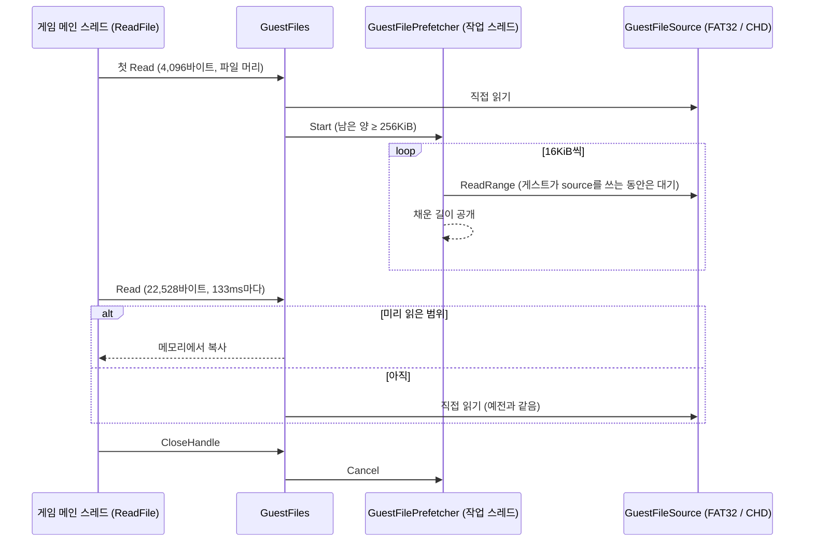
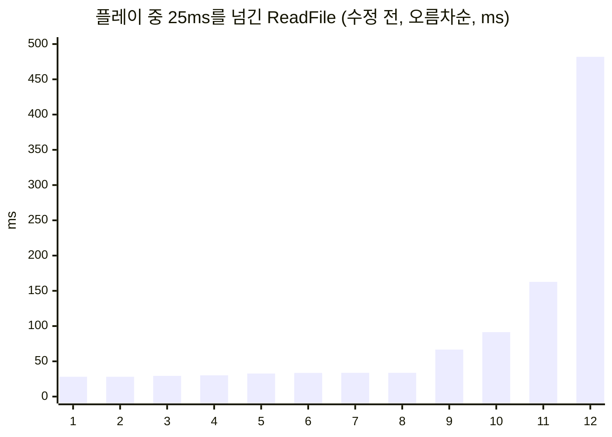

# 배경음이 끊기던 이유: 메인 스레드가 HDD를 기다리지 않게 CHD 파일 미리 읽기 (WIP)

범위: [#9](https://github.com/nworkers/re2DJ/issues/9) (브랜치 `feature/chd-file-prefetch`, 아직 릴리스 전)

EZ2DJ 6th의 SpaceMix를 Windows에서 플레이하면 가끔 화면이 멈칫하고 배경음이 끊겼습니다. 원인은 그래픽도 오디오도 아니었습니다. 6th는 소리 스레드 없이 게임의 메인 스레드가 배경음 파일을 조금씩 읽어 소리 버퍼를 채우는데, HDD에 둔 CHD를 처음 읽는 조각마다 그 스레드가 디스크를 수십~수백 ms씩 기다렸습니다. 이번 작업은 게임 코드를 건드리지 않고 HLE 파일 계층에서 그 파일을 백그라운드로 미리 읽어, 플레이 중 `ReadFile`이 디스크를 기다리지 않게 한 기록입니다.

## 주요 변경 사항

### 1. 무엇이 일어나고 있었나

임시 계측(커밋하지 않음)으로 프레임 시간, 느린 import, CHD hunk 캐시 실패와 그 시간, 배경음 스트림을 함께 기록했습니다. 한 곡을 전체 API 기록으로 다시 돌려 플레이 중 파일 접근도 모두 셌습니다.

* **6th는 메인 스레드가 배경음을 스트리밍합니다.** 매 프레임 배경음 버퍼(360,448바이트, 약 2.04초)의 재생 위치를 보고, 약 133ms마다 `.ezw` 파일에서 22,528바이트를 `ReadFile`로 읽어 씁니다. 재생 위치보다 약 1.5초 앞서 채웁니다.
* **플레이 중 파일 접근은 배경음 하나뿐입니다.** 한 곡에서 곡 전 로딩 2.4초 동안 파일 437개를 열었고, 플레이 70초 동안은 `bgm.ezw` 읽기 532번(12.3MB)뿐이었습니다.
* **느린 읽기는 디스크 대기였습니다.** 느린 `ReadFile`의 시간은 거의 전부 CHD hunk 읽기(`chd_read`)였습니다. 6th CHD는 4KB hunk에 LZMA라 압축 해제 자체는 짧고, 처음 읽는 조각마다 HDD(WD Red 4TB)를 기다린 것입니다. 같은 구간을 다시 돌리면 Windows 파일 캐시에 올라가 있어 느린 읽기가 사라졌습니다.
* **오디오 출력 쪽은 깨끗했습니다.** SDL이 이미 가져간 구간을 게임이 덮어쓴 일도, SDL이 데이터를 가져가지 못한 공백도 없었습니다. 끊김은 메인 스레드가 1.5초 앞섬보다 오래 멈출 때 나는 것으로 봅니다.

### 2. 어떻게 고쳤나 — 나눠 읽기 시작하면 통째로 미리 읽는다



* **언제 시작하나.** 읽기 전용으로 연 CHD 파일의 첫 `Read` 뒤 256KiB 이상 남으면 시작합니다. 로딩 때 한 번에 다 읽는 이미지·채보 파일은 미리 읽지 않아 같은 데이터를 두 번 읽지 않습니다.
* **어디서 읽나.** 작업 스레드 하나가 파일을 처음부터 16KiB(6th의 클러스터 하나)씩 메모리에 읽고, 채운 길이를 atomic으로 공개합니다. 게임의 `Read`는 그 길이 안이면 메모리에서 복사하고, 넘으면 예전처럼 직접 읽습니다. 결과는 바이트 단위로 같습니다.
* **게임이 먼저.** 첫 실제 실행에서, 작업 스레드가 모드 선택 BGM(14MB)을 읽는 동안 게임의 4KB 읽기가 273ms를 기다렸습니다. 작업 스레드가 CHD 잠금을 조각마다 바로 다시 잡았기 때문입니다. 이제 게임이 CHD를 쓰는 동안에는 작업 스레드가 다음 조각을 시작하지 않습니다. 게임은 길어야 조각 하나만큼 기다립니다.
* **자원.** CHD handle은 하나만 씁니다. 6th CHD는 hunk가 5,089,770개라 handle마다 hunk map에 약 60MB가 들기 때문입니다. 미리 읽은 메모리는 파일을 닫으면 버리고, 열린 파일을 합쳐 256MiB까지만 씁니다.
* **두 OS 공용.** `src/hle/`에 있어 Windows와 Linux x86·x64가 같은 코드를 씁니다.

### 3. 결과

Windows x86 Release, CHD가 HDD에 있는 상태에서, 아직 읽지 않은 곡으로 SpaceMix를 플레이한 구간(각 약 1분 40초)입니다.

| | 수정 전 | 수정 후 |
| --- | --- | --- |
| 25ms를 넘긴 `ReadFile` | 12번 (최대 481.9ms) | 0번 |
| 40ms를 넘긴 프레임 | 5번 (최대 485.3ms) | 0번 |
| 곡 배경음 | 플레이 중 133ms마다 HDD에서 | 곡 시작 직전 167ms에 16.9MB 전부 |



* 어트랙트 데모 4곡을 35분 동안 9바퀴 돌린 실행에서도 곡 재생 중 느린 읽기와 긴 프레임은 한 번도 없었습니다. 곡 배경음은 캐시가 비어 있던 첫 바퀴에 152~1,015ms, 이후 150~300ms 만에 다 읽혔습니다.
* 계측을 뺀 최종 빌드로 SpaceMix 세 곡을 직접 플레이했을 때 멈칫거림이나 끊김을 느끼지 못했습니다. 세 곡의 배경음(13.7~19.7MB)은 모두 곡 시작 전에 261~587ms 만에 다 읽혔습니다.

실행 로그에는 이렇게 남습니다.

```text
[re2dj] files: prefetch EZ2DJ/SOUND/blue/0-blue-bgm.ezw (18598826 bytes)
[re2dj] files: prefetched EZ2DJ/SOUND/blue/0-blue-bgm.ezw in 392 ms
```

### 4. sample test 결과

| 검사 | Windows x86 | Linux (WSL) |
| --- | --- | --- |
| 단위 테스트(나눠 읽기, 한 번에 읽는 파일·작은 파일 제외, 미리 읽는 중의 읽기, `Close` 취소, 메모리 한도, 게스트 우선, 종료) | 통과, 30번 반복 실패 없음 | x64·x86 통과 |
| CTest | 4개 통과 | 각 5개 통과 |
| 실제 게임 | 6th SpaceMix 플레이, 35분 어트랙트 | — |

현재 blocker는 없습니다.

### 알려진 것

* 곡 로딩과 화면 전환의 멈춤은 그대로입니다(캐시가 비어 있을 때 1.1~2.9초). 처음 읽는 작은 파일(키음 등) 하나마다 HDD 접근 25~48ms가 쌓이는 것이라, 게임이 곧바로 다 읽는 파일이어서 이번 방식으로는 줄지 않습니다. 디렉터리·FAT나 곡 폴더 단위 미리 읽기는 후속으로 남겼습니다.
* `..\..\ranking\ranking_*.bin`을 여는 `CreateFileA`가 CHD를 읽지 않는데도 65~80ms 걸립니다. 이번 변경 전에도 같았습니다.

## 사용된 기술 스택

### MAME CHD와 hunk

re2DJ는 원본 HDD를 MAME CHD로 받아 [libchdr](https://github.com/rtissera/libchdr)로 읽습니다. CHD는 디스크를 hunk 단위로 압축해 두며, 6th CHD는 4KB hunk에 LZMA·zlib·Huffman·FLAC codec을 씁니다. re2DJ는 푼 hunk를 32MB LRU 캐시에 두므로 같은 조각을 두 번 풀지는 않지만, 처음 읽는 조각은 압축된 바이트를 디스크에서 가져와야 합니다. HDD에서는 그 대기가 hunk 압축 해제보다 훨씬 깁니다.

### DirectSound 스트리밍 버퍼

DirectSound 게임은 재생 중인 원형 버퍼의 재생 위치(`GetCurrentPosition`)를 보고, 이미 재생한 구간을 다음 데이터로 다시 채워 긴 곡을 흘립니다. re2DJ는 게스트 버퍼의 사본을 SDL3 오디오 스트림 링으로 들고 SDL이 앞서 가져가게 합니다. 게임이 제때 채우기만 하면 끊김이 없으므로, 문제는 소리가 아니라 채우는 쪽, 곧 메인 스레드의 파일 읽기였습니다.

### 잠금을 넘겨받지 못하는 스레드

`std::mutex`는 공정성을 보장하지 않습니다. 작업 스레드가 조각을 다 읽고 잠금을 놓자마자 다음 조각을 위해 다시 잡으면, 기다리던 게임 스레드가 깨어나기 전에 잠금이 다시 넘어갈 수 있습니다. 그래서 게임의 호출이 진행 중이라는 표시(`BeginForeground`/`EndForeground`)를 두고, 작업 스레드는 조각을 시작하기 전에 그 표시가 없어질 때까지 기다립니다.

## English

# Why the Music Broke Up: Prefetching CHD Files So the Main Thread Never Waits on the HDD (WIP)

Range: [#9](https://github.com/nworkers/re2DJ/issues/9) (branch `feature/chd-file-prefetch`, not released yet)

Playing EZ2DJ 6th's SpaceMix on Windows stuttered now and then and the background music could break up. The cause was neither graphics nor audio. 6th has no sound thread: the game's main thread reads its music file a little at a time to fill the sound buffer, and each piece of a CHD on an HDD read for the first time kept that thread waiting on the disk for tens to hundreds of milliseconds. This work reads such files ahead in the background in the HLE file layer, without touching the game's code, so `ReadFile` no longer waits on the disk during play.

## Main changes

### 1. What was going on

Temporary instrumentation (not committed) recorded frame times, slow imports, CHD hunk-cache misses and their time, and the music stream together, and one song ran again with a full API record to count every file access during play.

* **6th's main thread streams the music.** Every frame it checks the play cursor of the music buffer (360,448 bytes, about 2.04 s) and, about every 133 ms, writes 22,528 bytes read from an `.ezw` file with `ReadFile`, about 1.5 s ahead of the cursor.
* **The music is the only file access during play.** For one song, 437 files were opened in the 2.4 s of loading before it, and the 70 s of play read nothing but `bgm.ezw`, 532 times (12.3 MB).
* **The slow reads were disk waits.** Nearly all the time of a slow `ReadFile` went to CHD hunk reads (`chd_read`). 6th's CHD uses 4 KB LZMA hunks, so decompressing is short; each piece read for the first time waited on the HDD (WD Red 4 TB). Running the same stretch again, with it in the Windows file cache, showed no slow reads.
* **The audio output was clean.** The game never overwrote bytes SDL had already taken, and SDL never went without data. The music presumably breaks up when the main thread stalls longer than its 1.5 s lead.

### 2. The fix — once a file is read in pieces, read all of it ahead

The sequence diagram above shows the flow: the first read of the file's head goes to the source and starts a job; the worker reads the file 16 KiB at a time, waiting while the guest uses the source, and publishes how much it holds; the guest's 22,528-byte reads every 133 ms copy from memory within that length and read directly beyond it; closing the handle cancels the job.

* **When it starts.** When at least 256 KiB of a CHD file opened read-only remain after its first `Read`. Image and chart files read whole at once during loading are not prefetched, so no data is read twice.
* **Where it reads.** One worker thread reads the file from the start into memory 16 KiB at a time (one 6th cluster) and publishes the filled length atomically. The game's `Read` copies from memory within that length and reads directly beyond it, as before; the bytes are the same either way.
* **The game goes first.** In the first real run, while the worker read the mode-select music (14 MB), a 4 KB game read waited 273 ms: the worker retook the CHD lock right after each piece. Now the worker starts no piece while the game is using the CHD, so the game waits for one piece at most.
* **Resources.** One CHD handle is used, since 6th's CHD has 5,089,770 hunks and each handle costs about 60 MB of hunk map. Prefetched memory goes when the file is closed, and open files hold at most 256 MiB together.
* **Both OSes.** It lives in `src/hle/`, so Windows and Linux x86 and x64 share the code.

### 3. Results

Windows x86 Release with the CHD on the HDD, playing SpaceMix on songs not read before (about 1 min 40 s of play each):

| | Before | After |
| --- | --- | --- |
| `ReadFile`s over 25 ms | 12 (up to 481.9 ms) | 0 |
| Frames over 40 ms | 5 (up to 485.3 ms) | 0 |
| The song's music | from the HDD every 133 ms during play | all 16.9 MB in 167 ms just before the song |

The chart above lists the twelve slow reads of the run before the change, in ascending order.

* A run with the attract's four demo songs looping 9 times over 35 minutes had no slow read and no long frame during a song either; each song's music was read whole in 152 to 1,015 ms on the cold first loop and 150 to 300 ms after.
* Playing three SpaceMix songs by hand on the final build, with the instrumentation removed, showed no stutter or break-up; each song's music (13.7 to 19.7 MB) was read whole 261 to 587 ms before the song began.

The run log records it as shown above (`files: prefetch …`, `files: prefetched … in N ms`).

### 4. Sample test results

| Check | Windows x86 | Linux (WSL) |
| --- | --- | --- |
| Unit tests (pieced reads, no prefetch for whole or small files, reads during a prefetch, cancel on `Close`, the memory budget, the game going first, shutdown) | pass, 30 repeated runs without a failure | x64 and x86 pass |
| CTest | 4 pass | 5 each pass |
| Real game | 6th SpaceMix play, a 35-minute attract | — |

There is no blocker at the moment.

### Known

* Song loading and screen transitions still stall (1.1 to 2.9 s when cold): each small file read for the first time (key sounds and the like) adds 25 to 48 ms of HDD access, and since the game reads those files whole right away, this approach does not shrink it. Reading directories, the FAT or whole song folders ahead is left as a follow-up.
* `CreateFileA` of `..\..\ranking\ranking_*.bin` takes 65 to 80 ms without reading the CHD, as it did before this change.

## Technology used

### MAME CHD and hunks

re2DJ takes the original HDD as a MAME CHD and reads it with [libchdr](https://github.com/rtissera/libchdr). A CHD stores the disk compressed in hunks; 6th's uses 4 KB hunks with the LZMA, zlib, Huffman and FLAC codecs. re2DJ keeps decompressed hunks in a 32 MB LRU cache, so no piece is decompressed twice, but a piece read for the first time has to bring its compressed bytes from the disk, and on an HDD that wait is far longer than the decompression.

### DirectSound streaming buffers

A DirectSound game plays a long song by watching the play cursor of a circular buffer (`GetCurrentPosition`) and refilling the part already played with the next data. re2DJ keeps a copy of the guest's buffer as an SDL3 audio-stream ring that SDL reads ahead from. As long as the game refills in time nothing breaks up, so the problem was not the sound but the refilling side: the main thread's file reads.

### A thread that never gets the lock

`std::mutex` promises no fairness. When the worker releases the lock after a piece and immediately takes it again for the next one, the lock can change hands before the waiting game thread wakes. So a game call under way is marked (`BeginForeground`/`EndForeground`), and the worker waits for the mark to clear before starting a piece.
