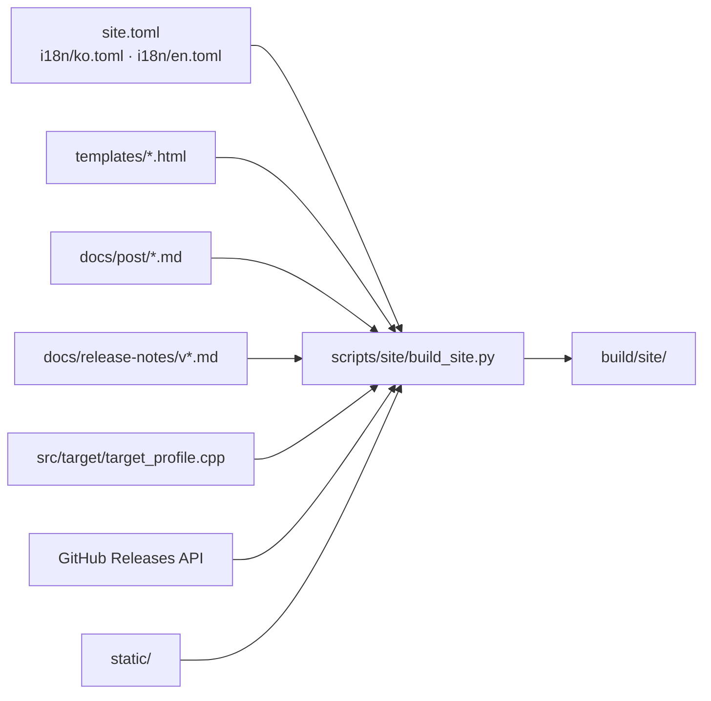

# re2DJ 프로젝트 사이트

이 디렉터리는 <https://nworkers.github.io/re2DJ/>의 소스입니다. 설계는
[작업 432 설계](../design/20261001-432-github-pages-site.md)에 있습니다. 작업 방식과 코드 구조는
rePIU 프로젝트 사이트(rePIU Task 756)를 따르고, 시각 디자인은 8비트 레트로 위에 EZ2DJ 초기
버전(The 1st Tracks / 1st SE)의 어두운 네온 아케이드 분위기를 입혔습니다.

## 구조



| 경로 | 내용 |
|---|---|
| `site.toml` | 저장소, 기본 URL, 언어 목록, 콘텐츠 경로, Mermaid 주소, 플랫폼 상태 |
| `i18n/ko.toml`, `i18n/en.toml` | 페이지 문구. 두 파일의 키 구조는 같아야 합니다 |
| `templates/` | Jinja2 템플릿 (`base`, `index`, `wip`, `download`, `post`, `404`) |
| `static/` | CSS, JS, favicon, Galmuri 폰트와 라이선스 |

산출물은 한국어가 `/`, 영어가 `/en/` 아래에 같은 파일 이름으로 생깁니다.

## 콘텐츠가 갱신되는 방법

* **개발 기록:** `docs/post/`에 [작성 지침](../post/README.md)대로 글을 추가하면 main에 머지될 때 게시됩니다.
  한국어 전문 → `## English` → 영어 전문 구조로 두 언어 페이지가 나뉩니다.
* **릴리스 타임라인과 다운로드:** 태그를 push해 Release 워크플로가 성공하면 Pages 워크플로가 이어서 돌며
  새 릴리스를 반영합니다. 본문은 `docs/release-notes/<tag>.md`가 있으면 그 파일을 씁니다.
* **내장 타깃 목록:** `src/target/target_profile.cpp`의 내장 카탈로그에서 읽습니다. 직접 대입과
  `MakeChdCompatibilityProfile(...)` 두 선언 형태를 모두 인식하고, HDD/CHD 입력 형식도 함께 표시합니다.
* **플랫폼 상태와 소개 문구:** `site.toml`의 `[[platforms]]`와 `i18n/*.toml`을 직접 고칩니다.
* **크레딧 페이지:** 언어 중립 사실(이름·버전·라이선스·링크)은 `site.toml`의 `[[credits]]`에,
  그룹 제목과 항목 설명은 `i18n/*.toml`의 `[credits]`에 둡니다. 전체 문서는 저장소의
  `LICENSE`, `THIRD_PARTY_NOTICES.md`, `CREDITS.md`입니다.

## 로컬 빌드

Python 3.11 이상이 필요합니다.

```bash
python3 -m pip install -r scripts/site/requirements.txt
python3 scripts/site/build_site.py            # GitHub API로 릴리스 조회
python3 scripts/site/build_site.py --offline  # API 없이 노트 파일만 사용
python3 -m http.server -d build/site 8000     # http://localhost:8000/
```

`GITHUB_TOKEN` 또는 `GH_TOKEN`이 있으면 API 요청에 사용합니다. 없어도 공개 저장소는 조회됩니다(IP당
시간당 60회 제한). 빌드는 모든 페이지의 내부 링크가 산출물 안의 파일을 가리키는지 검사하고, 깨진 링크가
있으면 실패합니다.

다운로드 페이지는 릴리스 산출물 중 `-windows-x86.zip`, `-linux-x64.tar.gz`, `-linux-x86.tar.gz`를 플랫폼별 패키지로, 각각의 `.sha256`을 그 체크섬으로 묶어 보입니다(`scripts/site/releases.py`, 작업 442).

## 배포

`.github/workflows/pages.yml`이 main의 관련 경로 변경, Release 워크플로 성공, 수동 실행 때 빌드해
배포합니다. PR에서는 빌드와 링크 검사만 합니다. 저장소 Settings → Pages → Source는 **GitHub Actions**여야
합니다. 브랜치의 `/docs` 폴더 배포로 바꾸면 `docs/`의 내부 문서가 모두 공개되므로 쓰지 않습니다.

## 디자인 메모

* Galmuri 픽셀 폰트는 정수 배수에서만 선명합니다: Galmuri14는 15px, Galmuri11/GalmuriMono11은 12px 배수.
* 팔레트는 EZ2DJ 초기 버전의 어두운 아케이드 화면을 따릅니다: 검정에 가까운 남색 바탕, 네온 시안 제목,
  호박색 링크, 빨강·초록 포인트.
* 메뉴 바 아래 색 띠는 1인 플레이 기어(빨강 턴테이블, 흰/파랑 건반, 초록 페달)의 인용입니다.
* 스캔라인은 `body::after`의 정적 오버레이입니다. 농도를 올리면 가독성이 먼저 무너지니 주의하십시오.

## English

# re2DJ project site

This directory is the source of <https://nworkers.github.io/re2DJ/>. The design is
[Task 432](../design/20261001-432-github-pages-site.md). The working method and code structure follow
the rePIU project site (rePIU Task 756); the visual design layers the dark neon arcade mood of early
EZ2DJ (The 1st Tracks / 1st SE) on an 8-bit retro base.

## Layout

See the diagram in the Korean section: `site.toml`, the `i18n/` strings, `templates/`, posts, release
notes, the built-in target catalog, the Releases API and `static/` feed `scripts/site/build_site.py`,
which writes `build/site/`. The output has Korean at `/` and English under `/en/` with the same file
names.

## How content is refreshed

* **Dev log:** add a post to `docs/post/` following the [guidelines](../post/README.md); it is published
  when it reaches main. The full-Korean → `## English` → full-English layout splits into the two languages.
* **Release timeline and downloads:** when a pushed tag's Release workflow succeeds, the Pages workflow
  runs next and picks up the new release. The body is `docs/release-notes/<tag>.md` when it exists.
* **Built-in target list:** read from the catalog in `src/target/target_profile.cpp`; both the direct
  assignment form and `MakeChdCompatibilityProfile(...)` calls are recognised, with the HDD/CHD input kind.
* **Platform status and introduction copy:** edit `[[platforms]]` in `site.toml` and `i18n/*.toml`.
* **Credits page:** language-neutral facts (name, version, licence, link) live in `[[credits]]` in
  `site.toml`; group titles and item descriptions in `[credits]` of `i18n/*.toml`. The full documents
  are the repository's `LICENSE`, `THIRD_PARTY_NOTICES.md` and `CREDITS.md`.

## Local build

Python 3.11 or later; see the commands in the Korean section. `GITHUB_TOKEN`/`GH_TOKEN` are used when
set. The build fails on any broken internal link.

The download page groups the release assets `-windows-x86.zip`, `-linux-x64.tar.gz` and `-linux-x86.tar.gz` as per-platform packages, each with its `.sha256` as the checksum (`scripts/site/releases.py`, Task 442).

## Deployment

`.github/workflows/pages.yml` builds and deploys on relevant-path changes on main, on a successful
Release workflow, and on manual runs. Pull requests only build and check links. Settings → Pages →
Source must be **GitHub Actions**; deploying a branch `/docs` folder would publish every internal
document, so it is not used.

## Design notes

Galmuri pixel fonts are crisp only at whole multiples (Galmuri14 at 15px; Galmuri11/GalmuriMono11 at
multiples of 12px). The palette follows the dark arcade screens of early EZ2DJ: near-black navy
background, neon cyan headings, amber links, red/green accents. The strip under the menu bar quotes the
single-player gear (red turntable, white/blue keys, green pedal). The scanline is a static `body::after`
overlay; raising its opacity hurts readability first.
