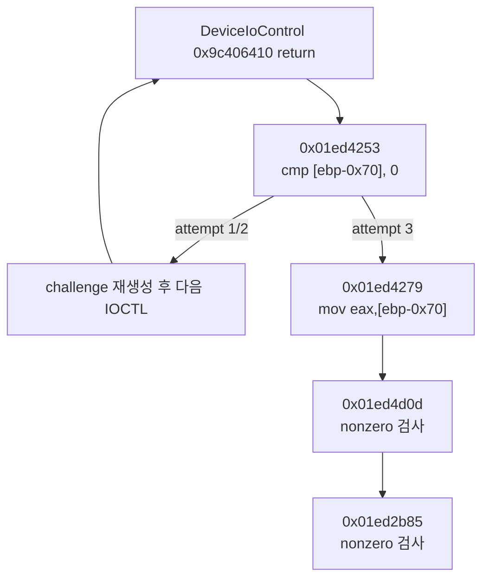

# LPTDI IOCTL 복귀 후 소비 추적 작업 로그

관련 설계: [LPTDI IOCTL 복귀 후 소비 추적](../design/20260824-053-lptdi-post-ioctl-trace.md)  
관련 작업 지시: [LPTDI IOCTL 복귀 후 소비 추적 작업 지시](../work-orders/20260824-053-lptdi-post-ioctl-trace.md)

## 구현

- `--lptdi-post-ioctl-trace <max-steps>` 옵션을 추가하고 1..4096 범위로 제한했다.
- injected runtime의 `_Re2djDeviceIoControlMock@32` export를 기존 `DeviceIoControl` API watch에 연결했다.
- synthetic handle의 return instruction부터 address, 최대 16바이트, GP register, output-range register alias를 기록했다.
- 외부 call 진입 시 caller의 return address에 one-shot breakpoint를 설치해 같은 보호 allocation 추적을 재개했다.
- 다음 IOCTL이 시작될 때 이전 호출 trace와 return breakpoint를 안전하게 정리했다.
- 기존 breakpoint와 return address가 겹치면 trace를 종료해 이미 설치된 breakpoint를 덮어쓰지 않도록 했다.

## 검증

- `cmake --build --preset windows-x86-debug`: 통과
- `ctest --preset windows-x86-debug`: 2/2 통과
- 128-step canonical:
  - `20260824-014354-425.jsonl`: private-page #UD `0x003ee004`, initializer AV 없음
  - `20260824-014423-993.jsonl`: private-page #UD `0x0034c004`, initializer AV 없음
- 512-step 관찰:
  - `20260824-014232-148.jsonl`
  - `20260824-014317-889.jsonl`
  - 두 로그 모두 호출별 address/byte trail이 112, 112, 394 sample로 동일했다.

512-step 실행은 unload-tail에서 이미 존재하는 breakpoint와 다음 외부-call 복귀 주소가 겹친 `0x01ed25c9`에서 추적을 중단했고 process는 `0x4000001f`로 종료됐다. 따라서 전체 종료 경로 판정에는 breakpoint 겹침 이전의 반복 가능한 소비 증거만 사용하고, canonical 결과는 128-step 두 실행으로 별도 확인했다.

## 확인된 소비 흐름

output 주소는 `EBP-0x70`이었고 보존된 첫 DWORD `0x770f0ff8`이 세 번째 시도 후 EAX로 전달됐다. 이는 첫 DWORD가 이 단계에서 nonzero branch/status 값으로 소비된다는 사실을 확인한다. 나머지 4바이트의 의미, 첫 challenge와 응답의 계산 관계, `0x9c406414` 소비는 미확정이다.

## access violation 확인

최종 두 canonical 실행 모두 기존 initializer execute AV `0x19d521bd`에는 도달하지 않았다. 대신 full-size preserving 응답이 선택하는 기존 private-page #UD가 재현됐다. 따라서 이번 trace 기능 자체가 initializer AV를 새로 만들지는 않았다.

---

# LPTDI Post-IOCTL Consumption Trace Work Log

Related design: [LPTDI Post-IOCTL Consumption Trace](../design/20260824-053-lptdi-post-ioctl-trace.md)  
Related work order: [LPTDI Post-IOCTL Consumption Trace Work Order](../work-orders/20260824-053-lptdi-post-ioctl-trace.md)

## Implementation

Added a bounded `--lptdi-post-ioctl-trace` option, registered the injected synthetic wrapper with the existing DeviceIoControl watch, recorded return-site instructions and registers, resumed same-allocation tracing after external calls with one-shot return breakpoints, retired traces before the next IOCTL, and avoided overwriting pre-existing breakpoints.

## Verification and findings

The Windows x86 Debug build and CTest 2/2 passed. Final 128-step logs `20260824-014354-425.jsonl` and `20260824-014423-993.jsonl` reproduced private-page #UD at 0x003ee004 and 0x0034c004 without reaching the initializer access violation. Two 512-step observation logs, `20260824-014232-148.jsonl` and `20260824-014317-889.jsonl`, produced identical per-call address/byte trails of 112, 112, and 394 samples before a pre-existing-breakpoint collision at 0x01ed25c9; only evidence before that boundary is used.

The first IOCTL repeats three times. Address 0x01ed4253 compares output DWORD zero at `[ebp-0x70]`; after the third attempt, 0x01ed4279 loads it into EAX and callers at 0x01ed4d0d and 0x01ed2b85 test it for nonzero. The preserved first DWORD 0x770f0ff8 propagated unchanged. The remaining four bytes, the response calculation, and 0x9c406414 consumption remain unresolved.
