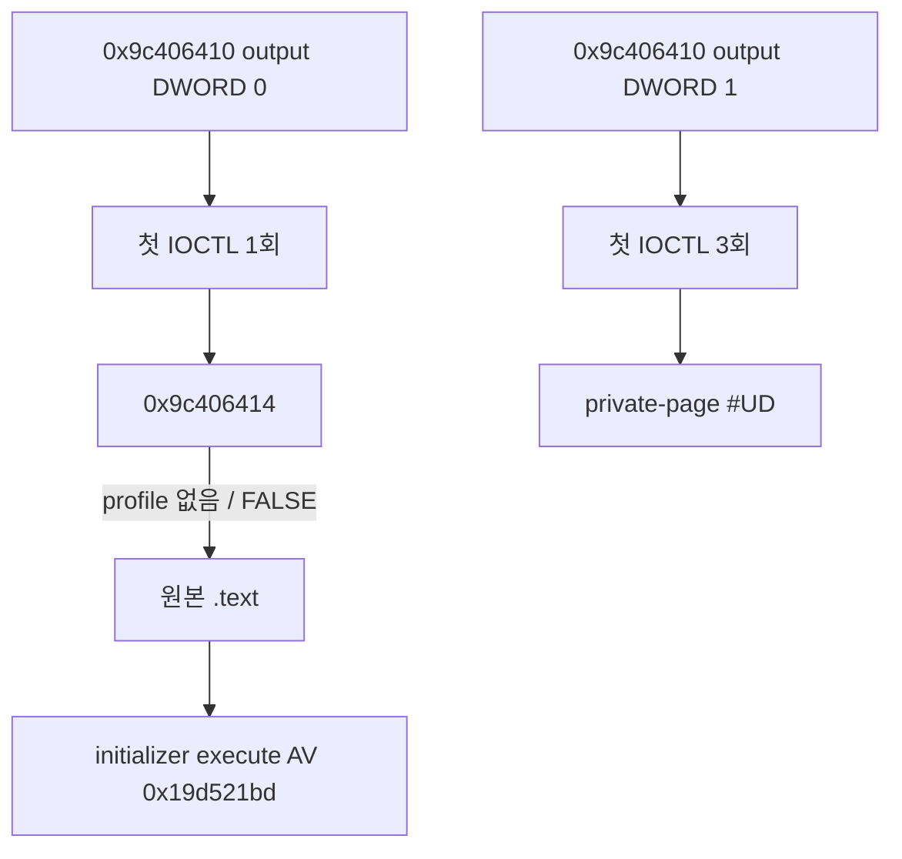

# LPTDI 외부 응답 profile 작업 로그

관련 설계: [LPTDI 외부 응답 profile](../design/20260824-054-lptdi-external-response-profile.md)  
관련 작업 지시: [LPTDI 외부 응답 profile 작업 지시](../work-orders/20260824-054-lptdi-external-response-profile.md)

## 구현

- 공용 core에 `re2dj-lptdi-response-v1` text parser를 추가했다.
- 허용 code를 `0x9c406410`, `0x9c406414`로 제한하고 각각 exact 8/104바이트를 검증한다.
- 중복 code, 알 수 없는 code, 잘못된 hex, 길이 불일치와 빈 profile을 거부한다.
- injected runtime에 code별 response buffer/size export와 mode 3을 추가했다.
- synthetic handle의 일치 code에는 profile bytes, full bytes-returned와 `TRUE`를 반환한다.
- profile에 없는 code는 bytes-returned 0, `ERROR_INVALID_FUNCTION`, `FALSE`를 반환한다.
- launcher 옵션 `--device-mock-lptdi-response-profile <path>`가 guest 생성 전에 profile을 읽고 runtime slot에 원격 복사한다.
- 단위 테스트와 Windows runtime probe에 parser/copy/missing-code 계약을 추가했다.

## 검증

- `cmake --build --preset windows-x86-debug`: 통과
- `ctest --preset windows-x86-debug`: 2/2 통과
- `cmake --build --preset windows-x64-debug -- /m:1`: 통과
- `ctest --preset windows-x64-debug`: 1/1 통과
- 임시 synthetic profile은 `build/` 아래에서만 사용하고 실행 후 제거했다.

최초 x64 재검증에서는 앞선 동일 build가 끝나기 전에 다시 실행되어 MSVC PDB 잠금 오류가 발생했다. 남은 compiler process가 없음을 확인한 뒤 `/m:1` 단일 빌드로 재실행해 통과했으므로 소스 회귀로 분류하지 않는다.

### 첫 DWORD 0

- `20260824-015631-301.jsonl`
- `20260824-015721-296.jsonl`

두 실행 모두 `0x9c406410`을 한 번 호출했다. output은 `0000000000000000`, bytes-returned는 8, `TRUE`였다. 이후 `0x9c406414`에 도달했고 profile 항목이 없어서 bytes-returned 0과 `FALSE`를 반환했다. 그 뒤 원본 `.text`가 실행됐으나 두 번 모두 execute AV `0x19d521bd`가 발생했다. `EAX=ECX=EDX=0x0045c008`, stack return `0x0043b688`, `.data` 8-dword window는 기존 작업 49와 동일했다.

### 첫 DWORD 1

- `20260824-015755-068.jsonl`: private-page #UD `0x003f8004`
- `20260824-015828-598.jsonl`: private-page #UD `0x003f4004`

두 실행 모두 output `0100000000000000`을 받은 첫 IOCTL을 세 번 반복했다. 두 번째 IOCTL과 initializer AV에는 도달하지 않았고 기존 WSOCK32 unload/private-page 실패 choreography를 선택했다.

## 결론

첫 IOCTL의 첫 단계 통과값은 DWORD 0으로 확인됐다. 그러나 두 번째 response가 없는 상태에서는 `.data` initializer가 복원되지 않는다. zero는 실험상 통과값이지 정상 HASP code로 확인된 값이 아니다. 다음 작업은 `0x9c406414` 복귀 후 104바이트 output의 소비 위치와 최소 통과 필드를 추적해야 한다.

## access violation 확인

첫 DWORD 0 경로에서 기존 access violation이 두 번 정확히 재현됐다. 주소와 손상 `.data` 값이 변하지 않았으므로 이번 profile 주입은 첫 단계 분기만 바꾸었고 initializer 손상의 원인은 해결하지 않았다. 첫 DWORD 1 경로에서는 access violation 전에 private-page #UD가 발생했다.

---

# LPTDI External Response Profile Work Log

Related design: [LPTDI External Response Profile](../design/20260824-054-lptdi-external-response-profile.md)  
Related work order: [LPTDI External Response Profile Work Order](../work-orders/20260824-054-lptdi-external-response-profile.md)

## Implementation and verification

Added the shared `re2dj-lptdi-response-v1` parser with known-code and exact-size validation, runtime code-specific response slots and profile mode, launcher pre-launch loading and remote injection, unit tests, and runtime-probe coverage. Missing entries fail explicitly with zero bytes and `ERROR_INVALID_FUNCTION`. Windows x86 build/CTest passed 2/2; Windows x64 build and CTest passed 1/1. An initial overlapping x64 rebuild hit an MSVC PDB lock, then passed under a single `/m:1` build after confirming no compiler process remained. Synthetic profiles lived only under the ignored build directory and were removed after observation.

Two first-DWORD-zero runs (`20260824-015631-301.jsonl`, `20260824-015721-296.jsonl`) called 0x9c406410 once, reached missing 0x9c406414, then reached original `.text` and reproduced execute AV 0x19d521bd with the same registers, return site, and corrupt `.data` window. Two first-DWORD-one runs (`20260824-015755-068.jsonl`, `20260824-015828-598.jsonl`) called the first IOCTL three times and ended in private-page #UD at 0x003f8004 and 0x003f4004 without reaching the second IOCTL or initializer AV.

First-DWORD zero is the first-stage advance value but is not established as a valid HASP response. The next task is to trace the 104-byte second output's consumption and minimum pass fields.
