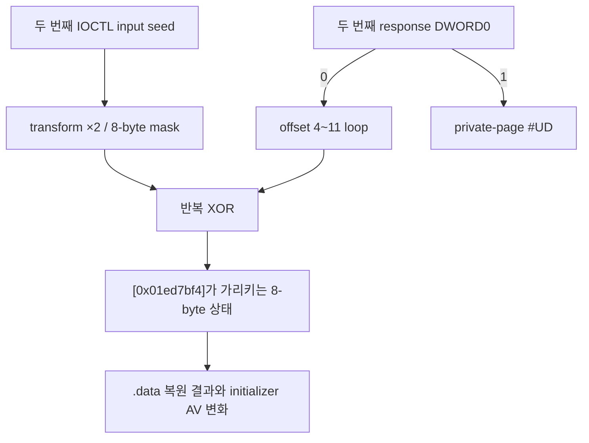

# LPTDI 두 번째 응답 소비 탐색 작업 로그

관련 설계: [LPTDI 두 번째 응답 소비 탐색](../design/20260824-055-lptdi-second-response-consumption.md)

관련 작업 지시: [LPTDI 두 번째 응답 소비 탐색 작업 지시](../work-orders/20260824-055-lptdi-second-response-consumption.md)

## 결과

`0x9c406414`의 104바이트 output 가운데 이 성공 경로가 읽는 영역을 반복 추적으로 확인했다.

- `0x01ed4dd5: cmp dword ptr [ebp-0x70], ebx`가 두 번째 output DWORD0을 0과 비교한다.
- DWORD0이 0이면 `0x01ed4df2: mov al, byte ptr [edi+ebp-0x6c]`가 offset 4~11을 차례로 읽는다.
- `0x01ed4dfc`가 각 바이트를 두 번째 IOCTL input seed를 두 번 변환해 얻은 8바이트 mask와 XOR한다.
- `0x01ed4e07`이 결과를 `[0x01ed7bf4]`에서 얻은 포인터를 통해 8바이트 상태에 기록한다.
- `0x01ed4e14`는 DWORD0을 반환한다.
- DWORD0이 1이면 8바이트 loop를 건너뛰고 기존 private-page 실패 경로를 선택한다.

따라서 두 번째 response에서 확인된 계약은 `DWORD0=0`과 offset 4~11의 8바이트 payload다. 나머지 92바이트를 이 경로에서 읽은 증거는 없다. 이 결과는 소비 위치와 변환 구조를 확인한 것이며, 실제 HASP/Hardlock vendor protocol이나 올바른 response 공식을 확정하지 않는다.

## 실행 증거

첫 IOCTL response는 두 profile 모두 8바이트 zero로 고정했다. 두 번째 IOCTL은 104바이트 all-zero 또는 DWORD0만 1인 값을 `TRUE`, 104 bytes-returned와 함께 반환했다.

### 두 번째 response all-zero

로그:

- `20260824-020755-132.jsonl`
- `20260824-020900-823.jsonl`

두 실행 모두 offset 0을 비교한 뒤 offset 4~11을 정확히 한 번씩 읽었다. 기존 response 부재 실행의 안정된 initializer execute AV `0x19d521bd`와 달리 결과는 challenge에 따라 달라졌다.

| 실행 | execute AV | `0x0045c000`부터 관찰한 8 DWORD |
| --- | --- | --- |
| 1 | `0xd3e72bdf` | `b3470b3f, 43971b0f, d3e72bdf, 637a01af, f3cb328f, 83d75b4f, 13276b1f, a3ba421f` |
| 2 | `0x0c5c6c3c` | `8cdcecbc, cc1c2cfc, 0c5c6c3c, 4cdf727c, 8c20d3cc, cc1c2cfc, 0c5c6c3c, 4cdf73ac` |

두 실행 모두 원본 `.text` initializer 간접 호출까지 도달했다. AV 주소와 `.data` window가 실행별 challenge에 따라 함께 변했으므로 offset 4~11로 만든 상태가 `.data` 복원에 인과적으로 관여한다.

### 두 번째 response DWORD0=1

canonical 128-step 로그:

- `20260824-020959-481.jsonl` — private-page #UD `0x003d4004`
- `20260824-021025-924.jsonl` — private-page #UD `0x002fc004`

두 실행 모두 offset 0만 읽고 offset 4~11 loop를 건너뛰었다. 원본 initializer AV에는 도달하지 않았다.

512-step 관찰 로그 `20260824-020937-650.jsonl`은 `0x01ed25c9`의 알려진 장시간 trace `resume_breakpoint_collision`으로 종료되어 최종 경로 분류에는 사용하지 않았다. 다만 DWORD0 비교와 loop 생략까지는 canonical 실행과 일치했다.

## 구현과 검증

작업 54에서 구현한 versioned external response profile과 bounded post-IOCTL tracer가 필요한 정보를 모두 제공했다. 소스 코드는 변경하지 않았고 diagnostic도 보강하지 않았다. Capstone은 trace의 memory operand effective address를 계산하는 일회성 로컬 분석 도구로만 사용했으며 저장소 의존성에 추가하지 않았다.

코드 변경이 없으므로 새 build와 CTest는 수행하지 않았다. 작업 54에서 통과한 Windows x86 CTest 2/2와 x64 CTest 1/1의 검증 상태를 그대로 유지한다. 임시 response profile은 분석 후 제거했다.

## 다음 작업

정상 initializer 배열의 알려진 값과 이번 8바이트 상태를 대조해 올바른 target state를 역산한다. 임의의 104바이트 brute force보다 `response[4+i] XOR challenge_mask[i]`와 `.data` 변환 키의 관계를 먼저 추적한다.

---

# LPTDI Second-Response Consumption Work Log

Related design: [LPTDI Second-Response Consumption](../design/20260824-055-lptdi-second-response-consumption.md)

Related work order: [LPTDI Second-Response Consumption Work Order](../work-orders/20260824-055-lptdi-second-response-consumption.md)

## Result

Repeated tracing identified which part of the 104-byte output from 0x9c406414 is consumed on this success path.

- `0x01ed4dd5: cmp dword ptr [ebp-0x70], ebx` compares the second output's DWORD0 with zero.
- With DWORD0 zero, `0x01ed4df2: mov al, byte ptr [edi+ebp-0x6c]` reads offsets 4 through 11 in order.
- Address 0x01ed4dfc XORs each byte with an eight-byte mask obtained by transforming the second-IOCTL input seed twice.
- Address 0x01ed4e07 writes the result into an eight-byte state through the pointer loaded from [0x01ed7bf4].
- Address 0x01ed4e14 returns DWORD0.
- With DWORD0 one, the guest skips the eight-byte loop and selects the existing private-page failure path.

The confirmed second-response contract is therefore DWORD0 zero plus the eight-byte payload at offsets 4 through 11. No read of the remaining 92 bytes was observed on this path. This confirms the consumption and transformation structure, not the real HASP/Hardlock vendor protocol or valid response formula.

## Run evidence

Both profiles fixed the first-IOCTL response at eight zero bytes. The second IOCTL returned either 104 all-zero bytes or DWORD0 one with the rest zero, together with TRUE and 104 bytes returned.

### All-zero second response

Logs:

- `20260824-020755-132.jsonl`
- `20260824-020900-823.jsonl`

Both runs compared offset zero and then read offsets 4 through 11 exactly once. Unlike the stable initializer execute AV at 0x19d521bd from the absent-response runs, the result varied with the challenge.

| Run | Execute AV | Eight DWORDs observed from `0x0045c000` |
| --- | --- | --- |
| 1 | `0xd3e72bdf` | `b3470b3f, 43971b0f, d3e72bdf, 637a01af, f3cb328f, 83d75b4f, 13276b1f, a3ba421f` |
| 2 | `0x0c5c6c3c` | `8cdcecbc, cc1c2cfc, 0c5c6c3c, 4cdf727c, 8c20d3cc, cc1c2cfc, 0c5c6c3c, 4cdf73ac` |

Both runs reached the original `.text` initializer indirect call. Because the AV address and `.data` window varied together with the per-run challenge, the state built from offsets 4 through 11 causally participates in `.data` restoration.

### DWORD0-one second response

Canonical 128-step logs:

- `20260824-020959-481.jsonl` — private-page #UD at `0x003d4004`
- `20260824-021025-924.jsonl` — private-page #UD at `0x002fc004`

Both runs read only offset zero, skipped the offsets 4-through-11 loop, and did not reach the original initializer AV.

The 512-step observation log `20260824-020937-650.jsonl` ended at the known long-trace `resume_breakpoint_collision` at 0x01ed25c9, so it was excluded from final path classification. Its DWORD0 check and skipped loop still matched the canonical runs.

## Implementation and verification

The versioned external response profile and bounded post-IOCTL tracer from Task 54 provided all required evidence. No source code or diagnostic change was needed. Capstone was used only as a one-off local analysis aid to calculate effective memory operands and was not added as a repository dependency.

Because there was no code change, no new build or CTest run was performed. The Task 54 verification state remains Windows x86 CTest 2/2 and x64 CTest 1/1. Temporary response profiles were removed after analysis.

## Next work

Compare the known normal initializer array with this eight-byte state and invert the required target state. Trace the relationship among `response[4+i] XOR challenge_mask[i]`, the `.data` transformation key, and the restored initializer before attempting arbitrary 104-byte brute force.
