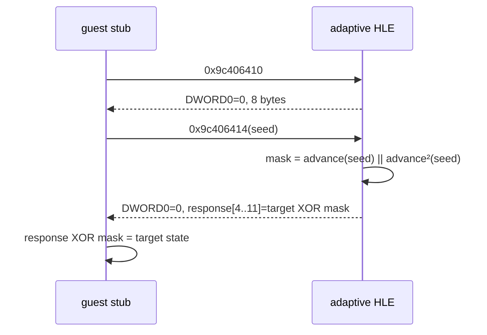

# LPTDI 적응형 target-state 응답 작업 로그

관련 설계: [LPTDI 적응형 target-state 응답](../design/20260824-056-lptdi-adaptive-target-state.md)

관련 작업 지시: [LPTDI 적응형 target-state 응답 작업 지시](../work-orders/20260824-056-lptdi-adaptive-target-state.md)

## 결과

보호 stub의 runtime trace에서 확인한 `0x01ed4141` 변환을 공용 코드로 옮기고, 실행별 seed에 적응해 지정한 8바이트 guest 상태를 만드는 진단 정책을 구현했다.



`--device-mock-lptdi-target-state <16-hex-digits>`는 기존 IOCTL success/profile 정책과 상호 배타적이다. mode 4 runtime은 첫 IOCTL에 8바이트 zero를 반환하고 두 번째 IOCTL의 24바이트 input 첫 DWORD로 mask를 계산한다. 104바이트 output은 zero로 초기화하며 offset 4~11에만 encoded payload를 쓴다.

## 확인된 변환

공용 `AdvanceLptdiChallenge`는 runtime 명령과 같은 unsigned 32비트 wraparound 계산을 수행한다. trace에서 직접 관찰한 다음 연쇄를 단위 테스트로 고정했다.

- `0x75ea31f1 → 0x446dc4e6 → 0xbb93d79f`
- `0x2656754c → 0xd05b70bd → 0x5eb9ed22`

이 명칭은 프로젝트 내부 관찰값을 나타내며 공식 HASP/Hardlock 알고리즘 식별이 아니다.

## canonical zero-state 실행

로그:

- `20260824-022700-925.jsonl`
- `20260824-022725-832.jsonl`

| 실행 | 두 번째 input seed | response offset 4~11 | guest target state | execute AV |
| --- | --- | --- | --- | --- |
| 1 | `0x7cd97507` | `74 5c 23 46 05 7c 45 40` | 8-byte zero | `0x19d521bd` |
| 2 | `0x5d7f6e64` | `b5 52 2c 62 7a 45 02 9d` | 8-byte zero | `0x19d521bd` |

서로 다른 seed와 wire response에도 두 실행의 `.data` 8-DWORD window는 모두 다음 값으로 같았다.

```text
b9f5c1dd, 69e5f14d, 19d521bd, c908172d,
79f968ad, 29a5b10d, d995e17d, 89c8d81d
```

이는 response 부재 baseline과도 같다. zero state가 정상 키라는 뜻은 아니지만, 실행별 challenge가 `.data` 결과에 주는 변동을 target state 고정으로 제거할 수 있음이 확인됐다. 따라서 다음 단계는 wire response를 다시 추측하는 것이 아니라 정상 initializer를 만드는 고정 8바이트 target state를 도출하는 것이다.

## 구현

- `lptdi_challenge_response`: 공용 변환, 8바이트 mask, target-state encoding, 엄격한 16자리 hex parser
- Windows injected runtime mode 4와 `g_re2dj_device_target_state` export
- launcher의 `--device-mock-lptdi-target-state` parsing, remote injection, diagnostic event
- 공용 단위 테스트와 Windows runtime probe의 410/414 buffer 계약 검증

외부 라이브러리는 추가하지 않았고 원본 실행 파일이나 HDD 자산을 수정·복사하지 않았다.

## 검증

- Windows x86 Debug build: 통과
- Windows x86 CTest: 2/2 통과
- Windows x64 Debug build: 통과
- Windows x64 CTest: 1/1 통과
- canonical zero-state 실행: 2/2 동일 AV와 `.data` window

## 다음 작업

보호 `.data` raw bytes, 정상 비보호 sibling plaintext, 선택한 target-state 실행 결과를 블록 단위로 대조하고, stub의 state 소비 함수를 추적해 정상 복원에 필요한 8바이트 target state를 역산한다.

---

# LPTDI Adaptive Target-State Response Work Log

Related design: [LPTDI Adaptive Target-State Response](../design/20260824-056-lptdi-adaptive-target-state.md)

Related work order: [LPTDI Adaptive Target-State Response Work Order](../work-orders/20260824-056-lptdi-adaptive-target-state.md)

## Result

The runtime-confirmed transform at 0x01ed4141 is now implemented in shared code, together with a diagnostic policy that adapts to each seed to produce a selected eight-byte guest state.

`--device-mock-lptdi-target-state <16-hex-digits>` is mutually exclusive with the existing IOCTL success and profile policies. Runtime mode 4 returns eight zero bytes for the first IOCTL, derives the mask from the first DWORD of the second 24-byte input, zero-initializes the 104-byte output, and writes the encoded payload only at offsets 4 through 11.

## Confirmed transform

Shared `AdvanceLptdiChallenge` performs the same unsigned 32-bit wraparound calculation as the runtime guest instructions. Unit tests fix the directly observed chains:

- `0x75ea31f1 → 0x446dc4e6 → 0xbb93d79f`
- `0x2656754c → 0xd05b70bd → 0x5eb9ed22`

The name describes an observed project-internal value and does not identify an official HASP or Hardlock algorithm.

## Canonical zero-state runs

Logs:

- `20260824-022700-925.jsonl`
- `20260824-022725-832.jsonl`

| Run | Second-input seed | Response offsets 4–11 | Guest target state | Execute AV |
| --- | --- | --- | --- | --- |
| 1 | `0x7cd97507` | `74 5c 23 46 05 7c 45 40` | eight zero bytes | `0x19d521bd` |
| 2 | `0x5d7f6e64` | `b5 52 2c 62 7a 45 02 9d` | eight zero bytes | `0x19d521bd` |

Despite different seeds and wire responses, both runs produced the same `.data` window:

```text
b9f5c1dd, 69e5f14d, 19d521bd, c908172d,
79f968ad, 29a5b10d, d995e17d, 89c8d81d
```

This also matches the absent-response baseline. Zero state is not a valid-key claim, but fixing the target state removes the per-run challenge variation from the `.data` result. The next problem is therefore deriving the fixed eight-byte target state that restores the normal initializer, not guessing another wire response.

## Implementation

- Shared transform, eight-byte mask, target-state encoder, and strict 16-hex-digit parser
- Windows injected-runtime mode 4 and `g_re2dj_device_target_state` export
- Launcher parsing, remote injection, and diagnostic event for `--device-mock-lptdi-target-state`
- Shared unit coverage and Windows runtime-probe coverage of the 410/414 buffer contract

No external dependency was added, and no original executable or HDD asset was modified or copied.

## Verification

- Windows x86 Debug build: passed
- Windows x86 CTest: 2/2 passed
- Windows x64 Debug build: passed
- Windows x64 CTest: 1/1 passed
- Canonical zero-state runs: 2/2 reproduced the same AV and `.data` window

## Next work

Compare protected `.data` raw bytes, known plaintext from the unprotected sibling, and selected target-state results block by block. Trace the stub function that consumes the state and invert the eight-byte target state required for normal restoration.
