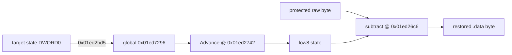

# LPTDI target state 역산 작업 로그

관련 설계: [LPTDI target state 역산](../design/20260824-057-lptdi-target-state-inversion.md)

관련 작업 지시: [LPTDI target state 역산 작업 지시](../work-orders/20260824-057-lptdi-target-state-inversion.md)

## 결과

보호 `.data` 복원 transform을 runtime 명령으로 확인하고 최소 8바이트 target state `0900000000000000`을 역산했습니다. 두 canonical 실행은 정상 initializer를 동일하게 기록하고 기존 `0x19d521bd` execute access violation 없이 ExitProcess breakpoint에 도달했습니다.

이 값은 현재 보호 바이너리를 정상 sibling 상태로 복원하는 진단값입니다. 실제 LPT HASP/Hardlock 동글의 고유키, vendor protocol, 원래 wire-response 알고리즘으로 확정하지 않습니다.

## 확인된 transform

4096-step zero-state trace `20260824-023857-194.jsonl`에서 다음 흐름을 확인했습니다.



```text
state = AdvanceLptdiChallenge(state)
restored[i] = protected_raw[i] - low8(state)
```

- `0x01ed2bd0`~`0x01ed2bd5`: 상태 첫 DWORD를 `0x01ed7296`에 seed
- `0x01ed2742`: 작업 56과 동일한 32비트 변환으로 state 갱신
- `0x01ed26c1`: 갱신된 state 하위 바이트 로드
- `0x01ed26c6`: 보호 raw 바이트에서 하위 바이트를 뺌
- `0x01ed26ce`: 복원 바이트를 원위치에 기록

보호본과 비보호 sibling의 `.data` 첫 64바이트 차이는 초기 state 하위 바이트 `0x09`에서 생성되는 하위 바이트열과 64/64 일치했습니다. 첫 출력 조건은 `(seed_low8 * 0x35 + 1) mod 256 = 0xde`이며 유일한 해가 `0x09`입니다. 관찰 경로에서 상위 24비트와 두 번째 DWORD가 필요하다는 증거가 없어 최소 후보의 나머지는 zero로 두었습니다.

## trace 안정화

최초 4096-step 실행 `20260824-023618-397.jsonl`은 `0x01ed25c9`에서 `resume_breakpoint_collision`으로 중단됐습니다. post-IOCTL trace가 외부 call 복귀를 기다리는 동안 unload-tail single-step이 같은 trace를 다시 처리해 복귀 breakpoint를 중복 설치한 것이 원인이었습니다.

launcher는 이제 복귀 대기 중인 trace의 외부 single-step을 재처리하지 않습니다. global syscall resume breakpoint와 post-IOCTL trace breakpoint가 실제로 같은 주소를 공유하면 원래 바이트 소유권을 trace에 넘깁니다. 수정 후 trace는 4096 sample을 완료하고 `.data` write loop까지 도달했습니다.

## 반복 실행 증거

| 로그 | target state | initializer 8 DWORD | 결과 |
| --- | --- | --- | --- |
| `20260824-024502-850.jsonl` | `0900000000000000` | `0,0,0,0043c600,0044e710,0,0,0043c730` | AV 없음, ExitProcess breakpoint |
| `20260824-024533-590.jsonl` | `0900000000000000` | `0,0,0,0043c600,0044e710,0,0,0043c730` | AV 없음, ExitProcess breakpoint |

원본 entry의 첫 `GetVersion` caller `0x0043a66c`에서 `.data` RVA `0x5c000`의 8 DWORD를 한 번 기록하는 `original_initializer_window` diagnostic을 추가했습니다. 두 실행 모두 `exit_process_return=0x0043b63f`, `outcome=success`였습니다.

## 검증

- Windows x86 Debug build: 성공
- Windows x86 CTest: 2/2 통과
- target state canonical 실행: 2/2 정상 initializer, initializer AV 없음
- 원본 HDD 파일과 실행 파일: 수정·복사·커밋하지 않음

## 다음 작업

정상 원본 초기화가 확보됐으므로 원본 `.text`의 첫 자산 파일 API까지 진행해 VFS runtime 연결을 검증합니다. 물리 동글의 원래 response 공식과 vendor 귀속은 별도 미확정 분석으로 남깁니다.

---

# LPTDI Target-State Inversion Work Log

Related design: [LPTDI Target-State Inversion](../design/20260824-057-lptdi-target-state-inversion.md)

Related work order: [LPTDI Target-State Inversion Work Order](../work-orders/20260824-057-lptdi-target-state-inversion.md)

## Result

Runtime instructions establish the protected `.data` restoration transform and yield minimal eight-byte target state `0900000000000000`. Two canonical runs recorded the normal initializer and reached the ExitProcess breakpoint without the old execute access violation at `0x19d521bd`.

This is a diagnostic restoration value for the current protected binary. It is not identified as a physical LPT HASP/Hardlock secret, vendor protocol, or original wire-response algorithm.

## Confirmed transform

Zero-state 4096-step trace `20260824-023857-194.jsonl` shows the first target-state DWORD seeded into global `0x01ed7296`, advanced once per byte by the same Task 56 transform at `0x01ed2742`, and its low byte subtracted from protected raw data at `0x01ed26c1`–`0x01ed26ce`.

All first 64 protected-versus-unprotected `.data` byte differences match the low-byte stream generated from initial low byte `0x09`. The first-byte equation `(seed_low8 * 0x35 + 1) mod 256 = 0xde` has unique solution `0x09`. No requirement for the upper 24 bits or second DWORD was observed, so the minimal candidate keeps them zero.

## Trace stabilization

Initial trace `20260824-023618-397.jsonl` ended in a duplicate resume breakpoint at `0x01ed25c9`. An unload-tail single-step was reprocessed while the post-IOCTL trace already waited for external-call return. The launcher now ignores that duplicate processing state and transfers original-byte ownership when the global syscall-resume breakpoint genuinely shares the trace resume address. The corrected trace completed 4096 samples and reached the `.data` write loop.

## Repeated evidence

Logs `20260824-024502-850.jsonl` and `20260824-024533-590.jsonl` both record target state `0900000000000000`, initializer `{0, 0, 0, 0x0043c600, 0x0044e710, 0, 0, 0x0043c730}`, no AV, `exit_process_return=0x0043b63f`, and successful outcome.

A one-shot `original_initializer_window` diagnostic records the eight DWORDs at `.data` RVA `0x5c000` when original caller `0x0043a66c` first calls `GetVersion`.

## Verification

- Windows x86 Debug build passed
- Windows x86 CTest passed 2/2
- Two canonical target-state runs restored the normal initializer without the initializer AV
- No original HDD file or executable was modified, copied, or committed

## Next work

With stable original initialization established, continue until the first original `.text` asset-file API and validate the VFS runtime connection. Physical-dongle response generation and vendor attribution remain separate unresolved analysis.
