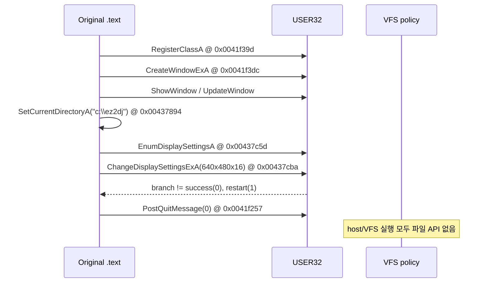

# 정상 초기화 후 첫 원본 자산 API 관찰 작업 로그

관련 설계: [정상 초기화 후 첫 원본 자산 API 관찰](../design/20260824-058-first-original-asset-api.md)

관련 작업 지시: [정상 초기화 후 첫 원본 자산 API 관찰 작업 지시](../work-orders/20260824-058-first-original-asset-api.md)

## 결과

첫 자산 API 전의 마지막 초기화 조건을 `ChangeDisplaySettingsExA` 실패로 확정했습니다. 정상 LPTDI target state가 적용된 host baseline과 `--hle-vfs` 실행은 모두 창 생성까지 성공했지만, 640×480×16 display-mode 요청이 성공 0/restart 1 이외의 분기로 돌아가 `PostQuitMessage(0)`를 호출했습니다.

따라서 현재 파일 API 부재는 VFS 실패가 아닙니다. display-mode 경계를 HLE한 뒤 첫 자산 API 관찰을 계속해야 합니다.

## 관찰 흐름

동형 비보호 코드 `0x00437c40`은 현재 mode가 이미 16bpp이면 성공하고, 아니면 640×480×16 `DEVMODEA`로 `ChangeDisplaySettingsExA`를 호출합니다. 반환 0은 Sleep 후 성공, 1은 `ExitWindowsEx`/Sleep 후 성공으로 처리하지만 다른 값은 0을 반환합니다. caller `0x004378b7`은 이 0을 보고 종료 helper `0x00437780`을 호출합니다. 이후 WM_DESTROY가 `0x0041f257: PostQuitMessage(0)`에 도달합니다.

## 진단 확장

launcher API trace가 초기 debug-event에서 `user32.dll` base를 수집하고 다음 API를 관찰하도록 확장했습니다.

- `RegisterClassA`, `CreateWindowExA`, `ShowCursor`, `ShowWindow`, `UpdateWindow`, `SendMessageA`
- `PostQuitMessage`, `EnumDisplaySettingsA`, `ChangeDisplaySettingsExA`, `GetAsyncKeyState`
- `SetCurrentDirectoryA`와 첫 ANSI 경로

`CreateWindowExA`의 12개 인자를 안전하게 포착하도록 API stack snapshot을 13 DWORD로 확장했습니다. 원본 guest 코드나 HDD 자산은 변경하지 않았습니다.

## 반복 실행

| 로그 | 정책 | 공통 결과 |
| --- | --- | --- |
| `20260824-030149-362.jsonl` | host file baseline | 정상 initializer, 창 생성, display change 실패 분기, PostQuitMessage, 파일 API 없음 |
| `20260824-030249-497.jsonl` | `--hle-vfs` | 정상 initializer, 같은 display change 실패 분기, PostQuitMessage, 파일 API 없음 |

두 실행 모두 `ExitProcess` return `0x0043b63f`, `outcome=success`로 debugger breakpoint에 도달했습니다. 이는 게임 정상 실행 성공이 아니라 관찰용 ExitProcess breakpoint의 정상 포착을 뜻합니다.

## 검증

- Windows x86 Debug build: 성공
- Windows x86 CTest: 2/2 통과
- host/VFS canonical 비교: 동일한 display-mode 종료 경계 재현

## 다음 작업

원본 요청을 host display mode 변경 없이 성공으로 보이게 하는 USER32 import-thunk HLE를 설계합니다. 640×480×16 요청은 논리 guest mode로 보존하고 실제 host window/surface 크기 변환은 플랫폼 backend가 담당해야 합니다.

---

# First Original Asset API Work Log

Related design: [First Original Asset API After Stable Initialization](../design/20260824-058-first-original-asset-api.md)

Related work order: [First Original Asset API Work Order](../work-orders/20260824-058-first-original-asset-api.md)

## Result

The last initialization condition before the first asset API is a failed `ChangeDisplaySettingsExA`. Both a normal-state host baseline and `--hle-vfs` run successfully create the window, then route the 640×480×16 mode request through the branch that is neither success zero nor restart one and call `PostQuitMessage(0)`.

The absence of file APIs is therefore not a VFS failure. Display-mode HLE must pass this boundary before asset observation continues.

## Observed flow

Original code calls RegisterClassA at 0x0041f39d, CreateWindowExA at 0x0041f3dc, ShowWindow and UpdateWindow, SetCurrentDirectoryA("c:\\ez2dj") at 0x00437894, EnumDisplaySettingsA at 0x00437c5d, and ChangeDisplaySettingsExA at 0x00437cba. The sibling code treats return zero and one as success paths; the observed other branch returns failure to 0x004378b7, invokes the shutdown helper, and reaches PostQuitMessage(0) at 0x0041f257.

## Diagnostic extension

The launcher now captures the user32 module base and watches window/display startup APIs plus SetCurrentDirectoryA. Its stack snapshot grows to 13 DWORDs for the 12-argument CreateWindowExA call. No original guest code or HDD asset was changed.

## Repeated runs

Logs `20260824-030149-362.jsonl` and `20260824-030249-497.jsonl` reproduce the same normal initializer, window creation, failed display-mode branch, PostQuitMessage, no file API, ExitProcess return `0x0043b63f`, and debugger outcome success under host and VFS policies respectively.

## Verification

- Windows x86 Debug build passed
- Windows x86 CTest passed 2/2
- Host/VFS canonical comparison reproduced the same display-mode termination boundary

## Next work

Design a USER32 import-thunk HLE that records 640×480×16 as the logical guest mode without changing the host display. Host window and surface scaling remain platform-backend responsibilities.
