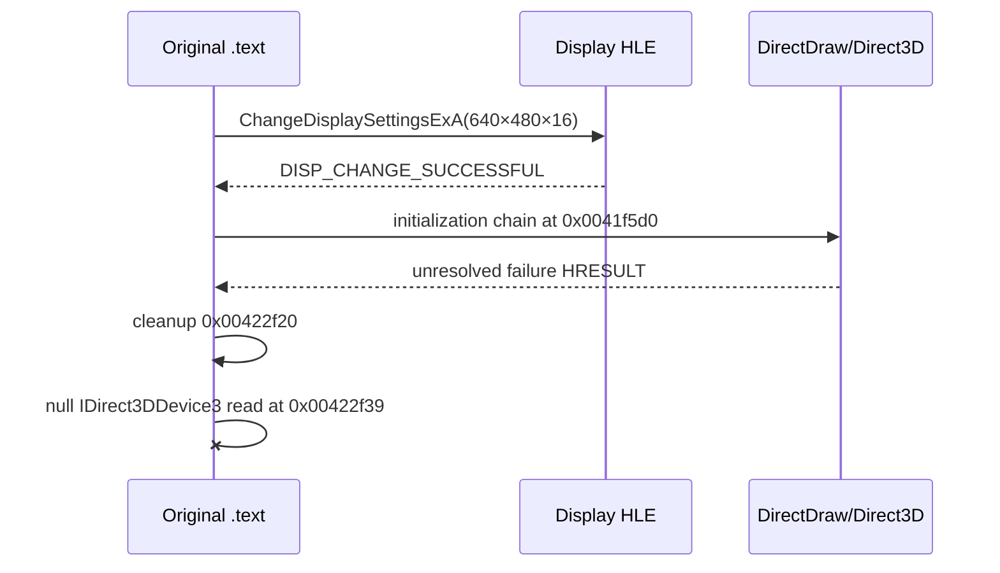

# 논리 display mode HLE 작업 로그

관련 설계: [논리 display mode HLE](../design/20260825-059-logical-display-mode-hle.md)

관련 작업 지시: [논리 display mode HLE 작업 지시](../work-orders/20260825-059-logical-display-mode-hle.md)

## 결과

관찰된 640×480×16 guest display 요청을 host desktop 변경 없이 성공시키는 `--hle-display-mode` 경계를 구현했습니다. 기존 `PostQuitMessage` 조기 종료가 제거됐고 원본은 DirectDraw/Direct3D 초기화까지 진행했습니다.

첫 자산 API에는 아직 도달하지 못했습니다. 두 canonical 실행은 모두 `0x00422f39`에서 address 0 read access violation을 재현했습니다. 이 지점은 선행 초기화 실패 뒤 호출되는 `0x00422f20` 정리 함수가 null `IDirect3DDevice3` 전역을 검사하지 않고 `SetTexture(0, nullptr)`를 호출하려는 곳입니다.

## 구현

- injected runtime에 strict-match `Re2djHleChangeDisplaySettingsExA` wrapper 추가
- launcher에 조합 가능한 `--hle-display-mode` 옵션과 USER32 IAT 교체 추가
- runtime probe에 exact-match 성공과 non-match host fallback 검증 추가
- display 정책을 VFS·LPTDI 정책과 독립적으로 준비하도록 launcher 조건 정리

## 반복 실행

| 로그 | 결과 |
| --- | --- |
| `20260825-001145-119.jsonl` | display 조기 종료 통과, `0x00422f39` null read AV |
| `20260825-001627-919.jsonl` | 동일한 caller·address·null device 상태 재현 |

두 로그 모두 첫 자산 파일 API 전에 충돌했습니다. 원본 HDD 자산은 읽기 입력으로만 사용했고 변경하지 않았습니다.

## 검증

- Windows x86 Debug build: 성공
- Windows x86 CTest: 2/2 통과
- runtime probe: exact 640×480×16 성공, non-match host fallback 성공
- canonical 실행 2회: 동일한 다음 차단점 재현

## 다음 작업

`0x0041f5d0`의 다섯 초기화 단계 반환값을 관찰하고 DirectDraw export·COM 생성 흐름을 추적해 최초 실패 HRESULT를 확정합니다. 2차 정리 AV를 단순 건너뛰기 전에 선행 그래픽 경계를 HLE할지 결정해야 합니다.

---

# Logical Display-Mode HLE Work Log

Related design: [Logical Display-Mode HLE](../design/20260825-059-logical-display-mode-hle.md)

Related work order: [Logical Display-Mode HLE Work Order](../work-orders/20260825-059-logical-display-mode-hle.md)

## Result

Implemented `--hle-display-mode`, which accepts the observed 640×480×16 guest request without changing the host desktop. The former `PostQuitMessage` exit is gone and original execution advances into DirectDraw/Direct3D initialization.

The first asset API is not reached yet. Both canonical runs reproduce an address-zero read AV at `0x00422f39`. This is cleanup function `0x00422f20` attempting `IDirect3DDevice3::SetTexture(0, nullptr)` through a null global after an earlier initialization failure.

## Implementation and verification

The injected runtime has a strict-match `ChangeDisplaySettingsExA` wrapper; the launcher has a composable option and USER32 IAT replacement; the runtime probe covers exact-match success and non-match host fallback. The Windows x86 Debug build and both CTest cases pass. Logs `20260825-001145-119.jsonl` and `20260825-001627-919.jsonl` reproduce the same next blocker without modifying original assets.

## Next work

Observe the five return values in the initialization chain at `0x0041f5d0` and trace DirectDraw export/COM creation to identify the first failing HRESULT before deciding the required graphics HLE boundary.
