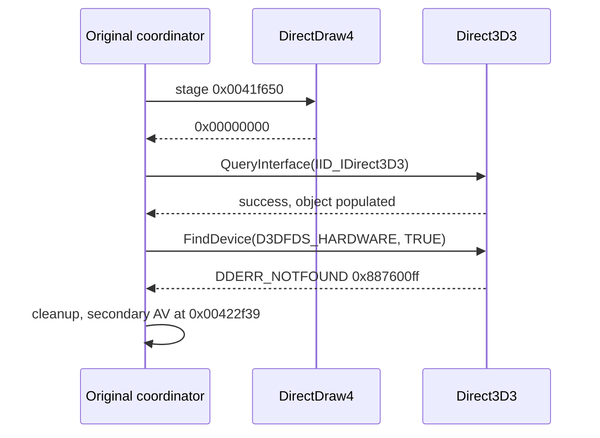

# Direct3D 초기화 실패 추적 작업 로그

관련 설계: [Direct3D 초기화 실패 추적](../design/20260825-060-direct3d-init-failure-trace.md)

관련 작업 지시: [Direct3D 초기화 실패 추적 작업 지시](../work-orders/20260825-060-direct3d-init-failure-trace.md)

## 결과

`0x00422f39` access violation보다 앞선 최초 실패는 hardware-only `IDirect3D3::FindDevice`의 `DDERR_NOTFOUND`(`0x887600ff`)로 확정됐습니다. DirectDraw와 `IDirect3D3` interface 획득은 성공하며, Z-buffer format 열거에는 진입하지 않습니다.

## 구현

launcher에 target 전용 `--d3d-init-trace`를 추가했습니다. 다섯 초기화 return site의 원본 바이트를 저장하고 일회성 `INT3`를 설치합니다. hit 시 EAX, DirectDraw/Direct3D COM 전역 여섯 개, `FindDevice`·Z-buffer phase marker 두 개를 JSONL에 기록하고 원본 바이트와 EIP를 복원합니다. 반환값이나 guest 메모리는 수정하지 않습니다.

## 증거

| 로그 | DirectDraw | Direct3D | phase marker | 후속 결과 |
| --- | --- | --- | --- | --- |
| `20260825-002850-505.jsonl` | `0x00000000` | `0x887600ff` | 둘 다 0 | `0x00422f39` AV |
| `20260825-002917-393.jsonl` | `0x00000000` | `0x887600ff` | 둘 다 0 | `0x00422f39` AV |

각 실행에서 DirectDraw4와 Direct3D3 객체 주소는 유효했고 D3D device·surface 전역은 0이었다. 정적 `0x0041f8e0`은 QueryInterface 성공 뒤 `D3DFINDDEVICESEARCH.dwFlags=4`, `bHardware=1`로 `FindDevice`를 호출하고, 성공한 경우에만 `[0x01eb7d48]=0x4000`을 쓴다. marker가 0인 반복 결과는 바로 이 호출이 실패했음을 보여 줍니다.

## 검증

- Windows x86 Debug build: 성공
- Windows x86 CTest: 2/2 통과
- canonical 최종 실행 2회: 같은 stage, result, marker, 2차 AV 재현
- 원본 HDD 자산과 guest 실행 파일: 변경 없음

## 다음 작업

`DirectDrawCreate` import에서 시작하는 COM proxy 계층을 설계합니다. host Direct3D가 제공하는 software/RGB device 또는 플랫폼 graphics backend를 원본의 hardware-device 계약으로 노출하되, `QueryInterface` identity와 `AddRef`/`Release` 수명을 먼저 보존해야 합니다.

---

# Direct3D Initialization-Failure Trace Work Log

Related design: [Direct3D Initialization-Failure Trace](../design/20260825-060-direct3d-init-failure-trace.md)

Related work order: [Direct3D Initialization-Failure Trace Work Order](../work-orders/20260825-060-direct3d-init-failure-trace.md)

## Result

The first failure preceding the AV at `0x00422f39` is hardware-only `IDirect3D3::FindDevice` returning `DDERR_NOTFOUND` (`0x887600ff`). DirectDraw and `IDirect3D3` acquisition succeed; Z-buffer format enumeration is never entered.

## Implementation and evidence

The target-specific `--d3d-init-trace` option installs one-shot breakpoints at five initialization return sites, records EAX, six COM globals, and two phase markers, then restores the original byte and EIP without modifying guest results. Final logs `20260825-002850-505.jsonl` and `20260825-002917-393.jsonl` both show DirectDraw success, Direct3D result `0x887600ff`, zero phase markers, and the same secondary AV.

## Verification and next work

The Windows x86 Debug build succeeds and CTest passes 2/2. The next graphics boundary is a COM proxy rooted at the `DirectDrawCreate` import, preserving COM identity and reference counting while exposing an HLE-compatible device contract.
