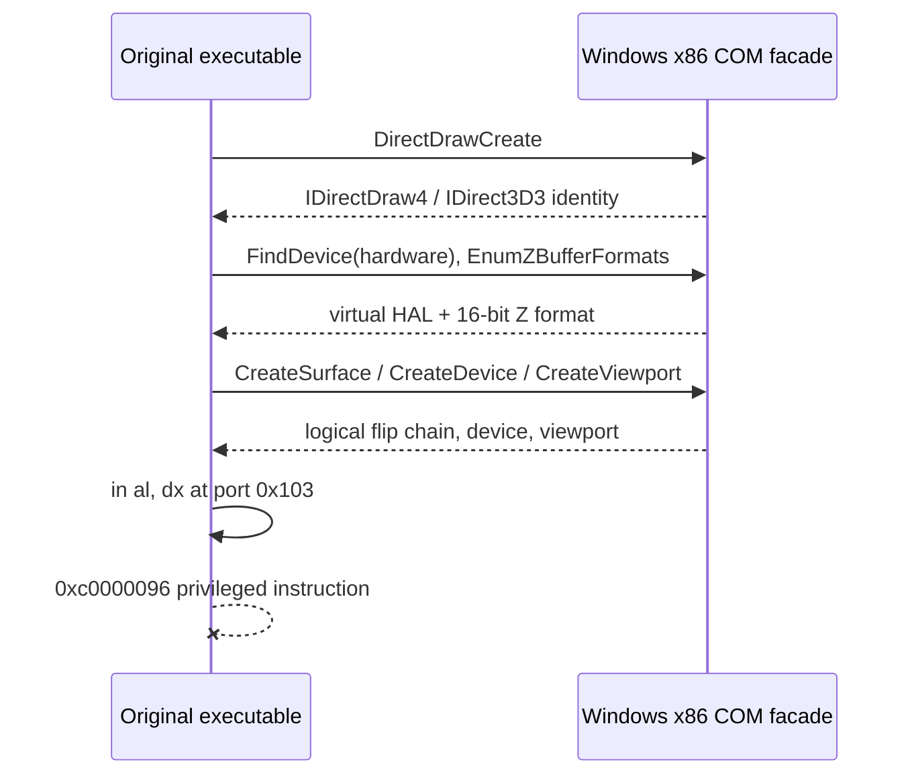

# Direct3D 3 OpenGL HLE 첫 구현 작업 로그

관련 설계: [Direct3D 3 OpenGL HLE](../design/20260825-061-direct3d3-opengl-hle.md)

관련 작업 지시: [Direct3D 3 OpenGL HLE 작업 지시](../work-orders/20260825-061-direct3d3-opengl-hle.md)

## 결과

Direct3D 3 OpenGL HLE의 첫 구현 단위를 완료했습니다. `--hle-d3d3`는 원본 `DirectDrawCreate` IAT를 주입 runtime의 guest 소유 COM facade로 교체합니다. host Direct3D 3 HAL을 사용하지 않고도 원본의 다섯 graphics initialization stage가 모두 성공하며, hardware-only `FindDevice` 실패와 `0x00422f39` 2차 null AV가 제거됐습니다.

OpenGL resource, draw와 present는 아직 구현하지 않았습니다. 다음 최초 실패는 두 실행 모두 원본 `.text` `0x00438987`의 port-I/O privileged instruction입니다.

## 구현

- `src/platform/windows/direct3d3_com_facade.*`: root COM identity와 refcount, DirectDraw4/Direct3D3, primary/back surface, Direct3DDevice3와 viewport facade
- 가상 `IID_IDirect3DHALDevice`, RGB565 texture format과 16-bit Z-buffer format
- 640×480×16 `SetDisplayMode`, primary/back flip chain, logical device와 viewport state
- null texture reset, render/light/transform state 저장과 surface restore contract
- launcher `--hle-d3d3`: `DirectDrawCreate` IAT 교체 및 논리 display mode 자동 활성화
- runtime probe: COM identity, format, surface, device, viewport와 수명 검증

OpenGL backend가 없는 method를 일반 성공으로 위장하지 않습니다. 현재 초기화와 정리에서 확인된 논리 상태만 구현했고 실제 texture binding, primitive draw와 present는 후속 범위입니다.

## 검증

- Windows x86 Debug build: 성공
- Windows x86 CTest: 2/2 통과
- 최종 canonical 로그:
  - `20260825-010400-373.jsonl`
  - `20260825-010421-739.jsonl`

두 로그 모두 stage 반환 `{direct_draw=0, direct_3d=0, surfaces=0, device=0, graphics_state=0}`, marker `{find_device_passed=0x4000, zbuffer_caps=0x400}`, 유효한 모든 COM 전역을 기록합니다. `av_access`는 없으며 다음 예외 주소와 코드는 각각 `0x00438987`, `0xc0000096`으로 같습니다. 원본 HDD와 실행 파일은 변경하지 않았습니다.

## 다음 작업

graphics 경계와 독립적으로 드러난 port `0x103`~`0x105` input 호출을 추적해 platform input HLE 계약을 설계합니다. OpenGL 단계는 surface storage와 실제 draw/present 구현으로 이어갑니다.

---

# Direct3D 3 Initialization HLE Work Log

Related design: [Direct3D 3 OpenGL HLE](../design/20260825-061-direct3d3-opengl-hle.md)

Related work order: [Direct3D 3 OpenGL HLE Work Order](../work-orders/20260825-061-direct3d3-opengl-hle.md)

## Result

The first Direct3D 3 OpenGL HLE increment is complete. `--hle-d3d3` replaces the original `DirectDrawCreate` IAT with a guest-owned COM facade. All five original graphics initialization stages now succeed without using the host Direct3D 3 HAL, eliminating hardware-only `FindDevice` failure and the secondary null AV at `0x00422f39`.

OpenGL resources, drawing, and presentation are not implemented yet. Both final runs first fail afterward at original `0x00438987` with a privileged port-I/O instruction.

## Implementation and verification

The Windows facade provides root COM identity and lifetime, DirectDraw4/Direct3D3, primary and back surfaces, a virtual HAL, 16-bit Z and RGB565 formats, Direct3DDevice3, viewport, and observed initialization state. The launcher installs it through `--hle-d3d3`, and the runtime probe covers identity, formats, object relationships, state, and release behavior.

The Windows x86 Debug build succeeds and CTest passes 2/2. Final logs `20260825-010400-373.jsonl` and `20260825-010421-739.jsonl` both record zero from all five stages, populated objects, markers 0x4000 and 0x400, no access violation, and the same next exception 0xc0000096 at 0x00438987. Original assets remain unchanged.

## Next work

Trace the port 0x103 through 0x105 input contract and design the platform input HLE boundary. The graphics track continues with surface storage and actual OpenGL drawing and presentation.
