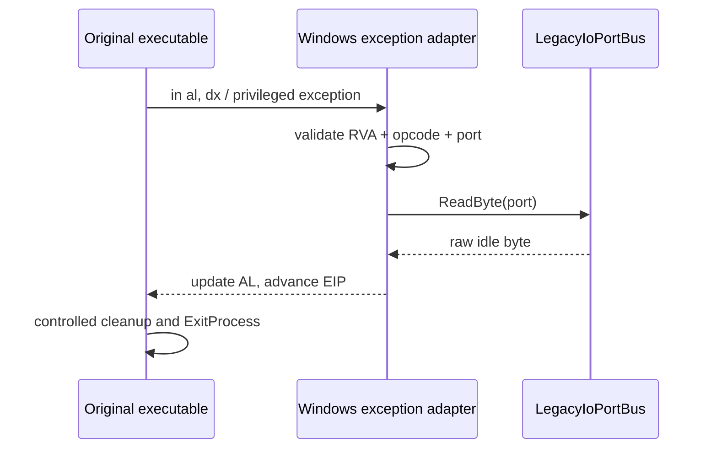

# 레거시 I/O 포트 HLE 작업 로그

관련 설계: [레거시 I/O 포트 HLE](../design/20260825-062-legacy-io-port-hle.md)

관련 작업 지시: [레거시 I/O 포트 HLE 작업 지시](../work-orders/20260825-062-legacy-io-port-hle.md)

## 결과

원본의 직접 x86 byte `IN`/`OUT` 경계를 platform-neutral raw bus와 제한된 Windows x86 exception trap으로 구현했다. `--hle-io-ports`는 1st SE의 확인된 `in al,dx`/`out dx,al` helper 주소, opcode와 port만 처리하고 원본 실행 파일은 수정하지 않는다.

정적 확인은 `0x101`, `0x102`, `0x106`이 active-low 24비트 입력임을 확정했다. `0x103`~`0x105`는 이전값과 비교하는 byte 상태이며 세 번째 값은 modulo-256 delta에 더해진다. 출력은 `0x100`~`0x103`, `0x106`에 기록된다. 물리 버튼·축·램프 배선 의미는 확정하지 않았다.

## 구현

- `LegacyIoPortBus`: readable/writable port allowlist, idle input, future input update, 마지막 output 보존
- launcher `--hle-io-ports`: `EXCEPTION_PRIV_INSTRUCTION` context 처리와 `io_port_read`/`io_port_write` JSONL event
- 알 수 없는 instruction 주소, opcode, port는 처리하지 않는 fail-closed 정책
- 공용 단위 테스트: idle 값, input update, output 보존, unknown port 거부
- DirectDraw4 `RestoreDisplayMode`: port 통과 직후 정리 경로에서 드러난 null vtable slot 제거

첫 구현 실행 `20260825-012727-288.jsonl`은 세 port read를 통과한 뒤 `IDirectDraw4` vtable offset `0x4c`가 null이어서 execute AV `0x00000000`을 기록했다. 원본 caller `0x0041f45a`와 interface slot을 확인해 `RestoreDisplayMode`를 구현했다. 이 AV는 최종 실행에서 재현되지 않았다.

## 검증

- Windows x86 Visual Studio 2022 Debug build: 성공
- Windows x86 CTest: 2/2 통과
- Windows x64 Visual Studio 2022 Debug build: 성공
- Windows x64 CTest: 1/1 통과
- 최종 canonical 로그:
  - `20260825-012844-967.jsonl`
  - `20260825-012915-759.jsonl`

두 로그 모두 `0x00438987`에서 port `0x103`, `0x104`, `0x105`를 값 `0x00`으로 처리한다. 이후 privileged-instruction exception, illegal instruction, `av_access` 없이 `ExitProcess` return `0x00424061`을 기록하고 launcher outcome success로 끝난다. 첫 자산 파일 API event는 아직 없다. 원본 HDD와 실행 파일은 변경하지 않았다.

## 다음 작업

정상 종료 자체를 새 성공 지점으로 오인하지 않는다. `0x00424061`로 이어지는 원본 초기화 coordinator의 반환값과 분기를 역추적해 아직 대체하지 않은 sound, timer, input 또는 다른 platform 경계 중 무엇이 종료를 선택했는지 확인한다.

---

# Legacy I/O Port HLE Work Log

Related design: [Legacy I/O Port HLE](../design/20260825-062-legacy-io-port-hle.md)

Related work order: [Legacy I/O Port HLE Work Order](../work-orders/20260825-062-legacy-io-port-hle.md)

## Result

Direct x86 byte I/O now crosses a platform-neutral raw bus and a narrowly validated Windows x86 exception adapter. `--hle-io-ports` handles only confirmed 1st SE helper addresses, opcodes, and ports without modifying the original executable. Static analysis confirms active-low reads at 0x101, 0x102, and 0x106, counter-like bytes at 0x103 through 0x105, and writes to 0x100 through 0x103 plus 0x106; physical meanings remain unresolved.

The first run exposed a null DirectDraw4 `RestoreDisplayMode` vtable entry as execute AV zero after all three reads. Implementing the observed cleanup method removed that AV.

## Verification and next work

The Windows x86 Debug build succeeds with CTest 2/2, and the Windows x64 Debug build succeeds with CTest 1/1. Final logs `20260825-012844-967.jsonl` and `20260825-012915-759.jsonl` both handle ports 0x103, 0x104, and 0x105 with zero and reach ExitProcess return 0x00424061 without a privileged exception, illegal instruction, or access violation. No asset-file event is observed. The next task is to trace the initialization result that selects this controlled shutdown and identify the next sound, timing, input, or platform boundary.
