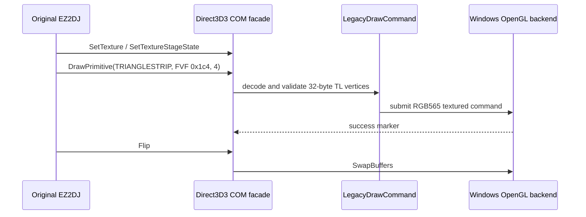

# DrawPrimitive OpenGL backend 작업 로그

관련 설계: [DrawPrimitive OpenGL backend](../design/20260825-067-drawprimitive-opengl-backend.md)  
관련 작업 지시: [DrawPrimitive OpenGL backend 작업 지시](../work-orders/20260825-067-drawprimitive-opengl-backend.md)

## 결과

- FVF `0x1c4`의 32바이트 XYZRHW/diffuse/specular/TEX1 정점을 검증해 플랫폼 중립 `LegacyDrawCommand`로 변환했다.
- Windows x86 COM facade가 stage 0 texture 수명, `DrawPrimitive`, `Get/SetTextureStageState`와 Flip을 보존한다.
- 전용 WGL/OpenGL backend가 GLSL 1.20 shader로 screen-space 정점을 변환하고 RGB565 texture, source color key와 triangle strip을 제출한다.
- 런처가 runtime handoff 뒤의 ANSI debug marker도 기록하도록 확장했다.
- 첫 통합 실행에서 기존 DrawPrimitive AV가 제거되고 `0x00431f2d`의 `SetTextureStageState` null slot이 드러났다. 이를 연결한 뒤 최종 두 실행은 더 이상 access violation을 만들지 않았다.

## 검증

- Windows x86 Debug build: 성공
- Windows x86 CTest: 2/2 성공
- Windows x64 공용 core/unit build와 CTest: 1/1 성공
- canonical log `20260825-024310-301.jsonl`: DrawPrimitive 성공 201회, OpenGL 실패 0회, `av_access` 0회
- canonical log `20260825-024347-572.jsonl`: DrawPrimitive 성공 201회, OpenGL 실패 0회, `av_access` 0회
- 두 실행 모두 caller `0x004249f6`, `ksnd: Cant Load Sound %s`, `title.wav`로 같은 제어 종료에 도달했다.

## 남은 범위

실제 framebuffer의 시각 정확성, 나머지 texture-stage/render state의 shader 의미, `title.wav` 검색 경로는 미확정이다. 원본 HDD 자산은 읽기 전용으로 유지했고 저장소에 추가하지 않았다.

---

# DrawPrimitive OpenGL Backend Work Log

## Result

Task 67 validates and decodes the observed 32-byte FVF 0x1c4 transformed/lit vertices into a platform-neutral LegacyDrawCommand. The Windows x86 COM facade now retains the stage-zero texture and texture-stage state, while a dedicated WGL/GLSL 1.20 backend submits RGB565 color-keyed triangle strips and presents on Flip. The launcher also records ANSI runtime debug markers after handoff.

The first integrated run removed the former DrawPrimitive access violation and exposed SetTextureStageState at call site 0x00431f2d. After connecting that state slot, both final canonical runs recorded 201 successful DrawPrimitive markers, zero OpenGL failures, and zero av_access events before reaching the same controlled `title.wav` sound-load exit. Windows x86 build and both tests passed; the x64 common-core unit build and test also passed. Visual framebuffer accuracy, remaining fixed-function state semantics, and the title.wav lookup remain unresolved.
