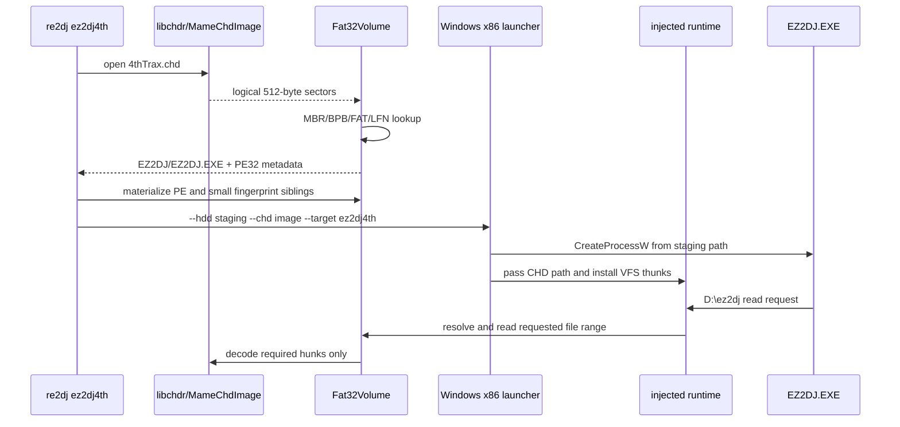

# 작업 114 — ez2dj4th FAT32/CHD 실행 연결 작업 로그

## 한국어

### 작업 요약

사용자가 제공한 `roms/ez2dj4th/4thTrax.chd`를 `libchdr`로 읽고, CHD 내부의 MBR/FAT32 파일시스템에서 `EZ2DJ/EZ2DJ.EXE`를 찾아 PE32 구조를 검증했습니다. 이후 `Fat32Volume` read-only 계층, CHD-backed Windows x86 VFS pseudo handle, 실행 파일 staging, `ez2dj4th` CLI 경로를 연결했습니다. 원본 CHD와 추출 이미지는 저장소에 추가하지 않았습니다.

### 확인된 실행 경로

CHD 파일은 `--hdd`에 직접 지정하거나, `--hdd`가 가리키는 디렉터리에 하나만 있는 `.chd` 파일로 지정할 수 있습니다. 프로파일 shortcut은 `roms/ez2dj4th`입니다. `--run` 없이 실행하면 CHD 파일시스템과 PE 정보를 출력하고, `--resolve D:\\ez2dj\\...`로 FAT 경로를 확인할 수 있습니다. Windows x86에서 `--run`을 사용하면 임시 staging 경로에서 원본 프로세스를 만들고 CHD 경로를 injected runtime에 전달합니다.

### 실제 CHD 검증 결과

수동으로 빌드한 `re2dj_chd_probe`로 실제 CHD를 읽어 다음을 확인했습니다.

* CHD v5, logical bytes `20,060,135,424`, hunk `4,096`, unit `512`.
* `GDDD` geometry: `CYLS:38869,HEADS:16,SECS:63,BPS:512`.
* MBR signature `55aa`; partition 0은 FAT32-LBA `0x0c`, start LBA `63`, length `39,166,407` sectors.
* FAT32 BPB: 512 bytes/sector, 32 sectors/cluster, reserved 32, FAT 2개, 9,558 sectors/FAT, root cluster 2, data LBA `19,211`.
* `EZ2DJ/EZ2DJ.EXE`: first cluster `232,139`, size `1,372,160` bytes.
* PE32/i386, Windows GUI subsystem, image base `0x00400000`, entry RVA `0x006e0240`, sections 6.
* LBA 0 읽기, hunk 경계 교차 16-byte 읽기, FAT directory lookup 및 EXE 전체 읽기가 모두 성공했습니다.

### 검증 명령과 결과

* `git diff --check`: 성공.
* MSVC x64 `/std:c++20 /W4 /WX` 수동 컴파일: CLI, FAT32 reader, CHD probe 성공.
* MSVC x86 `/std:c++20 /W4 /WX` 수동 컴파일: injected runtime, Windows x86 launcher, original-process backend 성공.
* 실제 CHD probe 종료 코드 0: FAT32 및 PE 출력 확인.
* 전체 CMake configure/build는 시도했으나 현재 환경에서 CMake 4.3의 기존 Renesas 전처리기 테스트 오류가 먼저 발생했고, VS CMake 3.31로 재시도한 구성은 SDL3 FetchContent GitHub clone 네트워크 제한으로 중단되었습니다. 이 외부 제한으로 전체 링크/CTest 결과를 새로 만들지는 못했습니다.

임시로 현재 소스의 x86 CLI/runtime를 링크하여 `re2dj ez2dj4th --run` 경로도 실제 CHD로 실행했습니다. `EZ2DJ.EXE`(1,372,160 bytes), `EZ2DJ.INI`, `FONTKR.DAT`, `FONTEN.DAT`가 `%TEMP%/re2dj/chd/ez2dj4th/EZ2DJ`에 materialize되었고, launcher diagnostic에는 원본 프로세스의 초기 breakpoint, CHD VFS mount, `LoadImageA` hook 준비가 기록되었습니다. 보호된 entry 이후 첫 `CreateFileA` handoff는 5초 내 관찰되지 않아 런처가 자식 프로세스를 종료하고 `runtime handoff was not observed before timeout`으로 끝났습니다. 따라서 CHD 읽기·staging·프로세스 생성·runtime 주입까지는 실제로 확인했지만, 4th 보호 실행의 첫 파일 접근과 게임 화면은 아직 확인하지 않았습니다.

### 남은 확인 사항

현재 구현은 원본 PE를 staging에서 생성하고 CHD-backed 파일 read를 연결한 상태입니다. 실제 보호 실행에서 첫 번째 추가 파일/API 접근, 화면 초기화, Hardlock 응답 시퀀스는 아직 관찰하지 않았으므로 `ez2dj4th`의 보호 실행이 게임 화면까지 도달한다고 확정하지 않습니다. 후속 작업에서 Windows x86 런처를 실제 자산과 함께 실행하고 VFS/Hardlock trace를 기록해야 합니다.

## English

### Summary

The user-supplied `roms/ez2dj4th/4thTrax.chd` was opened through `libchdr`. Its MBR and FAT32 structures were read directly from logical sectors, `EZ2DJ/EZ2DJ.EXE` was located, and its PE32 header was validated. The portable `Fat32Volume` read-only layer, Windows x86 CHD-backed VFS pseudo handles, executable staging, and the `ez2dj4th` CLI path are now connected. No original CHD or extracted image was added to Git.

The profile shortcut is `roms/ez2dj4th`. `--hdd` may name the CHD itself or a directory containing exactly one `.chd`. Without `--run`, the CLI reports the filesystem and PE facts; `--resolve D:\\ez2dj\\...` resolves a FAT path. On Windows x86, `--run` stages the PE and small fingerprint siblings, launches the original executable, and passes the CHD path to the injected runtime, which serves guest reads through the FAT32 view.

### Real-image evidence

The real probe confirmed CHD v5, 20,060,135,424 logical bytes, 4,096-byte hunks, 512-byte units, GDDD geometry `CYLS:38869,HEADS:16,SECS:63,BPS:512`, a FAT32-LBA partition at LBA 63, FAT32 data LBA 19,211, and `EZ2DJ/EZ2DJ.EXE` at cluster 232,139 with size 1,372,160 bytes. The executable is PE32/i386, Windows GUI, image base `0x00400000`, entry RVA `0x006e0240`, with six sections. LBA 0, a cross-hunk read, FAT directory lookup, and the complete executable read all succeeded.

### Verification and limits

`git diff --check` passed. Manual MSVC `/W4 /WX` compilation passed for the x64 CLI/FAT32/probe sources and the x86 injected runtime/launcher/backend sources. The real CHD probe exited with code 0. A full CMake build could not complete because the current CMake 4.3 setup fails an existing Renesas compiler test; a VS CMake 3.31 retry then stopped at the network-blocked SDL3 FetchContent clone.

An ad-hoc x86 link of the current CLI/runtime was also run against the real image. The launcher materialized `EZ2DJ.EXE` (1,372,160 bytes), `EZ2DJ.INI`, `FONTKR.DAT`, and `FONTEN.DAT` under `%TEMP%/re2dj/chd/ez2dj4th/EZ2DJ`. Its diagnostic recorded the original process's initial breakpoint, CHD VFS mount, and `LoadImageA` hook preparation. No first `CreateFileA` handoff was observed within the five-second wait, so the child was terminated with `runtime handoff was not observed before timeout`. This confirms CHD reading, staging, process creation, and runtime injection, but not the first protected 4th file access or the game screen.

The execution bridge is connected, but the first protected-runtime file/API sequence, display initialization, and Hardlock response sequence have not yet been observed for 4th Trax. The implementation therefore does not claim that the protected game reaches its gameplay screen; that requires a Windows x86 run with the supplied asset and trace capture.
