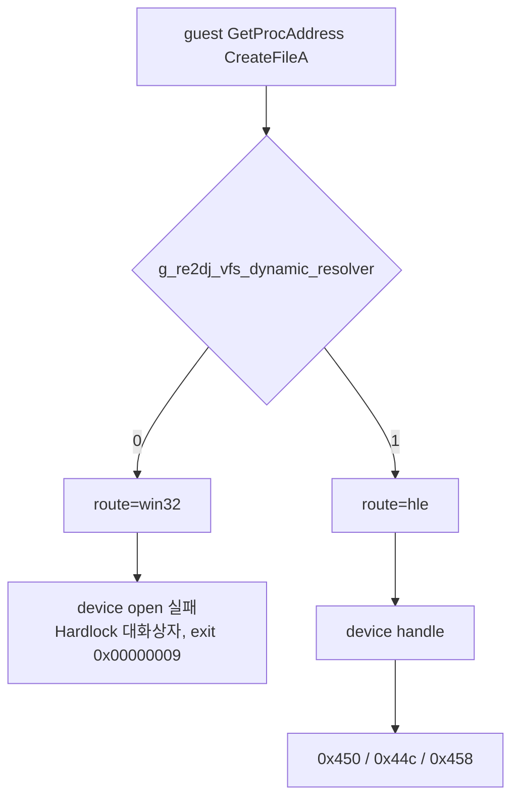

# ez2dj3rd transform challenge 관찰 작업 로그

관련 설계: [ez2dj3rd transform challenge 관찰](../design/20260902-138-ez2dj3rd-transform-challenge-observation.md), 관련 작업 지시: [작업 지시](../work-orders/20260902-138-ez2dj3rd-transform-challenge-observation.md)

*Related design: [ez2dj3rd transform challenge observation](../design/20260902-138-ez2dj3rd-transform-challenge-observation.md); related work order: [work order](../work-orders/20260902-138-ez2dj3rd-transform-challenge-observation.md).*

## 결과 — 32개다

3rd의 Function `0x0e` challenge는 **32개, 고유 28개**입니다. 기록된 18은 3rd 고유 규칙이 아니라 **잘린 관찰의 하한**이었습니다.

| 항목 | 값 |
| --- | --- |
| 요청 수 | 32 |
| 고유 값 | 28 |
| 중복 | `2cba42cbe47776f3` 4회, `1811bc0300613f52` 2회 |
| 종료 | 두 실행 모두 transform loop 이후 `0xc0000005` |

*The result — it is 32. 3rd's Function `0x0e` challenges number **32 with 28 unique**, so the recorded 18 was not a rule specific to 3rd but the lower bound of a truncated observation. Duplicates are `2cba42cbe47776f3` four times and `1811bc0300613f52` twice, and both runs ended at `0xc0000005` after the transform loop.*

## 유도 규칙 대조

4th와 같은 규칙을 3rd 원본 실행 파일에 적용해 32개를 유도하고 관찰 목록과 대조했습니다.

| section | raw 시작 | raw 크기 | 청크 |
| --- | --- | --- | --- |
| `.text` | `0x001000` | `0x0c1000` | 25 |
| `.rdata` | `0x0c2000` | `0x00b000` | 2 |
| `.data` | `0x0cd000` | `0x015000` | 3 |
| `.reloc` | `0x0e4000` | `0x00b000` | 2 |
| 합계 | | | **32** |

**값과 순서까지 정확히 일치했습니다.** 따라서 3rd도 re2DJ 실행 없이 원본 실행 파일만으로 challenge 목록을 만들 수 있고, reSoftlock 계약의 유도 규칙은 두 제품 공통입니다.

옛 18개 표는 새 목록의 앞 18개와 정확히 같습니다. `.text`의 25개 청크 중 18개까지만 남은 관찰이었습니다.

*Comparing the derivation rule: applying 4th's rule to 3rd's original executable produced 32 challenges — 25 in `.text`, 2 in `.rdata`, 3 in `.data`, 2 in `.reloc` — matching the observed list **exactly in value and order**. 3rd's list can therefore also be built from the original executable alone without running re2DJ, and the contract's derivation rule is common to both products. The old 18-entry table is identical to the first 18 entries of the new list: the observation had kept only 18 of `.text`'s 25 chunks.*

## 재현성

두 독립 실행이 값과 순서까지 동일한 32개를 기록했습니다.

- `20260902-124624-398`
- `20260902-124741-332`

*Reproducibility: two independent runs recorded the same 32 values in the same order.*

## 도중에 발견한 것 — 3rd는 dynamic resolver 없이 device에 도달하지 못한다

처음 두 번의 실행은 challenge를 하나도 기록하지 못했습니다. 원인은 보호 코드가 아니라 resolver 경로였습니다.



- 3rd는 보호 장치를 `GetProcAddress`로 해석한 `CreateFileA`로 엽니다.
- 이 resolver는 `hle_dynamic_vfs` profile 기본값으로만 켜지며, 그 기본값은 ez2dj4th에만 있습니다.
- 2026-08-31 3rd 실행 로그에는 `name=CreateFileA:route=hle`가 남아 있습니다. gate가 도입되기 전에는 3rd도 HLE 경로를 받았다는 뜻입니다. 이 gate는 `dff68eb`에서 들어왔습니다.
- gate 이후 3rd 실행은 `route=win32`가 되어 device mock이 open을 보지 못하고, `IOCTL`이 한 번도 발생하지 않은 채 `Hardlock` 대화상자와 종료 코드 `0x00000009`로 끝납니다.

**확인됨.** 관찰용으로 launcher 진단 flag `--hle-dynamic-vfs`를 추가했습니다. profile 기본값이 꺼져 있어도 resolver를 켭니다. flag를 주지 않으면 기존 동작 그대로입니다.

**제품 기본값은 바꾸지 않았습니다.** 3rd profile에 `hle_dynamic_vfs`를 켤지는 3rd 제품 정책 판단이므로 별도 작업으로 남깁니다. 현재 상태에서 3rd 제품 실행 경로는 여전히 보호 장치를 열지 못합니다.

*Found along the way — 3rd cannot reach the device without the dynamic resolver. The first two runs recorded no challenge at all, and the cause was the resolver route rather than the protection. 3rd opens its protection device through a `CreateFileA` resolved by `GetProcAddress`; that routing is enabled only by the `hle_dynamic_vfs` profile default, which only ez2dj4th carries. A 3rd run log from 2026-08-31 still shows `name=CreateFileA:route=hle`, so 3rd received the HLE route before the gate arrived in `dff68eb`; after it, 3rd runs take `route=win32`, the device mock never sees the open, and the run ends with a `Hardlock` dialog and exit code `0x00000009` without a single IOCTL. **Confirmed.** The launcher diagnostic flag `--hle-dynamic-vfs` was added for observation and turns the resolver on even when the profile default is off, with unchanged behavior when it is not given. **No product default was changed**: whether to enable `hle_dynamic_vfs` on the 3rd profile is a 3rd product-policy judgement left to a separate task, and 3rd's product path still cannot open the protection device.*

## 실행 명령

```powershell
build/windows-x86/bin/Debug/re2dj_windows_x86_launcher_probe.exe `
  --hdd roms/ez2dj3rd `
  --target ez2dj3rd --target-executable ez2dj/EZ2DJ.EXE `
  --run-detached --hle-directsound --hle-dynamic-vfs `
  --device-mock-lptdi-ioctl-full-success `
  --device-mock-wts-console-session `
  --device-mock-hardlock-450-response 0100fafa0010 `
  --device-mock-hardlock-44c-tail 0001 `
  --hardlock-transform-inputs
```

`0100fafa0010`과 `0001`은 기존 합성 진단값입니다. 실제 driver나 dongle 응답이 아니며, 이 실행에서 관찰된 동작을 원본 동작으로 인용하지 않습니다. challenge는 원본 이미지에서 온 암호문 바이트이므로 이 값들에 의존하지 않습니다.

*The `0100fafa0010` replay and `0001` tail are existing synthetic diagnostics, not real driver or dongle responses, so behavior observed under them is not cited as original behavior. The challenges themselves are ciphertext bytes from the original image and do not depend on those values.*

## 검증

- Windows x86 Debug launcher 빌드 성공, 경고 없음
- 두 실행이 동일한 32개 목록 기록
- 유도 목록이 관찰 목록을 값과 순서까지 재현 (`diff` 무차이)
- 원본 process 잔존 없음. 두 실행 모두 스스로 종료했고, 앞선 실패 실행의 자식 하나만 경로 확인 뒤 종료했습니다
- 원본 HDD와 overlay 변경 없음
- 관찰 목록 전체는 저장소에 커밋하지 않고, 분석 문서에는 section별 offset과 앞 세 값만 남겼습니다

*Verification: the Windows x86 Debug launcher built without warnings; two runs recorded the same 32-entry list; the derived list reproduced it in value and order with no `diff`; no original process remains, both runs having exited on their own with only one child from an earlier failed run terminated after a path check; the original HDD and overlay are unchanged; and the full observed list is not committed, with the analysis document carrying only per-section offsets and the first three values.*

## 다음 단계

1. 3rd profile의 `hle_dynamic_vfs` 기본값을 켤지 판단합니다. 3rd 제품 실행 경로가 보호 장치에 도달하려면 필요합니다.
2. reSoftlock이 3rd 매핑 파일을 주면 Stage 6 주입 실행을 돌립니다. 3rd는 28줄 매핑에 transform 줄 32개가 모두 `mapped=1:unmapped=0`이어야 합니다.
3. Stage 7 자동 판별을 위해 launcher probe에 게스트 memory dump 경로를 추가합니다 ([Task 137](20260902-137-decrypted-region-judge.md)의 남은 항목).

*Next: decide whether to enable `hle_dynamic_vfs` on the 3rd profile, which the 3rd product path needs to reach the protection device; run the Stage 6 injection once reSoftlock supplies 3rd map files, where a 28-line map must produce 32 transform lines all reading `mapped=1:unmapped=0`; and add the guest memory dump path to the launcher probe for Stage 7 automation, the item left over from Task 137.*
