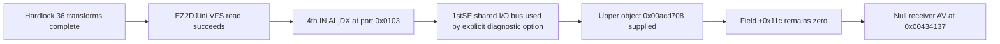

# v0.0.21 EZ2DJ 4th 다음 세션 인수인계

## 현재 도달점

Tasks 142–152는 실제 `4thTrax.chd`의 원본 `EZ2DJ/EZ2DJ.EXE`를 Windows x86 launcher 경로에서 실행하며, Hardlock 이후의 VFS와 raw I/O 경계를 통과한 뒤 남는 access violation을 상위 객체 field 초기화 문제로 좁혔습니다. 게임 자체는 아직 실행에 성공하지 않았습니다. launcher JSON의 `handoff=true`나 diagnostic log의 `outcome=status:success`는 계측 launcher가 예정된 경계까지 실행·수집을 마쳤다는 뜻이며, child는 여전히 `0x00434137 / 0xc0000005`로 종료합니다.



## 이번 버전에서 확인된 내용

- VFS는 staging HDD 또는 HLE Windows root 아래의 host absolute path를 guest-relative suffix로 다시 매핑합니다. `EZ2DJ.ini` 요청의 이중 결합이 제거되었고 원본 HDD는 읽기 전용이며 write는 overlay로 향합니다.
- Hardlock 설정은 Git-ignore된 `cfg/hardlock.ini`에서 로드됩니다. 36개 transform은 모두 `mapped=1:unmapped=0`으로 처리되며 비밀값과 response byte는 문서나 로그에 기록하지 않습니다.
- 기존 privileged fault는 `0x004c3817`의 `IN AL,DX`, port `0x0103`으로 확인되었습니다.
- `ez2dj1stse`가 사용하는 공용 `LegacyIoPortBus`/`Ez2DjIoBoard`를 4th의 확인된 read RVA `0x000c3817`에 연결했습니다. 4th는 물리 응답 계약이 확인되지 않았으므로 `--hle-io-ports` 명시 실행에서만 사용하고 제품 기본값은 계속 비활성입니다.
- 공용 I/O 경로는 `0x0103 -> 0x80`, `0x0104 -> 0x80`, `0x0105 -> 0x00`을 반환하고 privileged fault를 통과시켰지만, 그 값들이 실제 4th 보드 응답이라는 증거는 없습니다.
- 다음 실패는 `0x00434137`의 null receiver read입니다. caller chain에서 상위 객체 `0x00acd708`의 `+0x11c`, 즉 `0x00acd824`가 0으로 읽힙니다.
- 상위 객체 pointer는 runtime function boundary `0x0041a64c` 이후 `0x0041a668`의 `mov [EBP-0x118], ECX`로 stack local에 공급되며 당시 `ECX=0x00acd708`입니다. pointer 공급은 정상이고 field 초기화가 미해결입니다.
- process-create부터의 early write watch와 initial breakpoint 이후 write watch 모두 target field write를 관찰하지 못했습니다.
- 복호화된 runtime `.text` `0x00401000`–`0x004dc021` 전체 897,058바이트를 읽어 `+0x11c` syntactic 후보 23개를 찾았습니다. 분류는 read 16개, write 4개, other 3개입니다.

## 다음 세션의 첫 작업

네 direct-write 후보를 bounded execution trace로 감시하고, 실제 실행 hit의 receiver와 write target이 `0x00acd708 + 0x11c = 0x00acd824`인지 비교합니다.

| RVA | Runtime address | 명령 형태 | 확인할 receiver/value |
| --- | --- | --- | --- |
| `0x0000fdbd` | `0x0040fdbd` | `mov [ECX+0x11c], EAX` | `ECX`, `EAX`, target address |
| `0x0000fde1` | `0x0040fde1` | `mov [ECX+0x11c], imm32` | `ECX`, immediate, target address |
| `0x0001825f` | `0x0041825f` | `mov [EAX+0x11c], imm32` | `EAX`, immediate, target address |
| `0x0001dbd3` | `0x0041dbd3` | `mov [EDX+0x11c], ECX` | `EDX`, `ECX`, target address |

권장 구현은 전용 `--null-context-field-reference-execution-trace` 진단 옵션입니다. 네 x86 hardware execution breakpoint를 thread마다 설치하면 DR0–DR3을 모두 사용하므로 기존 source/field watch와 같은 실행에서 결합하지 않습니다. 각 hit에서 candidate index, EIP, receiver register, 계산된 target, write value, `target == 0x00acd824` 여부를 제한된 수로 기록합니다. C7 immediate는 runtime instruction에서 안전하게 읽고, target match 전에는 field 값을 바꾸지 않습니다.

판정은 다음과 같습니다.

1. target match와 nonzero write가 확인되면 해당 writer의 caller와 선행 HLE 경계를 추적합니다.
2. 후보는 실행되지만 target match가 없으면 동일 offset을 쓰는 다른 object type으로 분류합니다.
3. 네 후보가 first access 전에 target을 쓰지 않으면 간접 copy, 다른 section, 또는 static zero initialization 경로를 조사합니다.
4. 어느 경우에도 근거 없이 Hardlock response, I/O return, target field를 수정하지 않습니다.

## 재현 명령

먼저 Windows x86 Debug build와 unit test를 확인합니다.

```powershell
cmd /c scripts\build_win32.bat
.\build\windows-x86\bin\Debug\re2dj_unit_tests.exe
```

현재 마지막 진단과 동일한 실제 CHD 실행은 다음과 같습니다.

```powershell
.\build\windows-x86\bin\Debug\re2dj_windows_x86_launcher_probe.exe --hdd C:\Users\nworkers\AppData\Local\Temp\re2dj\chd\ez2dj4th --chd E:\MYWORK\Projects\re2DJ\roms\ez2dj4th\4thTrax.chd --target ez2dj4th --target-executable EZ2DJ\EZ2DJ.EXE --hle-io-ports --device-mock-lptdi --device-mock-wts-console-session --null-context-object-source-trace --null-context-field-access-trace
```

원본 CHD와 staging HDD는 로컬 입력이며 저장소에 추가하지 않습니다. `cfg/hardlock.ini`도 Git-ignore 상태를 유지하고 비밀 material을 명령행, JSONL, 문서에 출력하지 않습니다.

## 마지막 검증 증거

- Windows x86 Debug build: 통과
- Unit test: `checks: 1184, failures: 0`
- 최신 runtime scan: `logs/windows_x86_launcher_probe/ez2dj4th/20260903-032038-359.jsonl`
- pre-entry writer 확인: `logs/windows_x86_launcher_probe/ez2dj4th/20260903-031354-995.jsonl`
- 최신 실행 순서: source boundary 1회, dynamic source hit 2회, target-object match 1회, field access 1회, field value 0, child exit `0xc0000005`
- runtime scan summary: `readable=true`, `candidates=23`, `read_candidates=16`, `write_candidates=4`, `capped=false`

누적 근거는 [4th Hardlock runtime 분석](../analysis/ez2dj4th-hardlock-runtime.md)과 [Task 152 작업 로그](20260903-152-ez2dj4th-runtime-field-reference-scan.md)에 있습니다.

## 유지할 결정

- 원본 x86 EXE가 계속 주 실행 주체입니다.
- 4th의 raw I/O 공용 bus 연결은 진단 opt-in이며 제품 기본값이 아닙니다.
- Hardlock framing과 기존 response map을 통과한 뒤의 AV를 곧바로 Hardlock 직접 실패로 되돌려 분류하지 않습니다.
- `0x00acd824`를 직접 채우는 임시 patch는 initializer와 HLE 경계가 확인되기 전까지 추가하지 않습니다.
- 원본 CHD/HDD/EXE와 Hardlock secret은 저장하거나 커밋하지 않습니다.
- `logs/`, `cfg/`, staging HDD는 로컬 증거이며 Git 추적 대상이 아닙니다.

---

# v0.0.21 EZ2DJ 4th Next-Session Handoff

## Current milestone

Tasks 142–152 ran the original `EZ2DJ/EZ2DJ.EXE` from the real `4thTrax.chd` through the Windows x86 launcher path, passed the post-Hardlock VFS and raw-I/O boundaries, and narrowed the remaining access violation to an upper-object field-initialization problem. The game itself does not run successfully yet. `handoff=true` in launcher JSON or `outcome=status:success` in a diagnostic log means the instrumentation launcher completed its planned execution and collection boundary; the child still exits at `0x00434137 / 0xc0000005`.

## Confirmed in this version

- VFS remaps host-absolute paths under the staging HDD or HLE Windows root back to guest-relative suffixes. The `EZ2DJ.ini` double join is removed, original HDD input remains read-only, and writes go to the overlay.
- Hardlock configuration is loaded from Git-ignored `cfg/hardlock.ini`. All 36 transforms report `mapped=1:unmapped=0`; secrets and response bytes are not recorded in documentation or diagnostic output.
- The previous privileged fault is `IN AL,DX` at `0x004c3817`, port `0x0103`.
- The shared `LegacyIoPortBus`/`Ez2DjIoBoard` used by `ez2dj1stse` is connected to 4th's confirmed read RVA `0x000c3817`. Because the physical response contract is unconfirmed, 4th uses it only with explicit `--hle-io-ports`; product defaults remain disabled.
- The shared I/O path returns `0x0103 -> 0x80`, `0x0104 -> 0x80`, and `0x0105 -> 0x00` and passes the privileged fault, but these values are not confirmed physical 4th board responses.
- The next failure is a null-receiver read at `0x00434137`. The caller chain reads upper object `0x00acd708` field `+0x11c`, address `0x00acd824`, as zero.
- The upper-object pointer is supplied to the stack local by `mov [EBP-0x118], ECX` at `0x0041a668` after runtime function boundary `0x0041a64c`, with `ECX=0x00acd708`. Pointer supply succeeds; field initialization remains unresolved.
- Neither the process-create early write watch nor the post-initial-breakpoint write watch observed a write to the target field.
- A complete read of the decrypted runtime `.text`, `0x00401000`–`0x004dc021`, scanned 897,058 bytes and found 23 syntactic `+0x11c` candidates: 16 reads, four writes, and three other forms.

## First task next session

Bounded-trace the four direct-write candidates listed in the table above. For each execution hit, compare its receiver and calculated write target with `0x00acd708 + 0x11c = 0x00acd824`. A dedicated `--null-context-field-reference-execution-trace` option using the four x86 hardware execution breakpoints is the recommended implementation. Since this occupies DR0–DR3, do not combine it with the existing source/field watches in the same run.

Record candidate index, EIP, receiver register, calculated target, write value, and target-match status under an event cap. Read C7 immediates safely from runtime instructions. Do not change the field before a target match is confirmed.

## Reproduction and verification

Use the build, unit-test, and real-CHD commands above. The latest evidence logs are `20260903-032038-359.jsonl` for the runtime scan and `20260903-031354-995.jsonl` for the pre-entry writer watch. The latest automated verification passed the Windows x86 Debug build and reported `checks: 1184, failures: 0`.

The CHD, staging HDD, and `cfg/hardlock.ini` are local inputs. Do not add them to Git or expose Hardlock secret material in commands, JSONL, or documentation.

## Decisions to preserve

- The original x86 executable remains the primary executing subject.
- 4th shared raw-I/O reuse remains diagnostic opt-in, not a product default.
- Do not reclassify the later AV as a direct Hardlock failure without new evidence.
- Do not add a temporary direct patch for `0x00acd824` before identifying the initializer and HLE boundary.
- Never store or commit original CHD/HDD/EXE assets or Hardlock secrets.
- `logs/`, `cfg/`, and the staging HDD remain local, untracked evidence.
