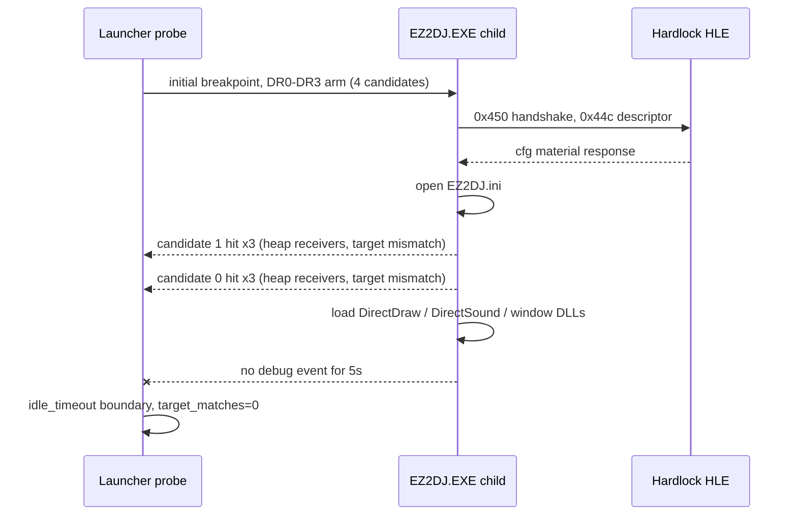

# Task 154: EZ2DJ 4th field writer 실행 추적 작업 로그

## 결과 요약

Task 152에서 정적으로 수집한 네 개의 `+0x11c` write 후보를 실제 실행 중 hardware execution breakpoint로 관찰했습니다. 두 번의 동일 실행에서 후보 hit는 각각 6건이었고, **`target_matches`는 0건**이었습니다. 관찰된 receiver는 모두 heap 영역의 서로 다른 객체였고 image-resident target object `0x00acd708`과 일치하지 않았습니다. 따라서 네 후보 중 어느 것도 관찰 구간에서 `0x00acd824`를 초기화하지 않습니다.

다만 이번 환경에서는 이전 세션이 기록한 field read anchor `0x0041a699` 도달과 `0x00434137 / 0xc0000005` AV가 **재현되지 않았습니다.** 따라서 "target match 없음"은 관찰된 구간에 한정된 확인이며, 첫 field access 직전 구간 전체를 덮지 못했습니다.

## 변경 사항

- launcher probe에 `--null-context-field-reference-execution-trace` 옵션과 usage 문자열을 추가했습니다.
- 네 후보 RVA를 `DR0`–`DR3` local execution breakpoint로 설치하는 준비 경로를 추가했습니다. primary thread와 CREATE_THREAD로 보고된 새 thread 모두에 설치합니다.
- hit에서 candidate index, receiver register/value, 계산된 `receiver + 0x11c`, target field, write source/value, `C7` immediate 읽기 상태, code window를 JSONL로 기록합니다.
- 후보 instruction은 breakpoint를 잠시 끄고 `TF` 단일-step으로 한 번 실행한 뒤 다음 single-step event에서 `DR0`–`DR3`를 복구합니다. field 값, 원본 instruction, Hardlock 응답, VFS 경로는 변경하지 않았습니다.
- 기존 slot writer / object source / field writer / field access / early writer 하드웨어 추적과의 동시 사용을 CLI에서 거부합니다.
- `ARCHITECTURE.md`에 진단 옵션 설명을 추가했습니다.

## 검증 증거

- Windows x86 Debug 전체 빌드: 성공 (설치된 CMake 절대 경로로 구성)
- `build/windows-x86/bin/Debug/re2dj_unit_tests.exe`: `checks: 1184, failures: 0`
- 실제 CHD 실행 로그
  - Run A: `logs/windows_x86_launcher_probe/ez2dj4th/20260903-113127-946.jsonl`
  - Run B(재현 확인): `logs/windows_x86_launcher_probe/ez2dj4th/20260903-113352-952.jsonl`
  - Baseline C(기존 옵션 조합): `logs/windows_x86_launcher_probe/ez2dj4th/20260903-113251-040.jsonl`

### 준비 상태

`null_context_field_reference_execution_trace_ready`: `prepared=true`, `target_object=0x00acd708`, `target_field=0x00acd824`, `candidate_count=4`. 후보 주소는 `0x0040fdbd`, `0x0040fde1`, `0x0041825f`, `0x0041dbd3`이며 thread arm event는 6건입니다.

### 후보 hit (Run A와 Run B 동일)

| sequence | candidate | receiver | 계산된 target | write source/value | target match |
| --- | --- | --- | --- | --- | --- |
| 1 | 1 (`0x0040fde1`) | `0x00946d50` | `0x00946e6c` | immediate `0x00000000` | false |
| 2 | 1 (`0x0040fde1`) | `0x00947220` | `0x0094733c` | immediate `0x00000000` | false |
| 3 | 1 (`0x0040fde1`) | `0x009476f0` | `0x0094780c` | immediate `0x00000000` | false |
| 4 | 0 (`0x0040fdbd`) | `0x00947bc0` | `0x00947cdc` | `EAX = 0x0094806c` | false |
| 5 | 0 (`0x0040fdbd`) | `0x00947bc0` | `0x00947cdc` | `EAX = 0x0094806c` | false |
| 6 | 0 (`0x0040fdbd`) | `0x00948090` | `0x009481ac` | `EAX = 0x0094853c` | false |

boundary: `reason=idle_timeout`, `hits=6`, `recorded=6`, `target_matches=0`, `pending=0`, `capped=false`.

### 실행 순서

### 단일-step 복구

`null_context_field_reference_execution_rearmed` 6건의 `eip_after`는 각각 `0x0040fdeb`(= `0x0040fde1 + 10`)와 `0x0040fdc3`(= `0x0040fdbd + 6`)이었습니다. 즉 원본 명령이 정확히 한 번 실행된 뒤 breakpoint가 복구되었고, 미완료 pending은 0건이었습니다.

## 판정

- **확인됨 — 네 후보는 target field를 쓰지 않습니다.** 관찰된 6건의 hit는 모두 `target_matches=false`였고, 두 실행에서 receiver·값·순서가 완전히 동일했습니다.
- **확인됨 — 후보 0과 1은 다른 객체 class입니다.** 서로 다른 receiver 다섯 개(`0x00946d50`, `0x00947220`, `0x009476f0`, `0x00947bc0`, `0x00948090`)는 간격 `0x4d0`으로 배치된 heap 객체이며, image-resident `0x00acd708`과 다릅니다. 후보 0은 `receiver + 0x4ac`를 `+0x11c`에 저장하는 내부 self-pointer 형태입니다.
- **확인됨 — 후보 2와 3은 실행되지 않았습니다.** `0x0041825f`와 `0x0041dbd3`는 관찰 구간에서 hit가 없었습니다.
- **확인됨 — 이번 환경에서 기존 fault 순서가 재현되지 않습니다.** 동일 바이너리로 Tasks 150–152와 같은 옵션(`--null-context-object-source-trace --null-context-field-access-trace`)을 실행한 Baseline C는 object-source boundary hit 0건, field access hit 0건이었고 `0xc0000005`가 전혀 발생하지 않았습니다. 세 실행 모두 Hardlock descriptor IOCTL과 `EZ2DJ.ini` 열기 직후 DirectDraw·DirectSound·window 관련 DLL을 적재한 뒤 5초 동안 debug event가 없어 `idle_timeout`으로 종료됐습니다. 관찰된 fault는 `0x004c3817`의 `in al, dx` privileged instruction 3건(`0xc0000096`)뿐입니다.
- **미확정 — 첫 field access 직전 구간 전체.** 위 이유로 이번 trace는 이전 세션이 관찰한 field read anchor `0x0041a699` 도달 이전 구간을 끝까지 덮지 못했습니다. 후보가 그 이후 구간에서 target을 쓸 가능성은 배제되지 않았습니다.
- **판정 — 조사 방향 전환 근거.** Task 146의 write watch(hit 0건), Task 146의 absolute reference scan(`matches=0`), Task 151의 pre-entry watch(hit 0건), 그리고 이번 실행 추적(target match 0건)을 합치면, 이 field는 사용 시점까지 **어떤 관찰된 경로로도 쓰이지 않습니다.** 다음 질문은 "어느 명령이 쓰는가"가 아니라 "원래 초기화했어야 할 경로가 왜 실행되지 않는가"입니다.

## 다음 단계

1. 이번 환경에서 child가 `EZ2DJ.ini` 이후 5초 동안 조용해지는 지점을 먼저 규명합니다. 그래픽·사운드 HLE 경계(`--hle-d3d3`, `--hle-directsound`, `--hle-vfs`)를 조합해 실행이 field read anchor까지 진행되는 조합을 찾습니다.
2. 관찰 구간이 복원되면 target object `0x00acd708`의 다른 field가 초기화되었는지 확인해, 객체 자체가 초기화되지 않은 것인지 특정 field만 비어 있는지 구분합니다.
3. field read anchor를 포함하는 함수의 호출자 경로를 역추적해, 초기화 분기가 건너뛰어지는 조건을 확인합니다.
4. target match가 확인되기 전까지 field 직접 주입과 Hardlock 응답 변경은 계속 보류합니다.

원본 CHD/HDD/EXE 내용과 Hardlock secret material은 이 문서와 저장소에 기록하지 않았습니다.

---

# Task 154: EZ2DJ 4th Field-Writer Execution Trace Work Log

## Result summary

The four static `+0x11c` write candidates from Task 152 were observed at runtime with hardware execution breakpoints. Two identical runs each recorded six candidate hits and **zero `target_matches`**. Every observed receiver was a distinct heap object and none equaled the image-resident target object `0x00acd708`. None of the four candidates therefore initializes `0x00acd824` within the observed window.

However, this environment did **not** reproduce the previously recorded arrival at field-read anchor `0x0041a699` or the `0x00434137 / 0xc0000005` AV. "No target match" is therefore confirmed only for the observed window and does not cover the full interval preceding the first field access.

## Changes

- Added the `--null-context-field-reference-execution-trace` option and usage text to the launcher probe.
- Added the preparation path that installs the four candidate RVAs as `DR0`–`DR3` local execution breakpoints on the primary thread and on every thread reported by CREATE_THREAD.
- Hits record candidate index, receiver register/value, calculated `receiver + 0x11c`, target field, write source/value, `C7` immediate-read status, and the code window as JSONL.
- Candidate instructions execute exactly once with the breakpoints temporarily disabled and `TF` set; `DR0`–`DR3` are restored on the following single-step event. Field values, original instructions, Hardlock responses, and the VFS path are unchanged.
- The CLI rejects concurrent use with the existing slot-writer, object-source, field-writer, field-access, and early-writer hardware traces.
- Documented the diagnostic option in `ARCHITECTURE.md`.

## Verification evidence

- Full Windows x86 Debug build: passed (configured with the installed CMake absolute path).
- `build/windows-x86/bin/Debug/re2dj_unit_tests.exe`: `checks: 1184, failures: 0`
- Real-CHD execution logs
  - Run A: `logs/windows_x86_launcher_probe/ez2dj4th/20260903-113127-946.jsonl`
  - Run B (reproduction): `logs/windows_x86_launcher_probe/ez2dj4th/20260903-113352-952.jsonl`
  - Baseline C (previous option set): `logs/windows_x86_launcher_probe/ez2dj4th/20260903-113251-040.jsonl`

### Preparation

`null_context_field_reference_execution_trace_ready` reported `prepared=true`, `target_object=0x00acd708`, `target_field=0x00acd824`, and `candidate_count=4`. The candidate addresses were `0x0040fdbd`, `0x0040fde1`, `0x0041825f`, and `0x0041dbd3`, with six thread-arm events.

### Candidate hits (identical in Run A and Run B)

| sequence | candidate | receiver | calculated target | write source/value | target match |
| --- | --- | --- | --- | --- | --- |
| 1 | 1 (`0x0040fde1`) | `0x00946d50` | `0x00946e6c` | immediate `0x00000000` | false |
| 2 | 1 (`0x0040fde1`) | `0x00947220` | `0x0094733c` | immediate `0x00000000` | false |
| 3 | 1 (`0x0040fde1`) | `0x009476f0` | `0x0094780c` | immediate `0x00000000` | false |
| 4 | 0 (`0x0040fdbd`) | `0x00947bc0` | `0x00947cdc` | `EAX = 0x0094806c` | false |
| 5 | 0 (`0x0040fdbd`) | `0x00947bc0` | `0x00947cdc` | `EAX = 0x0094806c` | false |
| 6 | 0 (`0x0040fdbd`) | `0x00948090` | `0x009481ac` | `EAX = 0x0094853c` | false |

Boundary: `reason=idle_timeout`, `hits=6`, `recorded=6`, `target_matches=0`, `pending=0`, `capped=false`.

### Execution order

### Single-step restoration

The six `null_context_field_reference_execution_rearmed` events reported `eip_after` values of `0x0040fdeb` (= `0x0040fde1 + 10`) and `0x0040fdc3` (= `0x0040fdbd + 6`). Each original instruction executed exactly once before the breakpoints were restored, and no pending single-step remained.

## Classification

* **Confirmed — the four candidates do not write the target field.** All six observed hits reported `target_matches=false`, and receivers, values, and ordering were identical across both runs.
* **Confirmed — candidates 0 and 1 belong to a different object class.** The five distinct receivers (`0x00946d50`, `0x00947220`, `0x009476f0`, `0x00947bc0`, `0x00948090`) are heap objects spaced `0x4d0` apart and differ from the image-resident `0x00acd708`. Candidate 0 stores the interior self-pointer `receiver + 0x4ac` into `+0x11c`.
* **Confirmed — candidates 2 and 3 never executed.** `0x0041825f` and `0x0041dbd3` produced no hits in the observed window.
* **Confirmed — the previously recorded fault order does not reproduce in this environment.** Baseline C ran the same binary with the Task 150–152 option set (`--null-context-object-source-trace --null-context-field-access-trace`) and recorded zero object-source boundary hits, zero field-access hits, and no `0xc0000005` at all. All three runs loaded DirectDraw, DirectSound, and window DLLs right after the Hardlock descriptor IOCTL and the `EZ2DJ.ini` open, then produced no debug event for five seconds and ended at `idle_timeout`. The only observed faults were three `0xc0000096` privileged-instruction events for `in al, dx` at `0x004c3817`.
* **Unresolved — the complete interval before the first field access.** For that reason this trace does not cover the whole interval leading to field-read anchor `0x0041a699` observed in the previous session. A candidate write to the target later in that interval is not excluded.
* **Classification — basis for changing investigation direction.** Combining Task 146's write watch (zero hits), Task 146's absolute-reference scan (`matches=0`), Task 151's pre-entry watch (zero hits), and this execution trace (zero target matches), the field is **not written by any observed path** before it is used. The next question is not which instruction writes it, but why the path that should have initialized it does not run.

## Next steps

1. First determine why the child goes quiet for five seconds after `EZ2DJ.ini` in this environment. Combine the graphics and sound HLE boundaries (`--hle-d3d3`, `--hle-directsound`, `--hle-vfs`) to find a configuration that advances execution to the field-read anchor.
2. Once the observation window is restored, check whether other fields of target object `0x00acd708` are initialized, to distinguish an entirely uninitialized object from a single empty field.
3. Backtrack the caller path of the function containing the field-read anchor to identify the condition that skips the initialization branch.
4. Keep direct field injection and Hardlock-response changes deferred until a target match is confirmed.

No original CHD/HDD/EXE content or Hardlock secret material was recorded in this document or the repository.
