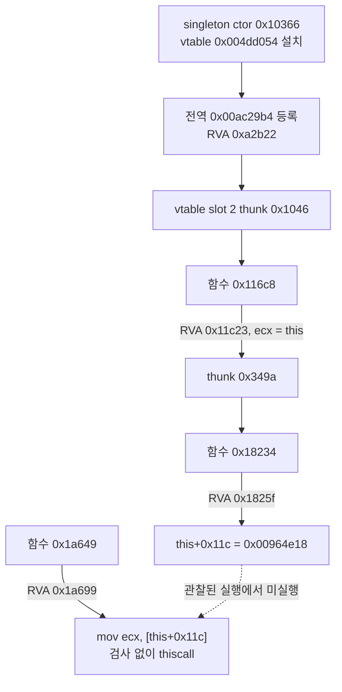
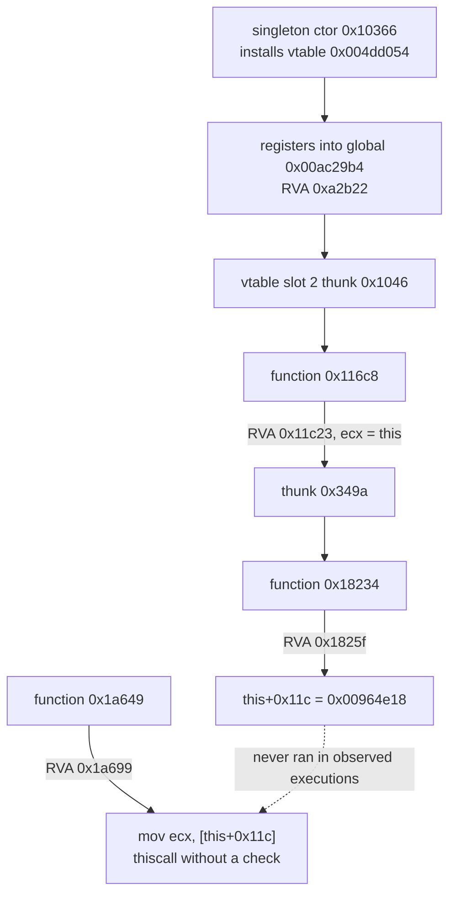

# Task 160: EZ2DJ 4th field initializer 호출 체인 작업 로그

## 결과 요약

**`0x00acd708 + 0x11c`를 채우는 코드를 찾았습니다.** write 후보 2(`RVA 0x0001825f`)는 자기 함수의 `this`에 대해 `mov dword ptr [this+0x11c], 0x00964e18`을 수행합니다. 그 함수는 `RVA 0x00018234`이고, thunk `0x0000349a`를 통해 **단 한 곳**(`RVA 0x00011c23`)에서 호출되며, 그 호출 지점을 포함하는 함수는 `RVA 0x000116c8`, 그 thunk는 `0x00001046`으로 **singleton vtable slot 2와 같습니다.**

즉 이 field는 singleton 클래스의 **가상 메서드 index 2**가 실행될 때 채워집니다. 관찰된 실행에서는 그 메서드가 호출되지 않았고, 그래서 field가 0으로 남아 null receiver AV로 이어집니다.

나머지 후보도 정리됐습니다. 후보 3은 `this`가 아니라 고정 주소 `0x00964e68`의 field를 씁니다. 후보 0·1은 Task 159에서 확인한 대로 다른 클래스의 배열 원소 초기화입니다. 따라서 **후보 2가 singleton `+0x11c`의 유일한 writer입니다.**

## 변경 사항

- 공용 코어 `code_scan`에 `ScanRelativeBranches`를 추가했습니다. 버퍼 안의 `call rel32`·`jmp rel32` 중 목적지가 지정 주소와 같은 것을 찾는 순수 함수이며, 32비트 wrap을 그대로 따르고 상한을 넘어도 계속 세어 `total_sites`를 유지합니다.
- 단위 테스트를 추가했습니다. `call`과 `jmp` 양쪽, 상한 초과 총계, 32비트 wrap 역방향 분기, 목적지 불일치, 짧은 버퍼, null 입력을 확인합니다.
- launcher probe가 각 anchor의 함수 시작에 대해 두 단계 분기 추적을 수행하고 `null_context_branch_scan`·`null_context_branch_site` 이벤트를 기록합니다.
- anchor에 후보 2·3과 후보 2의 호출 지점을 추가했습니다.
- prologue 역방향 검색 범위를 `0x400`에서 `0x2000`으로 넓혔습니다. `0x00011c23`의 함수 시작이 1371바이트 앞에 있어 기존 범위로는 찾지 못했습니다.

## 검증 증거

- Windows x86 Debug 전체 빌드: 성공
- `build/windows-x86/bin/Debug/re2dj_unit_tests.exe`: `checks: 1233, failures: 0` (Task 159 시점 1219에서 14개 증가)
- 실제 CHD 실행: `20260903-172826-488.jsonl`, 호출 지점 anchor 추가 후 `20260903-173021-584.jsonl`, prologue 범위 확대 후 `20260903-173115-277.jsonl` (모두 `--diagnostic-idle-timeout 60000`)

### 추적 방법 자기 검증

field read 함수 `0x0041a649`를 목적지로 하는 분기는 정확히 1개이며 `jmp`(thunk) `0x00401ac3`입니다. 그 thunk를 목적지로 하는 호출은 165건입니다. 이는 Task 157의 호출자 창(`call 0x00401ac3`)과 Task 158의 callee 집계(가장 빈번한 대상 `0x00001ac3`)와 일치하므로, 두 단계 추적이 올바르게 동작함을 확인합니다.

### 확인된 호출 체인

| 단계 | RVA | 내용 |
| --- | --- | --- |
| 생성 | `0x000a2958` | `mov ecx, obj` 후 thunk `0x0000344a` 호출 → 생성자 `0x00010366` |
| 등록 | `0x000a2b22` | 전역 `0x00ac29b4`에 객체 주소 저장 |
| 가상 메서드 | vtable slot 2 = `0x00001046` | thunk → 함수 `0x000116c8` |
| 초기화 호출 | `0x00011c23` | `mov ecx, [ebp-0x284]`(this) 후 thunk `0x0000349a` 호출 |
| field write | `0x0001825f` | 함수 `0x00018234`에서 `mov dword ptr [this+0x11c], 0x00964e18` |
| field read | `0x0001a699` | 함수 `0x0001a649`에서 `mov ecx, [this+0x11c]` 후 즉시 thiscall |

### 후보별 write receiver

| 후보 | RVA | 함수 | write 대상 |
| --- | --- | --- | --- |
| 0 | `0x0000fdbd` | `0x0000fc57` | 배열 원소 `0x00946d50 + n*0x4d0`의 `+0x11c` |
| 1 | `0x0000fde1` | `0x0000fc57` | 같은 원소의 `+0x11c` (else 분기) |
| 2 | `0x0001825f` | `0x00018234` | **함수의 `this`** 의 `+0x11c`, 값 `0x00964e18` |
| 3 | `0x0001dbd3` | `0x0001db3e` | 고정 주소 `0x00964e68`의 `+0x11c` |

후보 3의 함수 본문은 `mov dword ptr [ebp-0x20], 0x00964e68`으로 대상을 고정한 뒤 `+0x110`에 인자, `+0x114`에 `0x14`, `+0x118`에 `5`를 쓰고 `[+0x110] * ([+0x114] + 1)`을 `+0x11c`에 씁니다. 즉 크기 계산 결과를 저장하는 별개 객체용 코드입니다.

### 분기 추적 결과

| anchor | 함수 | 함수로 가는 분기 | thunk | thunk 호출 지점 |
| --- | --- | --- | --- | --- |
| field_read | `0x0001a649` | 1 (thunk) | `0x00001ac3` | 165 |
| write_candidate_0/1 | `0x0000fc57` | 0 | — | — |
| write_candidate_2 | `0x00018234` | 1 (thunk) | `0x0000349a` | 1 |
| write_candidate_3 | `0x0001db3e` | 1 (thunk) | `0x00003071` | 3 |
| candidate_2_call_site | `0x000116c8` | 1 (thunk) | `0x00001046` | 0 |
| vtable_store_0 | `0x00010366` | 1 (thunk) | `0x0000344a` | 2 |
| vtable_store_1 | `0x00010479` | 1 (thunk) | `0x000026a3` | 2 |

## 판정

- **확인됨 — 후보 2는 자기 `this`의 field를 씁니다.** 함수 `0x00018234`는 `mov [ebp-0x100], ecx`로 `this`를 저장한 뒤 `mov dword ptr [eax+0x11c], 0x00964e18`을 수행합니다. 따라서 singleton을 receiver로 이 함수가 실행되면 field가 채워집니다.
- **확인됨 — 후보 2의 함수는 한 곳에서만 호출됩니다.** thunk `0x0000349a`를 목적지로 하는 호출은 `RVA 0x00011c23` 하나뿐입니다.
- **확인됨 — 그 호출 지점은 `this`를 receiver로 넘깁니다.** 함수 `0x000116c8`은 진입 시 `mov [ebp-0x284], ecx`로 `this`를 저장하고, `0x00011c23` 직전에 `mov ecx, [ebp-0x284]`로 되읽습니다.
- **확인됨 — 그 함수는 singleton 클래스의 가상 메서드입니다.** 함수 `0x000116c8`의 thunk는 `0x00001046`이며, 이는 Task 157이 기록한 singleton vtable slot 2의 값과 같습니다. 이 thunk를 목적지로 하는 `call rel32`는 0건이므로 호출은 vtable을 통해서만 일어납니다.
- **확인됨 — 후보 3은 고정 객체 전용입니다.** receiver가 `this`가 아니라 상수 `0x00964e68`입니다.
- **확인됨 — 후보 0·1의 함수는 rel32로 불리지 않습니다.** `0x0000fc57`을 목적지로 하는 분기가 0건이므로 간접 호출 대상이거나 함수 시작 추정이 다를 수 있습니다. 어느 쪽이든 Task 159에서 확인한 배열 원소 초기화라는 결론은 바뀌지 않습니다.
- **판정 — singleton `+0x11c`의 유일한 writer는 후보 2이며, 가상 메서드 slot 2를 통해서만 도달합니다.** 관찰된 실행에서 후보 2는 한 번도 실행되지 않았고, 따라서 slot 2 메서드가 singleton에 대해 호출되지 않았습니다. field는 0으로 남고, 검사 없는 read가 null receiver AV로 이어집니다.
- **추정 — 값 `0x00964e18`과 후보 3의 `0x00964e68`은 같은 정적 테이블의 이웃 항목입니다.** 두 주소는 `0x50` 간격이며 모두 `.data` 범위입니다. 항목의 의미는 확인하지 않았습니다.
- **미확정 — slot 2 메서드가 호출되지 않는 이유.** 호출 주체와 조건은 아직 관찰되지 않았습니다. field 직접 주입과 Hardlock 응답 변경은 계속 보류합니다.

## 다음 단계

1. 함수 `0x004116c8` 진입에 execution breakpoint를 걸어 실행 중 호출 여부와 receiver를 확인합니다.
2. 호출되지 않는다면 singleton vtable slot 2를 가상 호출하는 지점(`call [reg+8]` 형태)을 찾아 그 앞 분기를 확인합니다.
3. 그 분기가 Hardlock·장치 초기화 결과에 의존하는지 확인해, HLE 경계 중 어디를 채워야 하는지 판정합니다.

원본 CHD/HDD/EXE 내용과 Hardlock secret material은 이 문서와 저장소에 기록하지 않았습니다.

---

# Task 160: EZ2DJ 4th Field-Initializer Call Chain Work Log

## Result summary

**The code that fills `0x00acd708 + 0x11c` has been found.** Write candidate 2 (`RVA 0x0001825f`) performs `mov dword ptr [this+0x11c], 0x00964e18` on its own function's `this`. That function is `RVA 0x00018234`, called from exactly **one** site (`RVA 0x00011c23`) through thunk `0x0000349a`; the function containing that site is `RVA 0x000116c8`, whose thunk `0x00001046` **equals singleton vtable slot 2**.

The field is therefore filled when **virtual method index 2** of the singleton's class runs. In the observed executions that method was never called on the singleton, so the field stayed zero and led to the null-receiver AV.

The other candidates are settled too. Candidate 3 writes the field of the fixed address `0x00964e68` rather than `this`, and candidates 0 and 1 are the array-element initialization confirmed in Task 159. **Candidate 2 is therefore the only writer of the singleton's `+0x11c`.**

## Changes

- Added `ScanRelativeBranches` to the shared-core `code_scan`: a pure function that finds every `call rel32` and `jmp rel32` whose destination equals a given address, following 32-bit wrap and keeping `total_sites` complete past the record cap.
- Added unit tests covering both `call` and `jmp`, totals past the cap, a backward branch through the 32-bit wrap, a non-matching destination, short buffers, and null input.
- The launcher probe now performs two-stage branch tracing for each anchor's function start and records `null_context_branch_scan` and `null_context_branch_site` events.
- Added candidates 2 and 3 and candidate 2's call site to the anchors.
- Widened the backward prologue search from `0x400` to `0x2000`; the function start for `0x00011c23` lies 1371 bytes back and was missed by the old range.

## Verification evidence

- Full Windows x86 Debug build: passed.
- `build/windows-x86/bin/Debug/re2dj_unit_tests.exe`: `checks: 1233, failures: 0` (14 more than the 1219 at Task 159).
- Real-CHD runs: `20260903-172826-488.jsonl`, then `20260903-173021-584.jsonl` after adding the call-site anchor, then `20260903-173115-277.jsonl` after widening the prologue range, all with `--diagnostic-idle-timeout 60000`.

### Self-check of the tracing method

Exactly one branch targets the field-read function `0x0041a649`, and it is the `jmp` thunk `0x00401ac3`; 165 calls target that thunk. This agrees with Task 157's caller window (`call 0x00401ac3`) and Task 158's callee tally (most frequent target `0x00001ac3`), confirming the two-stage tracing works.

### Confirmed call chain

| stage | RVA | content |
| --- | --- | --- |
| construction | `0x000a2958` | `mov ecx, obj` then call thunk `0x0000344a` → constructor `0x00010366` |
| registration | `0x000a2b22` | stores the object address into the global `0x00ac29b4` |
| virtual method | vtable slot 2 = `0x00001046` | thunk → function `0x000116c8` |
| initializer call | `0x00011c23` | `mov ecx, [ebp-0x284]` (this) then call thunk `0x0000349a` |
| field write | `0x0001825f` | in function `0x00018234`: `mov dword ptr [this+0x11c], 0x00964e18` |
| field read | `0x0001a699` | in function `0x0001a649`: `mov ecx, [this+0x11c]` then an immediate thiscall |

### Write receiver per candidate

| candidate | RVA | function | write target |
| --- | --- | --- | --- |
| 0 | `0x0000fdbd` | `0x0000fc57` | `+0x11c` of array element `0x00946d50 + n*0x4d0` |
| 1 | `0x0000fde1` | `0x0000fc57` | `+0x11c` of the same element (else branch) |
| 2 | `0x0001825f` | `0x00018234` | `+0x11c` of the **function's `this`**, value `0x00964e18` |
| 3 | `0x0001dbd3` | `0x0001db3e` | `+0x11c` of the fixed address `0x00964e68` |

Candidate 3's function body fixes its target with `mov dword ptr [ebp-0x20], 0x00964e68`, writes an argument to `+0x110`, `0x14` to `+0x114`, and `5` to `+0x118`, then stores `[+0x110] * ([+0x114] + 1)` into `+0x11c`. It is size-computation code for a separate object.

### Branch tracing results

| anchor | function | branches to function | thunk | call sites on thunk |
| --- | --- | --- | --- | --- |
| field_read | `0x0001a649` | 1 (thunk) | `0x00001ac3` | 165 |
| write_candidate_0/1 | `0x0000fc57` | 0 | — | — |
| write_candidate_2 | `0x00018234` | 1 (thunk) | `0x0000349a` | 1 |
| write_candidate_3 | `0x0001db3e` | 1 (thunk) | `0x00003071` | 3 |
| candidate_2_call_site | `0x000116c8` | 1 (thunk) | `0x00001046` | 0 |
| vtable_store_0 | `0x00010366` | 1 (thunk) | `0x0000344a` | 2 |
| vtable_store_1 | `0x00010479` | 1 (thunk) | `0x000026a3` | 2 |

## Classification

* **Confirmed — candidate 2 writes the field of its own `this`.** Function `0x00018234` stores `this` with `mov [ebp-0x100], ecx` and then performs `mov dword ptr [eax+0x11c], 0x00964e18`. Running this function with the singleton as receiver fills the field.
* **Confirmed — candidate 2's function has exactly one call site.** Only `RVA 0x00011c23` targets thunk `0x0000349a`.
* **Confirmed — that call site passes `this` as the receiver.** Function `0x000116c8` stores `this` at entry with `mov [ebp-0x284], ecx` and reloads it with `mov ecx, [ebp-0x284]` right before `0x00011c23`.
* **Confirmed — that function is a virtual method of the singleton's class.** Its thunk is `0x00001046`, the value Task 157 recorded for singleton vtable slot 2, and no `call rel32` targets that thunk, so it is reached only through the vtable.
* **Confirmed — candidate 3 serves a fixed object.** Its receiver is the constant `0x00964e68` rather than `this`.
* **Confirmed — candidates 0 and 1's function is not called through rel32.** No branch targets `0x0000fc57`, so it is an indirect-call target or the function-start guess differs. Either way the Task 159 conclusion that it initializes array elements is unchanged.
* **Classification — candidate 2 is the only writer of the singleton's `+0x11c`, reachable only through virtual slot 2.** Candidate 2 never executed in the observed runs, so the slot 2 method was never invoked on the singleton. The field stays zero and the unchecked read leads to the null-receiver AV.
* **Inferred — the value `0x00964e18` and candidate 3's `0x00964e68` are neighboring entries of one static table.** They are `0x50` apart and both lie in `.data`. The meaning of the entries was not established.
* **Unresolved — why the slot 2 method is not called.** The caller and its condition have not been observed. Direct field injection and Hardlock-response changes remain deferred.

## Next steps

1. Set an execution breakpoint on the entry of function `0x004116c8` to see whether it is called at runtime and with which receiver.
2. If it is not called, locate the sites that virtually call singleton vtable slot 2 (`call [reg+8]` shape) and inspect the branch preceding them.
3. Determine whether that branch depends on Hardlock or device-initialization results, to decide which HLE boundary must be filled.

No original CHD/HDD/EXE content or Hardlock secret material was recorded in this document or the repository.
