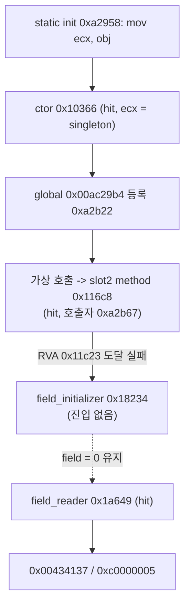
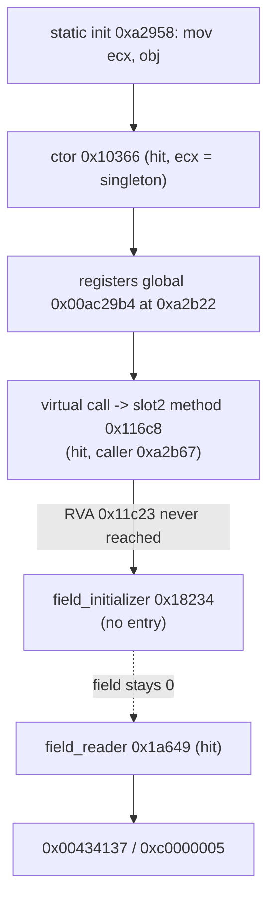

# Task 161: EZ2DJ 4th initializer 진입 추적 작업 로그

## 결과 요약

체인이 끊기는 위치가 확정됐습니다.

- **singleton 생성자는 실행됩니다.** `ECX = 0x00acd708`으로 진입하며 호출자는 `RVA 0x000a2965`입니다.
- **vtable slot 2 메서드도 실행됩니다.** 같은 receiver로 진입하며 호출자는 `RVA 0x000a2b67`, 즉 전역 등록 지점 바로 뒤의 정적 초기화 구간입니다.
- **그런데 field initializer는 한 번도 진입하지 않습니다.** slot 2 메서드 안의 유일한 호출 지점(`RVA 0x00011c23`)에 도달하지 못합니다.
- **field reader는 실행되고 AV로 이어집니다.** 같은 receiver로 진입하며 호출자는 `RVA 0x00071905`입니다.

따라서 문제는 "초기화 메서드가 호출되지 않는 것"이 아니라 **"호출된 초기화 메서드가 field write 지점 이전에 경로를 벗어나는 것"**입니다. 두 실행에서 동일하게 재현됐습니다.

## 변경 사항

- `--null-context-entry-trace` 옵션과 usage 문자열을 추가했습니다.
- 네 함수 진입(`0x000116c8`, `0x00018234`, `0x0001a649`, `0x00010366`)을 `DR0`–`DR3` execution breakpoint로 설치하고 새 thread에도 설치합니다.
- breakpoint가 함수 첫 바이트에서 걸리므로 `[ESP]`를 읽어 호출자 반환 주소를 함께 기록합니다. hit마다 진입 이름·RVA, `EIP`, `ECX`, singleton 일치 여부, `ESP`, 반환 주소와 RVA를 남깁니다.
- hit 후 breakpoint를 끄고 `TF`로 한 번 통과한 뒤 다음 single-step에서 복구합니다.
- 진입별 기록 상한 8과 boundary 요약을 연결하고, 기존 하드웨어 추적 옵션 및 `ez2dj4th` 외 target을 거부합니다.

## 검증 증거

- Windows x86 Debug 전체 빌드: 성공
- `build/windows-x86/bin/Debug/re2dj_unit_tests.exe`: `checks: 1233, failures: 0`
- 실제 CHD 실행: `20260903-174026-243.jsonl`, 재현 실행 `20260903-174125-316.jsonl` (둘 다 `--diagnostic-idle-timeout 60000`)
- 두 실행의 hit 집합과 boundary는 thread id와 event 수를 제외하고 완전히 동일합니다.
- boundary: `reason=child_exit`, `hits=3`, `recorded=3`, `singleton_receivers=3`, `pending=0`, `capped=false`, `code=0xc0000005`

### 진입 결과

| 순서 | 진입 | RVA | `ECX` | singleton | 호출자 RVA |
| --- | --- | --- | --- | --- | --- |
| 1 | singleton_constructor | `0x00010366` | `0x00acd708` | true | `0x000a2965` |
| 2 | vtable_slot2_method | `0x000116c8` | `0x00acd708` | true | `0x000a2b67` |
| — | field_initializer | `0x00018234` | — | — | **진입 없음** |
| 3 | field_reader | `0x0001a649` | `0x00acd708` | true | `0x00071905` |

## 판정

- **확인됨 — 생성자와 slot 2 메서드는 singleton을 receiver로 실행됩니다.** 세 hit 모두 `receiver_is_singleton=true`이며 `singleton_receivers=3`입니다.
- **확인됨 — slot 2 메서드의 호출자는 정적 초기화 구간입니다.** 반환 주소 `RVA 0x000a2b67`은 Task 157이 확인한 전역 등록 지점 `0x000a2b22` 직후입니다. 즉 생성 → 등록 → 초기화 메서드 호출이 한 구간에서 이어집니다.
- **확인됨 — field initializer는 진입하지 않습니다.** 상한 8에 걸리지 않았고 `capped=false`이므로 기록 누락이 아니라 실제 미진입입니다.
- **확인됨 — 진단은 실행을 바꾸지 않습니다.** 종료 코드는 기존과 같은 `0xc0000005`입니다.
- **판정 — 원인은 slot 2 메서드 내부의 조기 이탈입니다.** 메서드는 `0x000116c8`에서 시작하고 초기화 호출은 `0x00011c23`으로 1371바이트 뒤에 있습니다. 그 사이에서 분기나 조기 반환이 일어납니다.
- **추정 — 그 사이 코드는 장치·자원 생성입니다.** Task 158에서 이 singleton이 그래픽·장치 계열 관리자로 추정되었고, Task 160의 호출 지점 앞에는 `call [eax+0x40]` 형태의 가상 호출이 있습니다. 실패 시 조기 반환하는 초기화 절차로 보이지만, 어떤 호출이 실패하는지는 확인하지 않았습니다.
- **미확정 — 이탈 지점과 조건.** field 직접 주입과 Hardlock 응답 변경은 계속 보류합니다.

## 다음 단계

1. slot 2 메서드 본문(`0x000116c8`–`0x00011c30`)을 큰 코드 창으로 수집해 조기 반환 지점과 분기 구조를 확인합니다.
2. 본문 안의 호출 대상을 해석해 어떤 하위 초기화가 실패하는지 좁힙니다.
3. 그 실패가 Hardlock·장치·자산 경계 중 어디에 의존하는지 판정해, 채워야 할 HLE 경계를 정합니다.

원본 CHD/HDD/EXE 내용과 Hardlock secret material은 이 문서와 저장소에 기록하지 않았습니다.

---

# Task 161: EZ2DJ 4th Initializer Entry Trace Work Log

## Result summary

The break in the chain is now located.

- **The singleton constructor runs.** It is entered with `ECX = 0x00acd708`, called from `RVA 0x000a2965`.
- **The vtable slot 2 method also runs.** It is entered with the same receiver, called from `RVA 0x000a2b67`, the static-initialization span just after the global registration.
- **The field initializer is never entered.** The single call site inside the slot 2 method (`RVA 0x00011c23`) is not reached.
- **The field reader runs and leads to the AV.** It is entered with the same receiver, called from `RVA 0x00071905`.

The problem is therefore not that the initialization method goes uncalled, but that **the called initialization method leaves its path before the field write**. Both runs reproduced identically.

## Changes

- Added the `--null-context-entry-trace` option and usage text.
- Installed the four function entries (`0x000116c8`, `0x00018234`, `0x0001a649`, `0x00010366`) as `DR0`–`DR3` execution breakpoints, including on new threads.
- Because the breakpoint fires on the function's first byte, `[ESP]` is read to record the caller's return address. Each hit records the entry name and RVA, `EIP`, `ECX`, singleton equality, `ESP`, and the return address with its RVA.
- After a hit the breakpoints are disabled, `TF` steps once past the entry, and they are restored on the following single-step.
- Connected a per-entry record limit of eight and the boundary summaries, and rejected the existing hardware traces and non-`ez2dj4th` targets.

## Verification evidence

- Full Windows x86 Debug build: passed.
- `build/windows-x86/bin/Debug/re2dj_unit_tests.exe`: `checks: 1233, failures: 0`
- Real-CHD runs: `20260903-174026-243.jsonl` and the reproduction `20260903-174125-316.jsonl`, both with `--diagnostic-idle-timeout 60000`.
- The hit sets and boundaries are identical across both runs apart from thread ids and event counts.
- Boundary: `reason=child_exit`, `hits=3`, `recorded=3`, `singleton_receivers=3`, `pending=0`, `capped=false`, `code=0xc0000005`.

### Entry results

| order | entry | RVA | `ECX` | singleton | caller RVA |
| --- | --- | --- | --- | --- | --- |
| 1 | singleton_constructor | `0x00010366` | `0x00acd708` | true | `0x000a2965` |
| 2 | vtable_slot2_method | `0x000116c8` | `0x00acd708` | true | `0x000a2b67` |
| — | field_initializer | `0x00018234` | — | — | **no entry** |
| 3 | field_reader | `0x0001a649` | `0x00acd708` | true | `0x00071905` |

## Classification

* **Confirmed — the constructor and the slot 2 method run with the singleton as receiver.** All three hits report `receiver_is_singleton=true`, and `singleton_receivers=3`.
* **Confirmed — the slot 2 method's caller is the static-initialization span.** The return address `RVA 0x000a2b67` sits just after the global registration site `0x000a2b22` that Task 157 identified, so construction, registration, and the initialization call follow one another in one span.
* **Confirmed — the field initializer is not entered.** The record limit of eight was never reached and `capped=false`, so this is a real absence rather than a recording gap.
* **Confirmed — the diagnostic does not change execution.** The exit code is the same `0xc0000005` as before.
* **Classification — the cause is an early exit inside the slot 2 method.** The method starts at `0x000116c8` and the initialization call is at `0x00011c23`, 1371 bytes later; a branch or early return occurs in between.
* **Inferred — the intervening code is device or resource creation.** Task 158 inferred this singleton to be a graphics or device manager, and the call site in Task 160 is preceded by a `call [eax+0x40]` virtual call. It reads as an initialization sequence that returns early on failure, but which call fails was not established.
* **Unresolved — the exit point and its condition.** Direct field injection and Hardlock-response changes remain deferred.

## Next steps

1. Collect the slot 2 method body (`0x000116c8`–`0x00011c30`) with a larger code window and identify the early-return point and branch structure.
2. Resolve the call targets inside that body to narrow which sub-initialization fails.
3. Determine whether that failure depends on the Hardlock, device, or asset boundary, to decide which HLE boundary must be filled.

No original CHD/HDD/EXE content or Hardlock secret material was recorded in this document or the repository.
