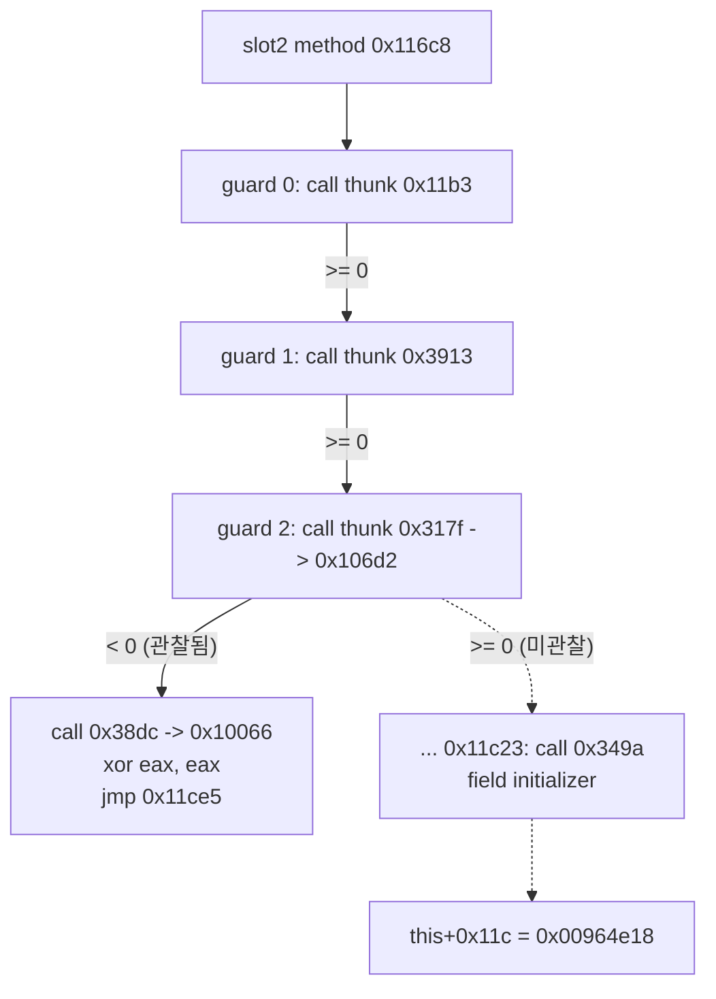
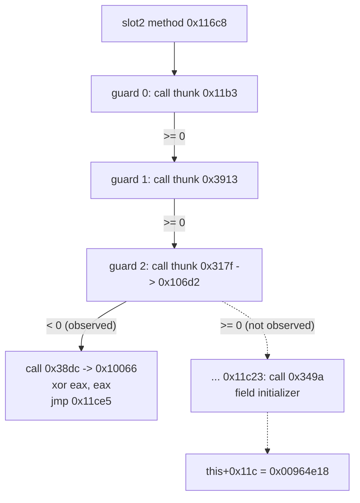

# Task 162: EZ2DJ 4th slot 2 메서드 조기 이탈 분석 작업 로그

## 결과 요약

**실패하는 호출을 특정했습니다.** vtable slot 2 메서드는 세 개의 "실패 시 반환" guard를 가지며, 실행은 **세 번째 guard**(`RVA 0x00011838`의 `jmp`)를 탑니다. 그 직전 호출은 `RVA 0x00011823`의 `call`이고, thunk `RVA 0x0000317f`를 거쳐 함수 **`RVA 0x000106d2`**로 갑니다. 이 호출이 음수를 반환하면 메서드는 오류 보고 함수(thunk `0x000038dc` → `RVA 0x00010066`)를 부른 뒤 `EAX = 0`으로 반환하고, 그래서 field initializer 호출(`RVA 0x00011c23`)에 도달하지 못합니다.

## 변경 사항

- 공용 코어 `code_scan`에 `ListNearBranches`를 추가했습니다. 지정 범위에서 `call rel32`, `jmp rel32/rel8`, `jcc rel8`, 두 바이트 `0f 8x jcc rel32`를 선형으로 훑어 목적지를 계산하는 순수 함수이며, 짧은 변위는 부호 확장합니다. 상한을 넘어도 계속 세어 `total_branches`를 유지합니다.
- 단위 테스트를 추가했습니다. 네 가지 분기 형태, 음수 짧은 변위, 범위 제한, 상한 초과 총계, 경계 입력을 확인합니다.
- launcher probe가 함수 범위의 분기 목록과 `skips_call` 표시를 기록합니다.
- 진입 추적 대상을 세 이탈 후보와 초기화 함수로 바꾸고 hit 기록에 `EAX`·`EDX`를 추가했습니다.
- 이탈 지점 세 곳과 guard·오류 thunk를 anchor·body 목록에 추가했습니다.

## 검증 증거

- Windows x86 Debug 전체 빌드: 성공
- `build/windows-x86/bin/Debug/re2dj_unit_tests.exe`: `checks: 1253, failures: 0` (Task 161 시점 1233에서 20개 증가)
- 실제 CHD 실행: 분기 목록 `20260903-174816-357.jsonl`, 이탈 측정 `20260903-175046-180.jsonl`, thunk 해석 `20260903-175539-518.jsonl` (모두 `--diagnostic-idle-timeout 60000`)

### 자기 검증

메서드 범위 `0x000116c8`–`0x00011c48`의 분기 목록은 110건이며 `capped=false`입니다. 목록에 초기화 호출 지점이 `RVA 0x00011c23`, `opcode=0xe8`, 대상 `RVA 0x0000349a`로 나타나 Task 160의 정적 결과와 일치합니다.

### 세 개의 guard

세 곳 모두 같은 형태입니다.

```
          e8 ...                call <thunk>
          83 c4 xx              add  esp, n
          89 45 b4              mov  [ebp-0x4c], eax     <- 반환값
          83 7d b4 00           cmp  dword ptr [ebp-0x4c], 0
          7d 07                 jge  +7                  <- 성공이면 계속
          33 c0                 xor  eax, eax
          e9 ...                jmp  0x00011ce5          <- 실패면 반환
```

| guard | `jmp` RVA | 직전 call RVA | thunk | 비고 |
| --- | --- | --- | --- | --- |
| 0 | `0x00011714` | `0x00011701` | `0x000011b3` | 인자 `[this+0xd0]` |
| 1 | `0x00011738` | `0x00011725` | `0x00003913` | 인자 `this+0x48`, `0` |
| 2 | `0x00011838` | `0x00011823` | `0x0000317f` | receiver `this`, 인자 `[ecx+4]` |

guard 2만 실패 시 `jmp` 앞에 오류 보고 호출(`RVA 0x00011831`, thunk `0x000038dc`)이 하나 더 있습니다.

### 실행 측정

세 `jmp` 주소를 `DR0`–`DR3`로 감시한 결과 hit는 **1건**이며 `slot2_early_exit_2`(`RVA 0x00011838`)입니다. `EAX = 0x00000000`인데, 이는 `jmp` 직전 `xor eax, eax`가 실행된 뒤의 값이므로 반환값 자체가 아니라 반환 준비 상태입니다. 같은 실행에서 `field_initializer` hit는 0건이고 boundary는 `reason=child_exit`, `hits=1`, `capped=false`, `code=0xc0000005`입니다.

### thunk 해석

| thunk RVA | 대상 RVA |
| --- | --- |
| `0x0000317f` | `0x000106d2` (실패하는 호출) |
| `0x000038dc` | `0x00010066` (오류 보고) |



## 판정

- **확인됨 — 메서드에는 실패 시 반환하는 guard가 세 개 있습니다.** 세 곳 모두 `cmp [ebp-0x4c], 0` 뒤 `jge`와 `xor eax, eax` · `jmp 0x00011ce5` 형태입니다.
- **확인됨 — 실행은 guard 2에서 이탈합니다.** 세 `jmp`를 동시에 감시했을 때 hit는 `0x00011838` 1건뿐입니다.
- **확인됨 — 실패하는 호출은 `RVA 0x00011823`이며 대상은 `RVA 0x000106d2`입니다.** 호출은 thunk `0x0000317f`를 거칩니다. receiver는 메서드의 `this`이고 인자는 다른 객체의 `[ecx+4]`입니다.
- **확인됨 — 실패 경로에만 오류 보고 호출이 있습니다.** `RVA 0x00011831`의 호출은 thunk `0x000038dc`를 거쳐 `RVA 0x00010066`으로 갑니다.
- **확인됨 — 분기 목록은 정적 결과와 일치합니다.** 초기화 호출 지점이 목록에 그대로 나타납니다.
- **추정 — guard는 HRESULT 형태의 실패 검사입니다.** 부호 비교로 음수를 실패로 처리하는 형태이며, 반환값의 실제 의미는 확인하지 않았습니다.
- **미확정 — `0x000106d2`가 왜 실패하는가.** 이 함수의 동작과 의존 경계는 아직 관찰되지 않았습니다. field 직접 주입과 Hardlock 응답 변경은 계속 보류합니다.

## 다음 단계

1. 함수 `0x000106d2`에 진입 breakpoint를 걸어 인자와 반환값을 관찰하고, 반환 직전 분기를 확인합니다.
2. 그 함수 본문의 분기와 호출 대상을 같은 방식으로 목록화해 실패 원인을 좁힙니다.
3. 실패가 IAT를 통한 외부 호출에 의존하면 해당 import를 확인해, 채워야 할 HLE 경계를 판정합니다.

원본 CHD/HDD/EXE 내용과 Hardlock secret material은 이 문서와 저장소에 기록하지 않았습니다.

---

# Task 162: EZ2DJ 4th Slot 2 Method Early-Exit Analysis Work Log

## Result summary

**The failing call is identified.** The vtable slot 2 method has three return-on-failure guards, and execution takes the **third** one (the `jmp` at `RVA 0x00011838`). The call before it is at `RVA 0x00011823` and goes through thunk `RVA 0x0000317f` to function **`RVA 0x000106d2`**. When that call returns a negative value, the method calls an error reporter (thunk `0x000038dc` → `RVA 0x00010066`), returns with `EAX = 0`, and therefore never reaches the field-initializer call at `RVA 0x00011c23`.

## Changes

- Added `ListNearBranches` to the shared-core `code_scan`: a pure function that linearly walks a range for `call rel32`, `jmp rel32/rel8`, `jcc rel8`, and the two-byte `0f 8x jcc rel32`, resolving destinations and sign-extending short displacements. It keeps counting past the cap so `total_branches` stays complete.
- Added unit tests covering the four branch forms, a negative short displacement, range limiting, totals past the cap, and boundary inputs.
- The launcher probe records the branch listing for a function range with the `skips_call` marking.
- Pointed the entry trace at the three exit candidates and the initializer, and added `EAX` and `EDX` to its hit records.
- Added the three exit sites and the guard and error thunks to the anchor and body lists.

## Verification evidence

- Full Windows x86 Debug build: passed.
- `build/windows-x86/bin/Debug/re2dj_unit_tests.exe`: `checks: 1253, failures: 0` (20 more than the 1233 at Task 161).
- Real-CHD runs: branch listing `20260903-174816-357.jsonl`, exit measurement `20260903-175046-180.jsonl`, and thunk resolution `20260903-175539-518.jsonl`, all with `--diagnostic-idle-timeout 60000`.

### Self-check

The branch listing for the method range `0x000116c8`–`0x00011c48` holds 110 entries with `capped=false`. The initializer call site appears in it as `RVA 0x00011c23`, `opcode=0xe8`, target `RVA 0x0000349a`, matching Task 160's static result.

### The three guards

All three share one shape.

```
          e8 ...                call <thunk>
          83 c4 xx              add  esp, n
          89 45 b4              mov  [ebp-0x4c], eax     <- return value
          83 7d b4 00           cmp  dword ptr [ebp-0x4c], 0
          7d 07                 jge  +7                  <- continue on success
          33 c0                 xor  eax, eax
          e9 ...                jmp  0x00011ce5          <- return on failure
```

| guard | `jmp` RVA | preceding call RVA | thunk | note |
| --- | --- | --- | --- | --- |
| 0 | `0x00011714` | `0x00011701` | `0x000011b3` | argument `[this+0xd0]` |
| 1 | `0x00011738` | `0x00011725` | `0x00003913` | arguments `this+0x48`, `0` |
| 2 | `0x00011838` | `0x00011823` | `0x0000317f` | receiver `this`, argument `[ecx+4]` |

Only guard 2 has an extra error-reporting call (`RVA 0x00011831`, thunk `0x000038dc`) before its `jmp`.

### Execution measurement

Watching the three `jmp` addresses in `DR0`–`DR3` produced exactly **one** hit, `slot2_early_exit_2` (`RVA 0x00011838`). `EAX = 0x00000000` there, which is the state after the preceding `xor eax, eax` rather than the returned value itself. In the same run `field_initializer` had zero hits, and the boundary reports `reason=child_exit`, `hits=1`, `capped=false`, `code=0xc0000005`.

### Thunk resolution

| thunk RVA | target RVA |
| --- | --- |
| `0x0000317f` | `0x000106d2` (the failing call) |
| `0x000038dc` | `0x00010066` (error reporting) |



## Classification

* **Confirmed — the method has three return-on-failure guards.** Each is `cmp [ebp-0x4c], 0` followed by `jge`, then `xor eax, eax` and `jmp 0x00011ce5`.
* **Confirmed — execution exits at guard 2.** Watching all three `jmp` addresses together produced only the one hit at `0x00011838`.
* **Confirmed — the failing call is at `RVA 0x00011823` and targets `RVA 0x000106d2`.** It goes through thunk `0x0000317f`, with the method's `this` as receiver and an argument taken from another object's `[ecx+4]`.
* **Confirmed — only the failure path reports an error.** The call at `RVA 0x00011831` goes through thunk `0x000038dc` to `RVA 0x00010066`.
* **Confirmed — the branch listing agrees with the static result.** The initializer call site appears in the listing unchanged.
* **Inferred — the guards are HRESULT-style failure checks.** They treat negative values as failure through a signed comparison; the actual meaning of the return value was not established.
* **Unresolved — why `0x000106d2` fails.** Its behavior and dependency boundary have not been observed. Direct field injection and Hardlock-response changes remain deferred.

## Next steps

1. Set an entry breakpoint on function `0x000106d2` to observe its arguments and return value, and inspect the branch before its return.
2. List that function's branches and call targets the same way to narrow the cause of failure.
3. If the failure depends on an external call through the IAT, resolve that import to decide which HLE boundary must be filled.

No original CHD/HDD/EXE content or Hardlock secret material was recorded in this document or the repository.
