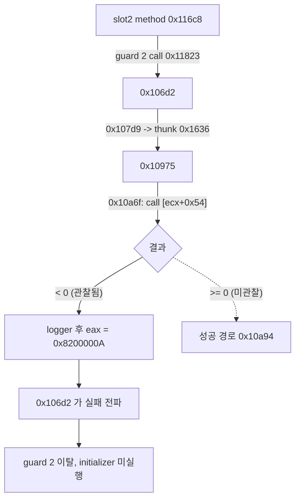
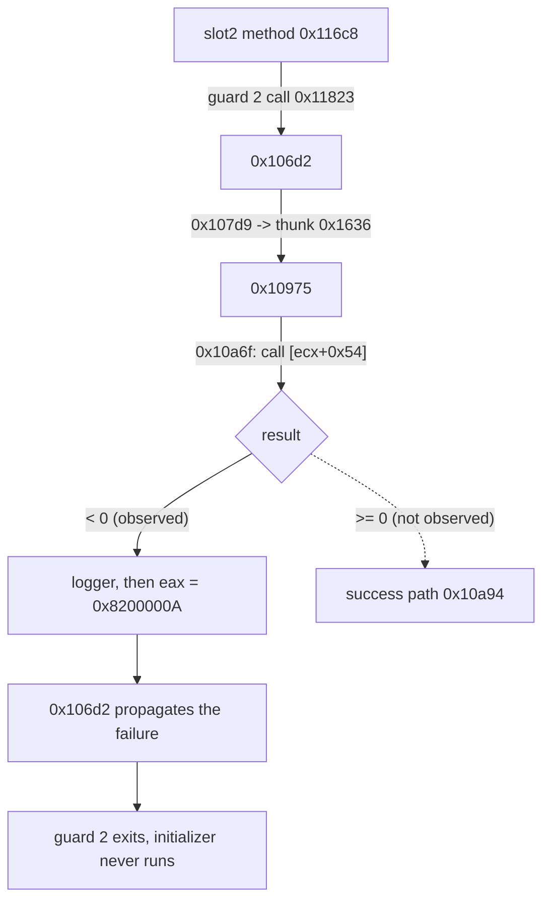

# Task 163: EZ2DJ 4th guard 실패 원인 추적 작업 로그

## 결과 요약

**초기화가 중단되는 직접 원인을 특정했습니다.** 세 guard의 반환값을 관찰한 결과 guard 0과 1은 `EAX = 0`으로 통과하고, guard 2만 `EAX = 0x8200000A`로 실패합니다. 이 값은 복호화된 `.text` 전체에서 **단 한 곳**, `RVA 0x00010a8a`의 `mov eax, 0x8200000A`에서만 생성됩니다.

그 지점은 `RVA 0x00010a6f`의 **COM 형태 가상 호출 `call dword ptr [ecx+0x54]`** 실패 경로입니다. 호출 대상 인터페이스 포인터는 `[this+0x28]`에서 읽습니다. 실패하면 메시지 포인터를 밀어 넣고 로거를 호출한 뒤 위 상수를 반환합니다.

함수 관계도 닫혔습니다. 실패 함수 `RVA 0x00010975`의 호출자는 `RVA 0x000107d9` 한 곳뿐이고, 그 주소는 guard 2의 대상 함수 `RVA 0x000106d2` 안에 있습니다.

## 변경 사항

- 진입 추적 대상을 세 guard의 호출 반환 지점(`0x00011706`, `0x0001172a`, `0x00011828`)과 guard 2 대상 함수 진입(`0x000106d2`)으로 교체했습니다.
- 참조 스캔 값 목록에 관찰된 실패 코드 `0x8200000a`를 추가했습니다.
- anchor 목록에 `guard2_target_entry`(`0x000106d2`)와 `guard2_failure_site`(`0x00010a7b`)를, body 목록에 `guard2_target`(`0x000106d2`, `0x400`바이트)을 추가했습니다.

## 검증 증거

- Windows x86 Debug 전체 빌드: 성공
- `build/windows-x86/bin/Debug/re2dj_unit_tests.exe`: `checks: 1253, failures: 0` (공용 코어 변경 없음)
- 실제 CHD 실행: 반환값 관찰 `20260903-192806-776.jsonl`, 실패 코드 스캔 `20260903-192957-170.jsonl`, 실패 지점 코드 창 `20260903-193112-757.jsonl` (모두 `--diagnostic-idle-timeout 60000`)

### guard 반환값

| 순서 | 지점 | RVA | `EAX` | `ECX` | 판정 |
| --- | --- | --- | --- | --- | --- |
| 1 | guard0_return | `0x00011706` | `0x00000000` | — | 통과 |
| 2 | guard1_return | `0x0001172a` | `0x00000000` | — | 통과 |
| 3 | guard2_target_entry | `0x000106d2` | `0x00000000` | `0x00acd708` | 진입, receiver는 singleton |
| 4 | guard2_return | `0x00011828` | `0x8200000a` | `0x00acd708` | **실패** |

boundary는 `reason=child_exit`, `hits=4`, `recorded=4`, `singleton_receivers=2`, `capped=false`, `code=0xc0000005`입니다.

### 실패 코드의 유일한 생성 지점

`.text` 전체 스캔에서 `0x8200000a`의 `total`은 1이고 `capped=false`입니다. 위치는 `RVA 0x00010a8a`입니다.

### 실패 지점 코드

```
00010a60  8b 42 28              mov  eax, [edx+0x28]
00010a63  8b 8d 58 ff ff ff     mov  ecx, [ebp-0xa8]        <- this
00010a69  8b 51 28              mov  edx, [ecx+0x28]        <- 인터페이스 포인터
00010a6c  8b 0a                 mov  ecx, [edx]             <- 그 객체의 vtable
00010a6e  50                    push eax
00010a6f  ff 51 54              call dword ptr [ecx+0x54]   <- 가상 호출, index 21
00010a72  3b f4                 cmp  esi, esp
00010a74  e8 ...                call <stack check>
00010a79  85 c0                 test eax, eax
00010a7b  7d 17                 jge  0x00010a94             <- 성공 경로
00010a7d  68 ec b3 4e 00        push <message pointer>
00010a82  e8 ...                call <logger, thunk 0x1d7a>
00010a87  83 c4 04              add  esp, 4
00010a8a  b8 0a 00 00 82        mov  eax, 0x8200000A
00010a8f  e9 ...                jmp  0x00010cac             <- 반환
```

### 함수 관계

| 항목 | 값 |
| --- | --- |
| 실패 함수 시작 | `RVA 0x00010975` |
| 그 thunk | `RVA 0x00001636` |
| thunk 호출자 | `RVA 0x000107d9` (총 1건) |
| 그 주소가 속한 함수 | `RVA 0x000106d2` (guard 2 대상) |



### 오류 코드 계열

실패 함수 바로 앞 함수는 같은 형태로 `0x8200000C`를 반환합니다(`RVA 0x000106b9`의 `mov [ebp-0x10], 0x8200000C`). 따라서 `0x8200000N`은 이 프로그램이 정의한 오류 코드 계열입니다.

### 인접 관찰

실패 함수 `0x00010975`의 시작부는 다섯 인자를 밀어 넣고 `call dword ptr [0x00ad1908]`을 수행합니다. `.idata`가 RVA `0x006d1000`, 크기 `0x0000171c`이므로 이 주소(RVA `0x006d1908`)는 IAT slot 범위 안입니다.

## 판정

- **확인됨 — guard 0과 1은 통과하고 guard 2만 실패합니다.** 반환 지점에서 각각 `EAX = 0`, `0`, `0x8200000a`입니다.
- **확인됨 — guard 2 대상 함수는 singleton을 receiver로 진입합니다.** `0x000106d2` 진입 시 `ECX = 0x00acd708`입니다.
- **확인됨 — 실패 코드의 생성 지점은 `.text`에서 유일합니다.** `RVA 0x00010a8a`이며 `total=1`, `capped=false`입니다.
- **확인됨 — 실패 판정은 가상 호출 결과에 대한 부호 검사입니다.** `0x00010a6f`의 `call dword ptr [ecx+0x54]` 뒤 `test eax, eax`와 `jge`가 성공 경로를 고릅니다.
- **확인됨 — 호출 체인이 닫힙니다.** 실패 함수 `0x00010975`의 유일한 호출자 `0x000107d9`는 guard 2 대상 함수 `0x000106d2` 안에 있습니다.
- **확인됨 — `0x8200000N`은 프로그램 정의 오류 계열입니다.** 인접 함수가 같은 형태로 `0x8200000C`를 반환합니다.
- **추정 — 실패한 것은 COM 인터페이스 메서드입니다.** `[this+0x28]`의 객체에서 vtable을 읽어 offset `0x54`(index 21)를 호출하는 형태입니다. 어떤 인터페이스인지는 확인하지 않았습니다. 호출이 간접이므로 대상은 실행 중 값에 의존합니다.
- **추정 — 이 계층은 IAT를 통한 외부 라이브러리에 의존합니다.** 실패 함수 시작부의 `call dword ptr [0x00ad1908]`이 `.idata` 범위입니다. import 이름은 확인하지 않았습니다.
- **미확정 — 가상 호출이 실패하는 이유.** 대상 인터페이스와 실패 조건은 아직 관찰되지 않았습니다. field 직접 주입과 Hardlock 응답 변경은 계속 보류합니다.

## 다음 단계

1. IAT slot `0x00ad1908`과 Task 159의 `0x00ad1724`를 import 이름으로 해석해 어떤 라이브러리 경계인지 확정합니다.
2. `0x00010a6f` 직전에 breakpoint를 걸어 `[this+0x28]`의 인터페이스 포인터와 `[ecx+0x54]`의 실제 대상 주소를 관찰합니다.
3. 그 대상이 시스템 DLL 안이면 어떤 API인지, HLE 경계 중 어디를 채워야 하는지 판정합니다.

원본 CHD/HDD/EXE 내용과 Hardlock secret material은 이 문서와 저장소에 기록하지 않았습니다. 오류 메시지는 포인터 존재만 기록하고 내용은 남기지 않았습니다.

---

# Task 163: EZ2DJ 4th Guard Failure Source Work Log

## Result summary

**The direct cause of the halted initialization is identified.** Observing the three guards' return values shows guards 0 and 1 passing with `EAX = 0` and only guard 2 failing with `EAX = 0x8200000A`. That value is produced at exactly **one** place in the whole decrypted `.text`: `mov eax, 0x8200000A` at `RVA 0x00010a8a`.

That site is the failure path of a **COM-style virtual call `call dword ptr [ecx+0x54]`** at `RVA 0x00010a6f`, whose interface pointer is read from `[this+0x28]`. On failure the code pushes a message pointer, calls a logger, and returns the constant.

The function relationships close as well: the failing function `RVA 0x00010975` has exactly one caller, `RVA 0x000107d9`, which lies inside guard 2's callee `RVA 0x000106d2`.

## Changes

- Replaced the entry-trace targets with the three guards' call return points (`0x00011706`, `0x0001172a`, `0x00011828`) and guard 2's callee entry (`0x000106d2`).
- Added the observed failure code `0x8200000a` to the reference scan's value list.
- Added `guard2_target_entry` (`0x000106d2`) and `guard2_failure_site` (`0x00010a7b`) to the anchors and `guard2_target` (`0x000106d2`, `0x400` bytes) to the bodies.

## Verification evidence

- Full Windows x86 Debug build: passed.
- `build/windows-x86/bin/Debug/re2dj_unit_tests.exe`: `checks: 1253, failures: 0` (no shared-core change).
- Real-CHD runs: return-value observation `20260903-192806-776.jsonl`, failure-code scan `20260903-192957-170.jsonl`, and failure-site code window `20260903-193112-757.jsonl`, all with `--diagnostic-idle-timeout 60000`.

### Guard return values

| order | point | RVA | `EAX` | `ECX` | result |
| --- | --- | --- | --- | --- | --- |
| 1 | guard0_return | `0x00011706` | `0x00000000` | — | passed |
| 2 | guard1_return | `0x0001172a` | `0x00000000` | — | passed |
| 3 | guard2_target_entry | `0x000106d2` | `0x00000000` | `0x00acd708` | entered, receiver is the singleton |
| 4 | guard2_return | `0x00011828` | `0x8200000a` | `0x00acd708` | **failed** |

The boundary reports `reason=child_exit`, `hits=4`, `recorded=4`, `singleton_receivers=2`, `capped=false`, and `code=0xc0000005`.

### The unique producer of the failure code

Scanning the whole `.text` for `0x8200000a` gives `total` 1 with `capped=false`, at `RVA 0x00010a8a`.

### Failure-site code

```
00010a60  8b 42 28              mov  eax, [edx+0x28]
00010a63  8b 8d 58 ff ff ff     mov  ecx, [ebp-0xa8]        <- this
00010a69  8b 51 28              mov  edx, [ecx+0x28]        <- interface pointer
00010a6c  8b 0a                 mov  ecx, [edx]             <- its vtable
00010a6e  50                    push eax
00010a6f  ff 51 54              call dword ptr [ecx+0x54]   <- virtual call, index 21
00010a72  3b f4                 cmp  esi, esp
00010a74  e8 ...                call <stack check>
00010a79  85 c0                 test eax, eax
00010a7b  7d 17                 jge  0x00010a94             <- success path
00010a7d  68 ec b3 4e 00        push <message pointer>
00010a82  e8 ...                call <logger, thunk 0x1d7a>
00010a87  83 c4 04              add  esp, 4
00010a8a  b8 0a 00 00 82        mov  eax, 0x8200000A
00010a8f  e9 ...                jmp  0x00010cac             <- return
```

### Function relationships

| item | value |
| --- | --- |
| failing function start | `RVA 0x00010975` |
| its thunk | `RVA 0x00001636` |
| callers of the thunk | `RVA 0x000107d9` (one total) |
| function containing that address | `RVA 0x000106d2` (guard 2's callee) |



### Error-code family

The function immediately before the failing one returns `0x8200000C` in the same shape (`mov [ebp-0x10], 0x8200000C` at `RVA 0x000106b9`), so `0x8200000N` is this program's own error-code family.

### Adjacent observation

The start of the failing function `0x00010975` pushes five arguments and performs `call dword ptr [0x00ad1908]`. With `.idata` at RVA `0x006d1000` and size `0x0000171c`, that address (RVA `0x006d1908`) lies in the IAT slot range.

## Classification

* **Confirmed — guards 0 and 1 pass and only guard 2 fails.** The return points report `EAX = 0`, `0`, and `0x8200000a`.
* **Confirmed — guard 2's callee is entered with the singleton as receiver.** `ECX = 0x00acd708` at the entry of `0x000106d2`.
* **Confirmed — the failure code has a unique producing site in `.text`.** It is `RVA 0x00010a8a` with `total=1` and `capped=false`.
* **Confirmed — the failure decision is a signed check on a virtual call's result.** `test eax, eax` and `jge` after `call dword ptr [ecx+0x54]` at `0x00010a6f` select the success path.
* **Confirmed — the call chain closes.** The failing function `0x00010975` has the single caller `0x000107d9`, inside guard 2's callee `0x000106d2`.
* **Confirmed — `0x8200000N` is a program-defined error family.** The adjacent function returns `0x8200000C` in the same shape.
* **Inferred — what failed is a COM interface method.** The shape reads the vtable from the object at `[this+0x28]` and calls offset `0x54` (index 21). Which interface it is was not established, and because the call is indirect its target depends on runtime values.
* **Inferred — this layer depends on an external library through the IAT.** The failing function's opening `call dword ptr [0x00ad1908]` lies in the `.idata` range. The import name was not resolved.
* **Unresolved — why the virtual call fails.** The target interface and failure condition have not been observed. Direct field injection and Hardlock-response changes remain deferred.

## Next steps

1. Resolve IAT slots `0x00ad1908` and Task 159's `0x00ad1724` to import names to establish which library boundary this is.
2. Break just before `0x00010a6f` to observe the interface pointer at `[this+0x28]` and the actual target of `[ecx+0x54]`.
3. If that target lies inside a system DLL, determine which API it is and which HLE boundary must be filled.

No original CHD/HDD/EXE content or Hardlock secret material was recorded in this document or the repository. Only the existence of the error-message pointer is recorded, never its text.
