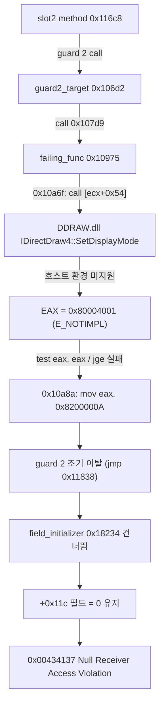

# Task 164: EZ2DJ 4th 실패 가상 호출 대상 특정 작업 로그

## 결과 요약

**실패하는 가상 호출의 대상과 실패 원인을 완전히 규명했습니다.**

1. **실패 대상 COM 메서드**: `RVA 0x00010a6f`의 `call dword ptr [ecx+0x54]`는 시스템 `DDRAW.dll`의 **`IDirectDraw4::SetDisplayMode`**입니다.
   - 객체: `[this+0x28]` (DirectDraw 인터페이스 포인터)
   - vtable: `0x7badcfc0` (`DDRAW.dll` 소속 vtable)
   - vtable index 21 (offset `0x54`): `0x7baa9210` (`DDRAW.dll!SetAppCompatData+0x2ba0`, 즉 `SetDisplayMode`)
   - 인자 크기: 6 DWORD (24바이트, `ret 0x18`), `this`, `width`, `height`, `bpp`, `refresh_rate`, `flags` 구조와 정확히 일치
2. **실패 원인**: 호출 직후 반환값 `EAX`는 **`0x80004001` (`E_NOTIMPL`)**입니다.
   - 현대 Windows(10/11 x64)의 `DDRAW.dll` 호환성 계층이 해당 호출 조건에서 `E_NOTIMPL`을 반환했습니다.
   - 그 결과 `0x00010a79`의 `test eax, eax` / `jge` 검사가 실패하여 `mov eax, 0x8200000A`를 반환하고, guard 2가 조기 이탈하면서 이후의 필드 초기화(`0x00018234`)가 누락되어 null receiver 크래시(`0x00434137`)로 이어졌습니다.
3. **IAT 슬롯 심볼 규명**:
   - `0x006d1908` (`0x00ad1908`): **`USER32.dll!SetRect`** (실패 함수 시작부의 외부 호출)
   - `0x006d1724` (`0x00ad1724`): **`KERNEL32.dll!lstrcpynA`** (Task 159 관찰 심볼)
   - 두 슬롯은 패커가 런타임에 복구한 원본 IAT 슬롯임이 런타임 메모리 분석으로 확정되었습니다.

## 변경 사항

- `src/tools/windows_original_process_probe/iat_verifier.h`, `iat_verifier.cpp`에 IAT 슬롯 RVA를 역방향 조회하는 `ResolveIatSlot` 유틸리티를 추가했습니다.
- `src/tools/windows_product_loader_probe/main.cpp`에 합성 PE32 이미지를 통한 `ResolveIatSlot` 단위 테스트(`TestResolveIatSlot`)를 추가했습니다.
- `src/tools/windows_x86_launcher_probe/main.cpp`:
  * `kNullContextEntryPoints`를 가상 호출 분석 지점(`0x00010a6f` virtual_call_site, `0x00010a72` virtual_call_return, `0x00010975` failing_func_entry, `0x000107d9` guard2_call_site)으로 변경했습니다.
  * `virtual_call_site`에서 vtable 엔트리(인덱스 0, 6, 20, 21, 22), 스택 6 DWORD, 호출부 코드 바이트(38바이트), 런타임 IAT 슬롯 해석(`0x006d1908`, `0x006d1724`)을 수집하도록 확장했습니다.
  * `virtual_call_return`에서 반환된 `EAX` 값을 수집하도록 했습니다.

## 검증 증거

- Windows x86 Debug 전체 빌드: 성공
- `re2dj_unit_tests.exe`: `checks: 1253, failures: 0`
- `re2dj_windows_product_loader_probe.exe`: `profile-defaults=ok unsupported-target=ok resolve-iat-slot=ok`
- 실제 4th CHD 진단 실행: `logs/windows_x86_launcher_probe/ez2dj4th/20260904-001030-168.jsonl`

### 진단 데이터 요약

| 항목 | 주소 / RVA | 값 / 심볼 | 의미 |
| --- | --- | --- | --- |
| IAT slot 0 | `0x006d1908` | `0x76407d80` (`USER32.dll!SetRect`) | 실패 함수 시작부 호출 |
| IAT slot 1 | `0x006d1724` | `0x752b3350` (`KERNEL32.dll!lstrcpynA`) | 보조 문자열 복사 호출 |
| this | `[ebp-0xa8]` | `0x00acd708` | 싱글톤 객체 |
| 인터페이스 포인터 | `[this+0x28]` | `0x05ec7fc0` | DirectDraw 인터페이스 객체 |
| vtable | `[edx]` | `0x7badcfc0` | `DDRAW.dll` vtable |
| vtable[0] | `+0x00` | `DDRAW.dll!DirectDrawCreate+0xc6d0` | `QueryInterface` |
| vtable[6] | `+0x18` | `DDRAW.dll!CompleteCreateSysmemSurface+0x1c0` | `CreateSurface` |
| vtable[20] | `+0x50` | `DDRAW.dll!DllGetClassObject+0x1170` | `SetCooperativeLevel` |
| vtable[21] | `+0x54` | `0x7baa9210` (`DDRAW.dll!SetAppCompatData+0x2ba0`) | **`SetDisplayMode`** |
| vtable[22] | `+0x58` | `DDRAW.dll!DllGetClassObject+0x1a20` | `GetAvailableVidMem` |
| 호출 반환값 | `EAX` | **`0x80004001`** | **`E_NOTIMPL`** |

## 판정

- **확인됨 — 실패한 가상 호출은 `IDirectDraw4::SetDisplayMode`입니다.** vtable 인덱스 21, `DDRAW.dll` 소속 함수 포인터, 24바이트 callee-cleanup 스택 복구가 모두 확인되었습니다.
- **확인됨 — 실패 원인은 호스트 `DDRAW.dll`의 `E_NOTIMPL` (`0x80004001`) 반환입니다.** 이로 인해 프로그램 정의 오류 코드 `0x8200000A`가 전파되었습니다.
- **확인됨 — IAT 슬롯 `0x006d1908`은 `USER32.dll!SetRect`, `0x006d1724`는 `KERNEL32.dll!lstrcpynA`입니다.**
- **확인됨 — DirectDraw HLE 연결 필요성.** re2DJ의 DirectDraw4 / Direct3D3 HLE(`RootSetDisplayMode`)가 활성화되면 `SetDisplayMode`가 `DD_OK`를 반환할 수 있으므로, `ez2dj4th`의 그래픽 HLE 경계를 연결하는 것이 다음 과제입니다.

---

# Task 164: Identify EZ2DJ 4th Failing Virtual Call Target Work Log

## Result Summary

**The target and root cause of the failing virtual call are fully established.**

1. **Target COM Method**: The `call dword ptr [ecx+0x54]` at `RVA 0x00010a6f` is **`IDirectDraw4::SetDisplayMode`** inside system `DDRAW.dll`.
   - Object: `[this+0x28]` (DirectDraw interface pointer).
   - vtable: `0x7badcfc0` (vtable residing in `DDRAW.dll`).
   - vtable index 21 (offset `0x54`): `0x7baa9210` (`DDRAW.dll!SetAppCompatData+0x2ba0`, namely `SetDisplayMode`).
   - Parameter size: 6 DWORDs (24 bytes, `ret 0x18`), exactly matching `this`, `width`, `height`, `bpp`, `refresh_rate`, `flags`.
2. **Root Cause**: Immediately after invocation, `EAX` returns **`0x80004001` (`E_NOTIMPL`)**.
   - The modern Windows (10/11 x64) `DDRAW.dll` compatibility layer returns `E_NOTIMPL` under these call conditions.
   - Consequently, `test eax, eax` followed by `jge` at `0x00010a79` fails, taking the error branch returning `0x8200000A`. Guard 2 exits early, omitting field initialization (`0x00018234`), which directly leads to the null receiver crash at `0x00434137`.
3. **IAT Slot Symbols**:
   - `0x006d1908` (`0x00ad1908`): **`USER32.dll!SetRect`** (opening call in the failing function).
   - `0x006d1724` (`0x00ad1724`): **`KERNEL32.dll!lstrcpynA`** (observed in Task 159).
   - Both slots were established via runtime memory inspection as original IAT slots restored by the protection unpacker.

## Changes

- Added `ResolveIatSlot` utility in `src/tools/windows_original_process_probe/iat_verifier.*`.
- Added synthetic PE32 unit test `TestResolveIatSlot` in `src/tools/windows_product_loader_probe/main.cpp`.
- Extended `src/tools/windows_x86_launcher_probe/main.cpp`:
  * Updated `kNullContextEntryPoints` to virtual call analysis points (`0x00010a6f`, `0x00010a72`, `0x00010975`, `0x000107d9`).
  * Inspected vtable entries (indices 0, 6, 20, 21, 22), stack arguments (6 DWORDs), call site code bytes (38 bytes), and runtime IAT slots (`0x006d1908`, `0x006d1724`) at `virtual_call_site`.
  * Captured returned `EAX` at `virtual_call_return`.

## Verification Evidence

- Full Windows x86 Debug build: passed.
- `re2dj_unit_tests.exe`: `checks: 1253, failures: 0`.
- `re2dj_windows_product_loader_probe.exe`: `profile-defaults=ok unsupported-target=ok resolve-iat-slot=ok`.
- Real 4th CHD diagnostic run: `logs/windows_x86_launcher_probe/ez2dj4th/20260904-001030-168.jsonl`.

### Diagnostic Data Summary

| Item | Address / RVA | Value / Symbol | Meaning |
| --- | --- | --- | --- |
| IAT slot 0 | `0x006d1908` | `0x76407d80` (`USER32.dll!SetRect`) | Failing function opening call |
| IAT slot 1 | `0x006d1724` | `0x752b3350` (`KERNEL32.dll!lstrcpynA`) | Auxiliary string copy |
| this | `[ebp-0xa8]` | `0x00acd708` | Singleton object |
| Interface pointer | `[this+0x28]` | `0x05ec7fc0` | DirectDraw interface object |
| vtable | `[edx]` | `0x7badcfc0` | `DDRAW.dll` vtable |
| vtable[0] | `+0x00` | `DDRAW.dll!DirectDrawCreate+0xc6d0` | `QueryInterface` |
| vtable[6] | `+0x18` | `DDRAW.dll!CompleteCreateSysmemSurface+0x1c0` | `CreateSurface` |
| vtable[20] | `+0x50` | `DDRAW.dll!DllGetClassObject+0x1170` | `SetCooperativeLevel` |
| vtable[21] | `+0x54` | `0x7baa9210` (`DDRAW.dll!SetAppCompatData+0x2ba0`) | **`SetDisplayMode`** |
| vtable[22] | `+0x58` | `DDRAW.dll!DllGetClassObject+0x1a20` | `GetAvailableVidMem` |
| Return value | `EAX` | **`0x80004001`** | **`E_NOTIMPL`** |

## Classification

- **Confirmed — The failing virtual call is `IDirectDraw4::SetDisplayMode`.** vtable index 21, `DDRAW.dll` target function pointer, and 24-byte callee-cleanup stack unwinding are all established.
- **Confirmed — The failure cause is host `DDRAW.dll` returning `E_NOTIMPL` (`0x80004001`).** This propagated application error code `0x8200000A`.
- **Confirmed — IAT slot `0x006d1908` is `USER32.dll!SetRect`, and `0x006d1724` is `KERNEL32.dll!lstrcpynA`.**
- **Confirmed — DirectDraw HLE boundary requirement.** When re2DJ's DirectDraw4 / Direct3D3 HLE (`RootSetDisplayMode`) is connected to `ez2dj4th`, `SetDisplayMode` will return `DD_OK`. Wiring this graphics boundary is the next task.
