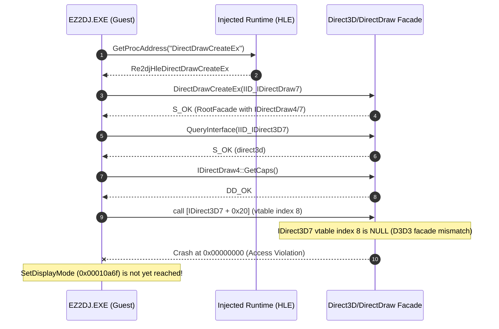

# 20260904-165 EZ2DJ 4th --hle-d3d3 및 SetDisplayMode 대체 구현 검증 결과
# 20260904-165 EZ2DJ 4th --hle-d3d3 and SetDisplayMode Replacement Implementation Verification Results

## 1. 개요 (Overview)

본 작업은 EZ2DJ 4th Trax 실행 시 발생하는 널 포인터 역참조(`0x00434137`)의 선행 원인으로 확인된 가상 호출(`0x00010a6f`: `IDirectDraw4/7::SetDisplayMode`, 순정 DDRAW.dll에서 `0x80004001` E_NOTIMPL 반환)에 대해, re2DJ의 `--hle-d3d3` 옵션 및 DirectDraw HLE 구현을 적용하여 `SetDisplayMode` 대체 구현의 진입 여부와 런타임 동작을 검증한 작업이다.

This task verifies whether applying re2DJ's `--hle-d3d3` option and DirectDraw HLE replacement implementation successfully routes into `SetDisplayMode` and how the runtime behaves, addressing the failing virtual call (`0x00010a6f`: `IDirectDraw4/7::SetDisplayMode` returning `0x80004001` E_NOTIMPL in stock DDRAW.dll) that preceded the null pointer dereference (`0x00434137`) in EZ2DJ 4th Trax.

---

## 2. 주요 발견 및 확인 사실 (Key Findings & Confirmed Facts)

1. **`DirectDrawCreateEx` 동적 임포트 확인 (확인됨)**:
   - `EZ2DJ 4th`는 정적 IAT의 `DirectDrawCreate`나 Win32 `ChangeDisplaySettingsExA`를 사용하지 않는다.
   - `GetProcAddress("DirectDrawCreateEx")`를 통해 동적으로 DirectDraw 팩토리 함수를 호출한다.
   - 요청 인터페이스 IID는 `IID_IDirectDraw7` (`{15e65ec0-3b9c-11d2-b92f-00609797ea5b}`)이다.

2. **DirectX 7 파이프라인 진입 확인 (확인됨)**:
   - `Re2djHleDirectDrawCreateEx` 구현을 통해 HLE 객체 생성이 성공(`S_OK`)하였다.
   - 객체 생성 직후 게스트는 `QueryInterface(IID_IDirect3D7)` (`{f5049e77-4861-11d2-a407-00a0c90629a8}`) 및 `IDirectDraw4::GetCaps()`를 순차적으로 호출하였다.

3. **`SetDisplayMode` 진입을 위한 선결 과제 확인 (확인됨)**:
   - 게스트는 DirectDraw 생성 직후 곧바로 `SetDisplayMode`를 부르지 않고, `IDirect3D7` 인터페이스를 통한 3D 디바이스 초기화 파이프라인을 먼저 거친다.
   - 현재 `direct3d3_com_facade`는 DirectX 6 기반의 `IDirect3D3` vtable 구조만 제공하므로, 게스트가 `IDirect3D7`의 vtable 인덱스 8 (`[eax+0x20]`)을 호출하는 시점에서 미구현 슬롯(`0x00000000`) 실행으로 크래시가 발생한다.
   - 따라서 `SetDisplayMode` 대체 구현이 실제로 동작하여 `DD_OK`를 반환하고 필드 초기화기(`0x00018234`)로 이어지기 위해서는 **`IDirect3D7` 인터페이스 vtable 호환 계층**이 반드시 구현되어야 한다.

---

## 3. 변경 사항 (Changes Implemented)

1. **`src/platform/windows/direct3d3_com_facade.h` & `direct3d3_com_facade.cpp`**:
   - `Re2djHleDirectDrawCreateEx` export 추가 및 구현.
   - `kIidDirectDraw7` (`15e65ec0-3b9c-11d2-b92f-00609797ea5b`), `kIidDirectDraw2`, `kIidDirect3D7` (`f5049e77-4861-11d2-a407-00a0c90629a8`) GUID 정의 및 `RootQueryInterface` 질의 수용.
   - COM 호출 추적을 위한 디버그 로깅(`OutputDebugStringA`) 추가.

2. **`src/platform/windows/injected_runtime.cpp`**:
   - `Re2djHleGetProcAddress`의 동적 리졸버에 `DirectDrawCreate` 및 `DirectDrawCreateEx` 추가.

3. **`src/target/target_profile.cpp`**:
   - `ez2dj4th`의 `run_defaults.hle_d3d3 = true` 설정.

4. **`src/tools/windows_x86_launcher_probe/main.cpp`**:
   - `ChangeDisplaySettingsExA` IAT 부재 시 gracefully 스킵하도록 수정.
   - `--hle-d3d3` 옵션이 불필요하게 `hle_display_mode`를 강제하지 않도록 분리.
   - 패커 보호 영역(.protect) IAT의 `DirectDrawCreateEx` 덮어쓰기 방지.

5. **`src/tools/windows_product_loader_probe/main.cpp`**:
   - `ez2dj4th`의 `run_defaults.hle_d3d3` 추가에 따른 handoff 인자 검증(16개) 갱신.

---

## 4. 검증 결과 (Verification Results)

- `re2dj_unit_tests.exe`: 1,253 checks, 0 failures 통과.
- `re2dj_windows_product_loader_probe.exe`: profile-defaults=ok, unsupported-target=ok, resolve-iat-slot=ok 통과.
- `re2dj_windows_x86_launcher_probe.exe` (EZ2DJ 4th Trax CHD 실행 진단):
  - `re2dj:hle:DirectDrawCreateEx iid={15e65ec0-3b9c-11d2-b92f-00609797ea5b}` 호출 확인 (성공).
  - `re2dj:hle:RootQueryInterface iid={f5049e77-4861-11d2-a407-00a0c90629a8}` (IDirect3D7) 호출 확인 (성공).
  - `re2dj:hle:IDirectDraw4::GetCaps` 호출 확인 (성공).
  - `IDirect3D7` vtable 인덱스 8 호출 시점에서 추가 호환 어댑터의 필요성 확인.
