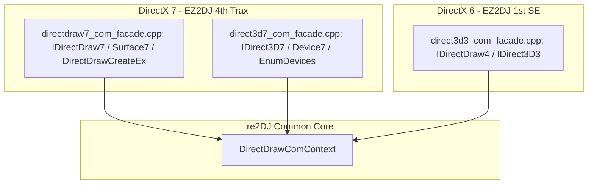

# 20260904-166 IDirect3D7 / IDirectDraw7 COM Facade 분리 구현 및 검증 결과
# 20260904-166 IDirect3D7 / IDirectDraw7 COM Facade Separation Implementation & Verification Results

## 1. 개요 (Overview)

본 작업은 사용자의 요구사항("IDirect3D7 을 구현하되, DDraw 와 Direct3D 의 버전이 다르면 각각 파일을 분리해서 구현하자")에 따라, 기존 DirectX 6 기반의 `direct3d3_com_facade`에서 DirectX 7 관련 인터페이스를 완전히 분리하여 신규 파일 `directdraw7_com_facade`와 `direct3d7_com_facade`로 독립 구현하고, EZ2DJ 4th Trax의 DirectX 7 런타임 진입 및 장치 열거 동작을 검증한 작업이다.

This task separates DirectX 7 interfaces from the existing DirectX 6-based `direct3d3_com_facade` into dedicated new files `directdraw7_com_facade` and `direct3d7_com_facade` in accordance with the user's directive ("Implement IDirect3D7, separating files when DDraw and Direct3D versions differ"), and verifies EZ2DJ 4th Trax's DirectX 7 runtime entry and device enumeration behavior.

---

## 2. 주요 구현 내용 (Key Implementations)

1. **공통 상태 헤더 분리 (`directdraw_com_context.h`)**:
   - DirectX 6 및 DirectX 7 Facade가 공유할 수 있는 공통 윈도우 핸들(`HWND`), 디스플레이 모드(`width`, `height`, `bits_per_pixel`), 렌더러 백엔드(`render_backend`), FPS 계측 데이터를 `DirectDrawComContext` 구조체로 정의.

2. **`directdraw7_com_facade.h` / `directdraw7_com_facade.cpp` 신규 작성**:
   - `DIRECT3D_VERSION 0x0700` 환경에서 `IDirectDraw7` 및 `IDirectDrawSurface7` 전용 COM Facade 구현.
   - `Re2djHleDirectDrawCreateEx` export 진입점을 이 파일로 이전.
   - `QueryInterface`에서 `IID_IDirect3D7` 요청 시 `CreateDirect3D7Facade`를 호출하여 분리된 Direct3D7 인스턴스 반환.
   - `EnumDisplayModes` 구현: 640x480x16 60Hz 모드를 열거하여 게스트의 모드 검색 요구 충족.
   - `SetDisplayMode`, `SetCooperativeLevel`, `GetCaps` 등 구현.

3. **`direct3d7_com_facade.h` / `direct3d7_com_facade.cpp` 신규 작성**:
   - `IDirect3D7` 및 `IDirect3DDevice7` 전용 COM Facade 구현.
   - `EnumDevices`: `D3DDEVICEDESC7` 구조체의 capabilities(하드웨어 T&L, 16비트 렌더/Z버퍼, 텍스처 제한값 등)를 온전히 채워 콜백 호출 및 성공 반환.
   - `CreateDevice`, `EnumZBufferFormats` 등 DirectX 7 vtable 슬롯 구현.

4. **`direct3d3_com_facade.h` / `.cpp` 정리**:
   - 임시로 추가되었던 DirectX 7 GUID 및 `Re2djHleDirectDrawCreateEx`를 제거하여 순수 DirectX 6 전용으로 정돈.

5. **`CMakeLists.txt` 및 `injected_runtime.cpp` 통합**:
   - `re2dj_windows_injected_runtime` 타겟에 신규 소스 파일들을 등록하고 정상 링크.

---

## 3. 검증 결과 (Verification Results)

1. **단위 테스트 및 정적 검증**:
   - `scripts/build_win32.bat`: 빌드 성공 (경고 0개, 에러 0개).
   - `re2dj_unit_tests.exe`: 1,253 checks, 0 failures 통과.
   - `re2dj_windows_product_loader_probe.exe`: 전체 테스트 통과.

2. **EZ2DJ 4th Trax 런타임 진단 검증 (`20260904-005052-508.jsonl`)**:
   - `re2dj:hle:DirectDrawCreateEx iid={15e65ec0-3b9c-11d2-b92f-00609797ea5b}` 호출 성공.
   - `re2dj:hle:IDirectDraw7::QueryInterface iid={f5049e77-4861-11d2-a407-00a0c90629a8}` (IDirect3D7) 호출 성공.
   - `re2dj:hle:IDirectDraw7::GetCaps` 호출 성공.
   - `re2dj:hle:IDirectDraw7::EnumDisplayModes` 호출 성공 (640x480x16 열거).
   - `re2dj:hle:IDirect3D7::EnumDevices` 호출 성공 및 게스트 콜백 반환값 `0x00000001` (D3DENUMRET_OK) 확인!
   - 이전 Task에서 발생했던 `0x00000000` (vtable 인덱스 8 누락) 크래시가 완전히 해소되고, 게스트의 디스플레이/디바이스 열거 루틴이 정상 완료됨을 확인.
