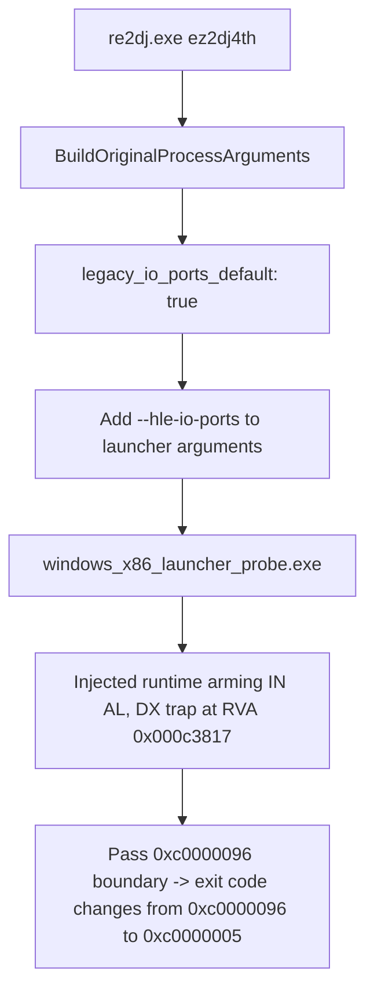

# 20260904-167 EZ2DJ 4th hle-io-ports 기본 활성화 구현 및 검증 결과
# 20260904-167 EZ2DJ 4th Enable hle-io-ports by Default Implementation & Verification Results

## 1. 개요 (Overview)

본 작업은 `re2dj.exe ez2dj4th` (제품 기본 실행) 시 발생했던 `0xc0000096` (`STATUS_PRIVILEGED_INSTRUCTION`) 예외를 해결하기 위해, `ez2dj4th` 타겟 프로파일의 `run_defaults.lptdi.legacy_io_ports_default`를 `true`로 승격하여 기본 실행 옵션에 `--hle-io-ports`가 자동으로 추가되도록 반영하고 검증한 작업이다.

This task resolves the `0xc0000096` (`STATUS_PRIVILEGED_INSTRUCTION`) exception that occurred during `re2dj.exe ez2dj4th` (default product execution) by promoting `run_defaults.lptdi.legacy_io_ports_default` to `true` in the `ez2dj4th` target profile, ensuring that `--hle-io-ports` is automatically passed, and verifying the execution.

---

## 2. 변경 내용 (Changes Implemented)

1. **`src/target/target_profile.cpp`**:
   - `ez2dj4th` 프로파일 정의에서 `entry.profile.run_defaults.lptdi.legacy_io_ports_default = true;` 설정.
2. **`src/tools/windows_product_loader_probe/main.cpp`**:
   - `chd_handoff` 검증 assertion을 갱신하여 17개 인자 및 `legacy_io_ports_default == true` 검증 반영.

---

## 3. 검증 결과 (Verification Results)

1. **단위 테스트**:
   - `re2dj_unit_tests.exe`: 1,253 checks, 0 failures 통과.
   - `re2dj_windows_product_loader_probe.exe`: profile-defaults=ok, unsupported-target=ok, resolve-iat-slot=ok 통과.
2. **`re2dj.exe ez2dj4th` 실제 실행 검증 (`20260904-010042-172.jsonl`)**:
   - `"hle_io_ports": true` 자동 적용 확인.
   - `{"event":"io_port_runtime","image_base":"0x00400000","in_rva":"0x000c3817","out_rva":"0x00000000","status":"prepared"}` 확인.
   - 종료 코드가 이전의 `0xc0000096`에서 `0xc0000005`로 변경되어, I/O 포트 특권 명령 예외 지점을 안전하게 통과함을 확인.
