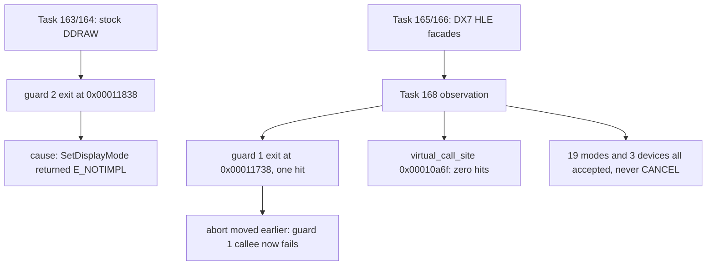

# 20260904-168 EZ2DJ 4th D3D7 초기화 조기 중단 지점 특정 결과
# 20260904-168 EZ2DJ 4th D3D7 Initialization Early-Abort Localization Results

## 1. 개요 (Overview)

본 작업은 `IDirectDraw7` / `IDirect3D7` HLE facade 연결 이후 `IDirect3D7::EnumDevices` 직후 초기화가 중단되는 지점을 실행 증거로 특정하고, 같은 작업에서 열거 데이터를 확장해 그 확장이 중단을 해소하는지까지 관측한 작업이다.

**결론: 중단 지점은 guard 2가 아니라 guard 1(`RVA 0x00011738`)이며, 열거 데이터 확장으로는 해소되지 않는다.**

This task localizes, with execution evidence, where initialization stops right after `IDirect3D7::EnumDevices` under the `IDirectDraw7` / `IDirect3D7` HLE facades, and in the same task expands the enumerated data to observe whether that expansion clears the stop.

**Conclusion: the abort is at guard 1 (`RVA 0x00011738`), not guard 2, and expanding the enumerated data does not clear it.**

---

## 2. 변경 내용 (Changes Implemented)

1. **`src/platform/windows/graphics_trace_log.h` / `.cpp` 신규.**
   - `g_re2dj_graphics_trace_path` export 정의를 이 파일로 옮기고, `WriteGraphicsTraceLine` / `WriteGraphicsTraceFormat`을 제공한다.
   - append 핸들 하나를 `SRWLOCK`으로 공유해, 이전에 `direct3d3_com_facade.cpp`와 `window_mode.cpp`에 세 벌로 중복돼 있던 파일 열기·기록 코드를 한 곳으로 모았다.
2. **`direct3d3_com_facade.cpp` · `window_mode.cpp` 정리.**
   - 자체 파일 기록 코드를 제거하고 공용 sink를 호출하도록 변경. 동작은 같고 중복만 사라졌다.
3. **`directdraw7_com_facade.cpp` 확장.**
   - 모든 진단을 `OutputDebugStringA`에서 공용 sink로 이전. detached 제품 실행에서도 `.ddraw.log`가 남는다.
   - `TraceDd7Call`로 22개 vtable 메서드에 호출 원장 추가(상한 4096줄).
   - `EnumDisplayModes`가 320x240·512x384·640x480·800x600·1024x768 × 16·24·32비트 = 15개 모드를 열거하고, 각 `DDSURFACEDESC2`와 게스트 콜백 반환값을 기록. `DDENUMRET_CANCEL`에서 중단.
   - `CreateSurface`가 요청 flags·caps·크기를 기록.
4. **`direct3d7_com_facade.cpp` 확장.**
   - `FillPrimitiveCaps` / `FillDeviceDescription` 추가로 `dpcTriCaps`·`dpcLineCaps`·`dwZCmpCaps`·블렌드·필터·주소 지정·`dwTextureOpCaps`·`wMaxTextureBlendStages`·`dwVertexProcessingCaps` 등을 채운다.
   - RGB Emulation, Direct3D HAL, Direct3D T&L HAL 세 장치를 DirectX 7 표준 이름과 GUID로 열거하고, 각 desc 요약과 콜백 반환값을 기록.
5. **`src/platform/windows/message_box_boundary.h` / `.cpp` 신규.**
   - `USER32!MessageBoxA` / `MessageBoxW` 진입점을 5바이트 상대 점프로 기록기로 우회시켜 caption·text를 로그에 남기고 기본 응답(IDOK)을 즉시 반환한다.
   - 게스트가 패킹돼 있어 import가 `GetProcAddress`가 아니라 USER32 export table 순회로 해석되므로, import 슬롯이 아니라 함수 진입점을 우회시켜야 도달한다.
6. **`injected_runtime.cpp` 연결.**
   - export `g_re2dj_hle_message_box`, `g_re2dj_message_box_result` 추가.
   - 런처가 DLL 적재 후에 플래그를 쓰므로 `DllMain`에서는 설치할 수 없다. `Re2djHleGetProcAddress`와 `Re2djVfsCreateFileA` 진입부에서 `EnsureDiagnosticBoundariesInstalled()`를 호출해 최초 1회 설치한다.
7. **`windows_x86_launcher_probe/main.cpp`.**
   - `--hle-message-box` 옵션 추가, `launch` 이벤트에 `hle_message_box` 기록, 준비 상태를 기존 readiness 집계에 포함.
   - `kNullContextEntryPoints`를 이번 질문에 맞게 재조준: `virtual_call_site`(`0x00010a6f`)와 guard 0·1·2 이탈(`0x00011714`, `0x00011738`, `0x00011838`).

---

## 3. 검증 결과 (Verification Results)

### 3.1 정적 검증

- `scripts/build_win32.bat`: 빌드 성공, 경고·에러 0.
- `re2dj_unit_tests.exe`: 1,253 checks, 0 failures.
- `re2dj_windows_product_loader_probe.exe`: profile-defaults=ok, unsupported-target=ok, resolve-iat-slot=ok.

### 3.2 진단 실행 (`20260904-013219-685`, attached, `--hle-message-box`, idle 60s)

- **확인됨 — `SetDisplayMode`는 도달하지 않는다.** `virtual_call_site`(`0x00010a6f`) hit 0건. Task 168 설계에서 추정이었던 사실이 확인 사실이 되었다.
- **확인됨 — 이탈 guard는 guard 1이다.** `null_context_entry_trace_boundary`가 `hits=1`, `recorded=1`, `capped=false`이고, 유일한 hit는 `slot2_early_exit_1`(`RVA 0x00011738`, `EIP=0x00411738`, `EAX=0`, `thread=25536`)이다. guard 0(`0x00011714`)과 guard 2(`0x00011838`)는 hit가 없다.
- **확인됨 — 열거 데이터 확장은 중단을 해소하지 못한다.** 게스트는 15개 모드와 3개 장치를 모두 받아들이면서 매번 `0x00000001`(계속)만 반환하고 `DDENUMRET_CANCEL` / `D3DENUMRET_CANCEL`을 한 번도 반환하지 않는다. 이후 `CreateDevice`·`SetCooperativeLevel`·`SetDisplayMode`·`CreateSurface`는 여전히 한 번도 호출되지 않는다.
- **확인됨 — 대화상자는 표시되지 않는다.** 경계는 `re2dj:hle:message-box:installed:ansi=1:wide=1:result=1`로 정상 설치됐으나 포착 건수는 0이다. 설계 2절의 "모달 대화상자 추정"은 **반증**되었다. 문제의 DLL 무리 적재는 대화상자가 아닌 다른 초기화에서 온다.
- **확인됨 — AV 지점 불변.** thread 25536이 `0x00434137`에서 `EAX=ECX=0`으로 동일한 `0xc0000005`를 낸다.

### 3.3 제품 기본 경로 (`20260904-013337-654`, detached)

- **확인됨 — detached 실행에도 그래픽 증거가 남는다.** `.ddraw.log` 7,893바이트 생성, 모드 열거 45줄(3회 × 15개), 장치 열거 9줄(3회 × 3개). 이전에는 이 경로에 아무 기록도 남지 않았다.
- 종료 코드는 여전히 `0xc0000005`이며, 이번 작업의 변경으로 진행이 더 나아가지는 않았다.

---

## 4. 가설 판정 (Hypothesis Verdicts)

| # | 가설 | 판정 |
| - | - | - |
| H1 | `D3DDEVICEDESC7` caps 부족으로 장치 거부 | **반증.** caps를 채우고 3개 장치를 열거해도 동작 변화 없음 |
| H2 | 필요한 디스플레이 모드 부재 | **반증.** 15개 모드를 열거해도 동작 변화 없음 |
| H3 | `deviceGUID` 불일치 | **반증.** RGB·HAL·TnLHAL 표준 GUID를 모두 열거해도 동작 변화 없음 |
| H4 | 중단이 guard 2보다 앞으로 이동 | **확인.** guard 1(`0x00011738`)에서 이탈 |
| — | 3회 반복 사이 모달 대화상자 | **반증.** MessageBox 경계 포착 0건 |

| # | Hypothesis | Verdict |
| - | - | - |
| H1 | Device rejected for missing `D3DDEVICEDESC7` caps | **Refuted.** Filling the caps and enumerating three devices changed nothing |
| H2 | Required display mode absent | **Refuted.** Enumerating 15 modes changed nothing |
| H3 | `deviceGUID` mismatch | **Refuted.** Enumerating the standard RGB/HAL/TnLHAL GUIDs changed nothing |
| H4 | The abort moved earlier than guard 2 | **Confirmed.** Execution exits at guard 1 (`0x00011738`) |
| — | Modal dialog between the three attempts | **Refuted.** The MessageBox boundary captured nothing |

---

## 5. 다음 작업 (Next Task)

guard 1의 실패한 호출을 Task 163이 guard 2에 대해 한 것과 같은 방식으로 추적한다. 구체적으로 `guard1_return`(`RVA 0x0001172a`)에서 `EAX`를 읽어 실패 코드를 얻고, 그 코드의 생성 지점을 `.text` 스캔으로 찾아 어떤 연산이 실패로 판정되는지 확정한다. 열거 데이터는 원인이 아니므로 그 방향의 추가 확장은 하지 않는다.

Trace guard 1's failing call the way Task 163 traced guard 2's. Read `EAX` at `guard1_return` (`RVA 0x0001172a`) to obtain the failure code, then scan `.text` for where that code is produced to establish which operation is judged to have failed. The enumerated data is not the cause, so no further expansion in that direction.

---

## 6. 관련 문서 (Related Documents)

- [Task 168 설계](../design/20260904-168-ez2dj4th-d3d7-init-abort.md)
- [Task 168 작업 지시서](../work-orders/20260904-168-ez2dj4th-d3d7-init-abort.md)
- [4th Hardlock 런타임 분석](../analysis/ez2dj4th-hardlock-runtime.md)
