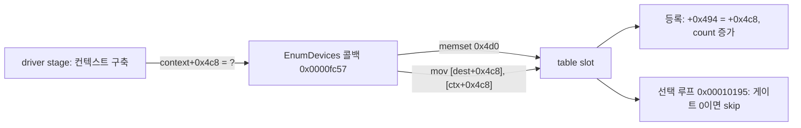

# 20260904-171 EZ2DJ 4th 장치 레코드 게이트 writer 추적 결과
# 20260904-171 EZ2DJ 4th Device Record Gate Writer Tracing Results

## 1. 개요 (Overview)

Task 170이 남긴 미확정 항목 — `record + 0x4c8`을 채우는 코드 경로 — 을 추적했다.

**결론: 레코드는 `EnumDevices` 콜백(`RVA 0x0000fc57`)이 테이블 슬롯을 0으로 밀고 채운다. 게이트 `+0x4c8`은 그 콜백이 계산하지 않고, 콜백의 네 번째 인자인 컨텍스트 구조체의 같은 오프셋에서 그대로 복사한다. `.text` 전체에서 `+0x4c8`에 쓰는 명령은 이 복사 하나뿐이다. 따라서 게이트를 실제로 결정하는 코드는 그 컨텍스트를 만드는 드라이버 단계에 있다.**

**부수 확인: 레코드 전체 레이아웃이 DirectX 7 SDK 예제 프레임워크의 열거 구조와 일치하며, re2DJ가 발표한 caps와 모드 데이터가 모두 정상적으로 들어 있다. 게스트는 우리가 열거한 15개 모드 중 640x480x16(index 6)을 이미 선택해 두었다.**

This task traced the code path that fills `record + 0x4c8`. The records are built by the `EnumDevices` callback at `RVA 0x0000fc57`, which zeroes a table slot and fills it. The callback does not compute the gate: it copies it verbatim from the same offset of its fourth argument, the context structure. That copy is the only instruction in the whole `.text` that writes a `+0x4c8` displacement, so the code that decides the gate lives in the driver stage that builds the context. Separately, the full record layout matches the DirectX 7 SDK sample framework enumeration structure, every caps and mode value re2DJ publishes arrived intact, and the guest has already selected 640x480x16 (index 6) out of our fifteen enumerated modes.

---

## 2. 변경 내용 (Changes Implemented)

`src/tools/windows_x86_launcher_probe/main.cpp`만 변경했다. 새 CLI 옵션은 추가하지 않았고 기존 `--null-context-object-reference-scan`을 확장했다.

1. **레코드 상수 정의.** `kEz2dj4thDeviceRecordTableRva`(`0x00546d50`), `kEz2dj4thDeviceRecordCountRva`(`0x0054cd9c`), `kEz2dj4thDeviceRecordStride`(`0x4d0`), `kEz2dj4thDeviceRecordGateOffset`(`0x4c8`).
2. **상수 스캔 확장.** `scans[]`에 `device_table_base`, `device_count_global`, `device_record_stride`, `device_gate_displacement` 네 항목을 추가했다.
3. **레코드 창 스캔.** 기존 `ScanObjectWindow` 헬퍼로 레코드 0과 1의 `0x4d0` 바이트를 훑어 0이 아닌 dword를 `device_record_window`와 `device_record_field` 이벤트로 기록한다.

Only `src/tools/windows_x86_launcher_probe/main.cpp` changed, with no new CLI option: the existing reference scan gained four scanned constants and a per-record nonzero-dword window summary.

---

## 3. 검증 결과 (Verification Results)

- `scripts/build_win32.bat`: 빌드 성공, 경고와 에러 0.
- `re2dj_unit_tests.exe`: 1,253 checks, 0 failures.
- `re2dj_windows_product_loader_probe.exe`: 전체 통과.
- 진단 실행: `logs/windows_x86_launcher_probe/ez2dj4th/20260904-135318-201.jsonl`.

### 3.1 게이트에 접근하는 명령은 여섯 곳뿐이다 (확인됨)

`device_gate_displacement` 스캔이 `.text` 전체에서 `0x000004c8` 바이트 열을 6건 찾았다.

| RVA | 복원한 명령 | 성격 |
| - | - | - |
| `0x0000fce1` | `mov edx, [ecx+0x4c8]` | 읽기 (컨텍스트에서) |
| `0x0000fce7` | `mov [eax+0x4c8], edx` | **쓰기 (레코드로)** |
| `0x00010031` | `mov eax, [edx+0x4c8]` | 읽기 |
| `0x00010198` | `cmp dword [edx+ecx+0x4c8], 0` | Task 170이 확정한 게이트 비교 |
| `0x000502bc`, `0x0009fb7c` | 스택 지역에 쓰는 상수 `0x4c8` | 무관 |

즉 게이트에 값을 넣는 명령은 `0x0000fce7` 하나다.

### 3.2 `0x0000fc57`은 `EnumDevices` 콜백이다 (확인됨)

같은 실행의 `.ddraw.log`가 `re2dj:hle:IDirect3D7::EnumDevices callback=0040FC57`을 기록했다. 이미지 base가 `0x00400000`이므로 RVA `0x0000fc57`이며, `0x0000fce7`의 쓰기는 이 함수 안에 있다.

복원한 콜백 본문의 핵심은 다음과 같다.

```
0x0000fc86  mov  ecx, [ebp+0x14]            ; 콜백 네 번째 인자 = 컨텍스트
0x0000fc89  mov  [ebp-0x04], ecx
0x0000fc8b  mov  edx, [0x0094cd9c]          ; 현재 레코드 수
0x0000fc8f  imul edx, edx, 0x4d0
0x0000fc95  add  edx, 0x00946d50            ; dest = &table[count]
0x0000fc9b  mov  [ebp-0x0c], edx
0x0000fc9d  push 0x4d0
0x0000fca2  push 0
0x0000fca4  push dest
0x0000fca8  call memset                     ; 슬롯 전체를 0으로
...
0x0000fcdb  mov  eax, [ebp-0x0c]            ; dest
0x0000fcde  mov  ecx, [ebp-0x04]            ; 컨텍스트
0x0000fce1  mov  edx, [ecx+0x4c8]
0x0000fce7  mov  [eax+0x4c8], edx           ; 게이트를 컨텍스트에서 복사
0x0000fced  mov  esi, [ebp-0x04]
0x0000fcf0  add  esi, 0x120                 ; 컨텍스트의 DDCAPS 블록으로
```

- **확인됨 — 게이트는 콜백이 계산하지 않는다.** 컨텍스트의 같은 오프셋에서 복사만 한다.
- **확인됨 — 레코드 슬롯은 `memset`으로 0이 된 뒤 채워진다.** 컨텍스트의 `+0x4c8`이 0이면 레코드의 게이트는 0으로 남는다.

### 3.3 등록 경로는 게이트를 `+0x494`로 옮기고 개수를 늘린다 (확인됨)

```
0x0001002b  mov  ecx, [ebp-0x0c]
0x0001002e  mov  edx, [ebp-0x0c]
0x00010031  mov  eax, [edx+0x4c8]
0x00010037  mov  [ecx+0x494], eax
0x0001003d  mov  ecx, [0x0094cd9c]
0x00010043  add  ecx, 1
0x00010046  mov  [0x0094cd9c], ecx          ; 레코드 수 증가
0x0001004c  mov  eax, 1
```

같은 함수군에 레코드별 힙 포인터 `+0x4bc`를 해제하고 0으로 되돌리는 정리 경로(`0x0001009c`–`0x000100d8`)가 있고, `0x000100ea`는 Task 170이 확인한 base와 count getter다.

### 3.4 레코드 레이아웃이 확정되었다 (확인됨)

레코드 0(`RGB Emulation`)의 `0x4d0` 바이트에서 0이 아닌 dword는 80개다. 재구성한 배치다.

| 오프셋 | 크기 | 내용 | 확인 근거 |
| - | - | - | - |
| `+0x000` | `0x28` | 40바이트 설명 문자열 | `"RGB Emulation"`, `"Direct3D HAL"` |
| `+0x028` | 4 | `GUID*` → `+0x49c` | `0x009471ec` = base + `0x49c` |
| `+0x02c` | `0xec` | `D3DDEVICEDESC7` | `dwDevCaps 0x0008af51` |
| `+0x0f0` | `0x10` | `deviceGUID` | `{a4665c60-2673-11cf-a31a-00aa00b93356}` = `IID_IDirect3DRGBDevice` |
| `+0x100` | 4 | `wMaxUserClipPlanes`, `wMaxVertexBlendMatrices` | `0x00010006` = 6과 1 |
| `+0x104` | 4 | `dwVertexProcessingCaps` | `0x0000003f` |
| `+0x118` | 4 | `bHardware` | `0x00080000` = `dwDevCaps & D3DDEVCAPS_HWRASTERIZATION` |
| `+0x120` | `0x17c` | `DDCAPS` (driver) | `dwSize 0x17c`, `dwCaps 0x00400041`, `ddsCaps 0x6204` |
| `+0x29c` | `0x17c` | `DDCAPS` (HEL) | 같은 값 |
| `+0x418` | `0x7c` | 선택된 전체화면 모드 | `dwFlags 0x0004100e`, 640x480, pitch 1280, 60Hz, 16bpp 5-6-5 |
| `+0x494` | 4 | 게이트 사본 | `0x00010037`의 쓰기 |
| `+0x49c` | `0x10` | `GUID` 사본 | `+0x28`이 가리키는 대상 |
| `+0x4bc` | 4 | 모드 배열 힙 포인터 | `0x02bd44d0`, `0x000100d2`가 해제 후 0으로 |
| `+0x4c0` | 4 | 모드 수 | `0x0000000f` = 15 |
| `+0x4c4` | 4 | 선택된 모드 index | `0x00000006` |
| `+0x4c8` | 4 | **게이트** | `0x00000000` |

- **확인됨 — re2DJ가 발표한 caps가 그대로 들어 있다.** `dwCaps 0x00400041`은 `Dd7GetCaps`가 채우는 `DDCAPS_3D | DDCAPS_BLT | DDCAPS_COLORKEY`와 같고 `ddsCaps 0x6204`도 같다.
- **확인됨 — 게스트는 모드 선택을 이미 마쳤다.** `+0x4c0`의 15는 `Dd7EnumDisplayModes`가 열거하는 모드 수(해상도 5 × 깊이 3)와 같고, `+0x4c4`의 index 6은 그 순서에서 640x480x16이며 `+0x418`에 저장된 모드와 일치한다.
- **확인됨 — Task 170이 GUID 선택자로 본 `+0x118`은 `bHardware`다.** 값 `0x00080000`은 `D3DDEVCAPS_HWRASTERIZATION`이다. 루프는 하드웨어 장치면 T&L HAL GUID와, 아니면 Reference GUID와 비교한다.
- **추정 — `+0x418`의 모드 구조체는 `DDSURFACEDESC2`의 앞 `0x7c` 바이트다.** re2DJ는 `dwSize`에 `sizeof(DDSURFACEDESC2)`(`0x11c`)를 쓰지만 레코드에는 `0x7c`가 들어 있고, 다음 필드 `+0x494`까지의 간격도 `0x7c`와만 맞는다. 게스트가 자기 구조체 크기로 잘라 복사한 것으로 보인다.

### 3.5 이번 실행의 드라이버 수는 2다 (확인됨)

`.ddraw.log`에 `DirectDrawCreateEx`가 2회, `EnumDevices` 콜백이 2회, 모드 열거가 30회(2 × 15) 기록되었고 `device_table_count`는 `6`이다. Task 170의 실행에서는 3회와 9였다. 드라이버 수는 호스트 상태에 따라 달라지며, 드라이버당 한 벌이라는 Task 170의 추정과 일치한다.

---

## 4. 가설 판정 (Hypothesis Verdicts)

| 가설 | 판정 |
| - | - |
| 게이트를 쓰는 명령이 레코드 인덱싱 함수 안에 있다 | **확인.** `0x0000fce7`, `EnumDevices` 콜백 안 |
| 그 쓰기가 조건부라서 실행되지 않았다 | **반증.** 조건 없는 복사이며 실행되었다 |
| 레코드 후반부가 채워지지 않았다 | **반증.** 모드 포인터, 모드 수, 선택 index가 모두 채워져 있다 |
| 게이트 값이 컨텍스트에서 온다 | **확인** |



---

## 5. 다음 작업 (Next Task)

컨텍스트 구조체의 `+0x4c8`을 결정하는 드라이버 단계 코드를 읽는다. 컨텍스트는 스택 지역이라 변위가 접히므로 `0x4c8` 스캔으로는 잡히지 않는다. `0x0000f93e`에서 `push 0x4d0; push 0; lea eax, [ebp-0x4d4]`가 관측되었으므로 드라이버 콜백은 `[ebp-0x4d4]`에 `0x4d0` 바이트 지역 구조체를 두고 있고, 그 게이트는 `[ebp-0x0c]`으로 접근된다. 따라서 `RVA 0x0000f700`–`0x0000fd60` 구간을 덤프해 그 조건을 복원한다. 기존 코드 창 기구는 앵커 주변 `0xc0` 바이트만 기록하므로 지정 범위를 그대로 기록하는 최소 확장이 필요하다.

Read the driver-stage code that decides the context's gate. The context is a stack local, so its displacement folds and the `0x4c8` scan cannot see it: `0x0000f93e` shows `push 0x4d0; push 0; lea eax, [ebp-0x4d4]`, meaning the driver callback holds a `0x4d0`-byte local whose gate is reached as `[ebp-0x0c]`. Dumping `RVA 0x0000f700`–`0x0000fd60` recovers the condition. The existing code-window machinery records only `0xc0` bytes around an anchor, so a minimal extension that records a requested range is needed.

---

## 6. 관련 문서 (Related Documents)

- [Task 171 설계](../design/20260904-171-ez2dj4th-device-record-gate-writer.md)
- [Task 171 작업 지시서](../work-orders/20260904-171-ez2dj4th-device-record-gate-writer.md)
- [Task 170 작업 로그](../work-logs/20260904-170-ez2dj4th-device-selection-inputs.md)
- [4th Hardlock 런타임 분석](../analysis/ez2dj4th-hardlock-runtime.md)
