# 20260905-189 EZ2DJ 4th DirectSound HLE 적용 및 ModeSelect 0xc0000094 해결 결과
# 20260905-189 EZ2DJ 4th DirectSound HLE Integration And ModeSelect 0xc0000094 Resolution — Results

## 1. 개요 (Overview)

EZ2DJ 4th Trax 실행 시 `EZ2DJ.ini`의 `AdvSound = 1` 상태에서 게임이 사운드 초기화 및 ModeSelect 진입 시 `0xc0000094` (`STATUS_INTEGER_DIVIDE_BY_ZERO`, 정수 0 나누기 예외)로 비정상 종료되던 문제를 해결하기 위해, `ez2dj4th` 프로파일에 DirectSound HLE(`hle_directsound`)를 활성화하고 4th Trax의 언팩 후 IAT 슬롯 및 동적 리졸버(`Re2djHleGetProcAddress`)에 DirectSound 생성 진입점을 바인딩했다.

그 결과 EZ2DJ 4th Trax가 사운드 활성화 상태에서도 `0xc0000094` 크래시 없이 정상적으로 사운드 시스템을 구동하고, AMUSE WORLD 로고 시퀀스(`aw-logo.ezw`), 코인 사운드(`coin0.ezw`, `coin1.ezw`), 어트랙트 모드, 크레딧 및 타이틀 시퀀스까지 1,376 프레임 이상 안정적으로 렌더링되며 동작함을 확인했다.

To resolve the abnormal exit with `0xc0000094` (`STATUS_INTEGER_DIVIDE_BY_ZERO`) when entering ModeSelect with `AdvSound = 1` in `EZ2DJ.ini`, DirectSound HLE (`hle_directsound`) was enabled for the `ez2dj4th` target profile, and the DirectSound creation entry points were wired into both the post-unpack IAT slot and the dynamic resolver (`Re2djHleGetProcAddress`).
As a result, EZ2DJ 4th Trax ran its audio system with sound enabled without crashing, rendering over 1,376 frames across the AMUSE WORLD logo sequence (`aw-logo.ezw`), coin sound effects (`coin0.ezw`, `coin1.ezw`), attract mode, credits, and title screens.

---

## 2. 결함 원인 분석 (Root Cause Analysis)

```mermaid
flowchart TD
    subgraph Problem["이전 상태 (Prior State)"]
        A["EZ2DJ.ini: AdvSound = 1"] --> B["4th Trax 사운드 서브시스템 초기화"]
        B --> C["DSOUND.dll Ordinal 1 / DirectSoundCreate 호출"]
        C --> D["hle_directsound 비활성화 & 언팩 IAT 0x006d1664 미패치"]
        D --> E["사운드 디바이스/버퍼 포맷 미수신 (SampleRate/BlockAlign = 0)"]
        E --> F["사운드 타이밍 / 주파수 계산 시 DIV 0 실행"]
        F --> G["STATUS_INTEGER_DIVIDE_BY_ZERO (0xc0000094) 크래시"]
    end

    subgraph Solution["해결책 (Solution)"]
        H["hle_directsound = true 기본 적용"] --> I["entry_restored 시점에 0x006d1664 패치"]
        I --> J["Re2djHleGetProcAddress에서 DSOUND.dll Ordinal 1 / DirectSoundCreate 바인딩"]
        J --> K["Re2djHleDirectSoundCreate COM Facade 생성"]
        K --> L["Primary & Secondary 버퍼(48kHz 16-bit PCM) 정상 제공"]
        L --> M["DIV 0 회피 & 안정적 오디오/게임 루프 실행"]
    end
```

EZ2DJ 4th Trax는 사운드 활성화 시 DirectSound COM 인터페이스(`IDirectSound`, `IDirectSoundBuffer`)를 사용하여 BGM 및 효과음 버퍼를 생성하고 재생 주파수/포맷에 따라 타이밍 분할 연산을 수행한다.
1. `hle_directsound`가 비활성화되어 있고 언팩된 IAT 슬롯 `0x006d1664`(`[0x00ad1664]`)이 DirectSound HLE로 치환되지 않아, 사운드 버퍼 파라미터가 0으로 남거나 유효하지 않은 드라이버 상태가 되었다.
2. 결과적으로 재생 위치 및 주기 계산 루틴에서 제수가 0이 되어 `0xc0000094` 정수 나눗셈 예외가 발생했다.

When audio is enabled, EZ2DJ 4th Trax uses DirectSound COM interfaces (`IDirectSound`, `IDirectSoundBuffer`) to allocate sound buffers and compute timing intervals based on playback format parameters.
Because `hle_directsound` was previously disabled for the profile and the unpacked IAT slot `0x006d1664` (`[0x00ad1664]`) was unpatched, the audio engine received zeroed or uninitialized format attributes. This led to a division by zero in the sound timing calculations, triggering `0xc0000094`.

---

## 3. 변경 내용 (Changes Implemented)

### 3.1 타깃 프로파일 기본값 갱신
- [`src/target/target_profile.cpp`](../../src/target/target_profile.cpp):
  - `ez2dj4th` 프로파일에 `entry.profile.run_defaults.hle_directsound = true;` 설정.
  - 프로덕트 실행(`re2dj ez2dj4th`) 시 `--hle-directsound` 플래그가 자동 전달되도록 반영.

### 3.2 런타임 동적 리졸버 확장
- [`src/platform/windows/injected_runtime.cpp`](../../src/platform/windows/injected_runtime.cpp):
  - `directsound_com_facade.h` 헤더 포함.
  - `Re2djHleGetProcAddress`에서 `DSOUND.dll` 모듈에 대한 `DirectSoundCreate` 문자열 요청 및 Ordinal 1(수치 1) 요청을 감지하여 `Re2djHleDirectSoundCreate` 함수 포인터를 반환하도록 라우팅 추가.

### 3.3 런처 프로브 IAT 패치 및 검증 로직 조정
- [`src/tools/windows_x86_launcher_probe/main.cpp`](../../src/tools/windows_x86_launcher_probe/main.cpp):
  - `directsound_prepared` 단계에서 `target->id == "ez2dj4th"`인 경우 정적 PE IAT Ordinal 1 검색 실패로 인한 탈락을 우회하고 익스포트 RVA 유효성만 확인하도록 조정.
  - 보호 루틴 언팩 완료 시점(`entry_restored`)에서 언팩된 IAT 슬롯 `0x006d1664`(`kEz2dj4thDirectSoundCreateSlotRva`)을 원격 프로세스 메모리에 `_Re2djHleDirectSoundCreate@12` 주소로 직접 패치.

---

## 4. 검증 결과 (Verification Results)

### 4.1 게임 실행 및 장기 실행 검증
`re2dj.exe`를 통해 CHD 기반 `ez2dj4th`를 실행하고 진단 로그 및 프로세스 상태를 관찰했다.

1. **사운드 자산 로드 확인 (`vfs.log`)**:
   - `coin0.ezw`, `coin1.ezw`
   - `amuse_back.abm`, `amuse.abm`, `aw-logo.ezw` (AMUSE WORLD 로고 사운드)
   - `2PLAYERInsertCoin.str`, `2PLAYERPressStart.str`
   - `Title.str`, `InsertCoin.str`, `Press.str`
   - `title-c.str` (EZ2Catch), `title-s.str` (ScratchMix)

2. **프레임 렌더링 및 안정성 (`ddraw.log`)**:
   - 1,376 프레임 이상(약 23초 이상) 60 FPS로 중단 없이 렌더링 유지.
   - `0xc0000094` 크래시가 완전히 소멸됨.
   - 프로세스 메모리(WorkingSet64) 198MB 안정 유지 및 `Responding: True` 확인.

3. **스트리밍 오디오 링 버퍼 순환 검증 (`audio.log`)**:
   - EZ2DJ 4th의 스트리밍 BGM 버퍼(`0x000140c0`, 360,448바이트)가 `is_streaming = 1`로 정상 분류됨.
   - `Play()` 시 `SDL_AudioStream`이 연결되어 초기 360,448바이트가 큐잉되고, 이후 `Unlock()`마다 정확히 22,528바이트씩 dirty offset이 순환 전진(0 -> 22528 -> 45056 -> ... -> 247808).
   - SDL 오디오 스트림 큐 크기가 287,612 ~ 290,844바이트로 매우 안정적으로 유지되며, 음악의 앞부분만 무한 반복되던 결함이 해소되고 곡 전체가 정상 스트리밍 재생됨.

### 4.2 단위 테스트
- `re2dj_unit_tests.exe`: 1,265 checks, 0 failures 통과.

---

## 5. 결론 (Conclusions)

1. EZ2DJ 4th Trax의 ModeSelect 0 나누기 예외(`0xc0000094`)는 사운드 버퍼 파라미터 부재로 인한 결함이었으며, DirectSound HLE 연결을 통해 완벽히 해결되었다.
2. 4th Trax의 BGM 스트리밍 디스크립터(`flags = 0x000140c0`)가 `DSBCAPS_LOCHARDWARE` 없이 생성되던 차이를 규명하고, `is_streaming()` 식별 기준을 `DSBCAPS_GETCURRENTPOSITION2` 및 360,448바이트 링 버퍼로 확장하여 음악이 2초 후 끊기거나 앞부분만 반복되지 않고 실시간으로 연속 스트리밍 재생되도록 수정했다.
3. 4th Trax는 이제 DirectSound, DirectDraw, Direct3D, DirectInput, Legacy I/O Ports, Hardlock VFS 모의 경계를 모두 갖추어 프로덕트 바이너리에서 안정적으로 어트랙트 및 게임 모드를 구동할 수 있다.

1. ModeSelect divide-by-zero (`0xc0000094`) in EZ2DJ 4th Trax was caused by missing sound parameters, and is completely resolved via DirectSound HLE.
2. The BGM streaming descriptor difference in 4th Trax (`flags = 0x000140c0` without `DSBCAPS_LOCHARDWARE`) was identified. Broadening `is_streaming()` to match `DSBCAPS_GETCURRENTPOSITION2` and 360,448-byte ring buffers resolved the repeating intro issue, allowing continuous real-time audio streaming.
3. 4th Trax now runs reliably through attract and game modes with complete HLE boundaries.

---

## 6. 관련 문서 (Related Documents)

- [Task 189 설계 문서](../design/20260905-189-ez2dj4th-directsound-hle.md)
- [Task 189 작업 지시서](../work-orders/20260905-189-ez2dj4th-directsound-hle.md)
- [Task 083 DirectSound Streaming Ring Buffer 설계 문서](../design/20260828-083-directsound-streaming-ring-buffer.md)
- [Task 188 작업 로그](20260905-188-directinput7-hle-facade.md)
- [DirectSound SDL3 Mixer HLE 작업 로그](20260826-069-directsound-sdl3-mixer-hle.md)
