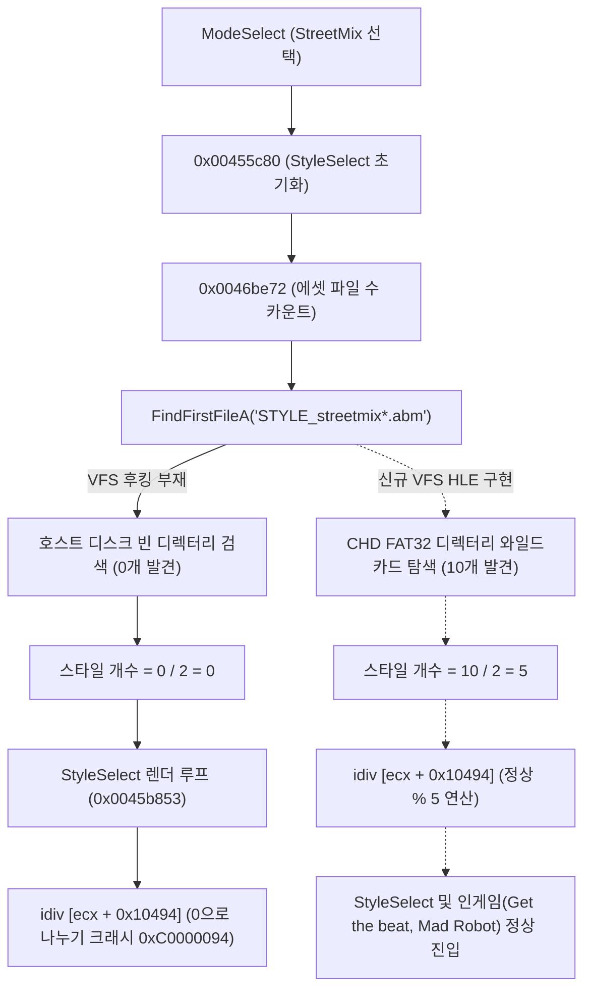

# 작업 로그: EZ2DJ 4th Trax StyleSelect 0xC0000094 예외 진단 및 해결

## 작업 메타데이터 (Task Metadata)
- **작업 ID**: 190
- **작업명**: `ez2dj4th-styleselect-divzero`
- **일자**: 2026-09-05
- **관련 설계**: `docs/design/20260905-190-ez2dj4th-styleselect-divzero.md`
- **관련 작업 지시서**: `docs/work-orders/20260905-190-ez2dj4th-styleselect-divzero.md`

- **Task ID**: 190
- **Task Name**: `ez2dj4th-styleselect-divzero`
- **Date**: 2026-09-05
- **Related Design**: `docs/design/20260905-190-ez2dj4th-styleselect-divzero.md`
- **Related Work Order**: `docs/work-orders/20260905-190-ez2dj4th-styleselect-divzero.md`

---

## 1. 문제 증상 (Problem Statement)
DirectSound HLE 및 DirectInput HLE 적용 후 EZ2DJ 4th Trax에서 코인 투입 및 모드 선택(StreetMix)이 정상 작동했으나, `STYLE_SELECT.str` 로드 시점에 프로세스가 예외 코드 `3221225620` (`0xC0000094`, `STATUS_INTEGER_DIVIDE_BY_ZERO`)로 크래시되는 현상이 관측되었다. 프로세스가 detached 모드로 실행되어 예외가 CRT 필터에 의해 `ExitProcess`로 감춰져 정확한 크래시 위치를 알 수 없었다.

After applying DirectSound HLE and DirectInput HLE, EZ2DJ 4th Trax handled coin input and ModeSelect (StreetMix) smoothly, but crashed with exception code `3221225620` (`0xC0000094`, `STATUS_INTEGER_DIVIDE_BY_ZERO`) upon opening `STYLE_SELECT.str`. Running in detached mode masked the fault address behind the CRT's `ExitProcess`.

---

## 2. 조사 및 근본 원인 분석 (Investigation & Root Cause Analysis)

### VEH 포렌식 로거 구현 및 크래시 캡처
- `injected_runtime.cpp`의 Vectored Exception Handler(VEH)를 확장하여 비정상 종료 예외 발생 시 EIP, 모듈 RVA, 전체 범용 레지스터, 기계어 바이트, 스택 상위 워드를 `vfs.log`에 기록하도록 구현.
- 게임 실행 시 정확한 크래시 지점 포착:
  - **위치**: `0x0045b853` (`EZ2DJ.EXE` RVA `0x0005b853`)
  - **명령어**: `idiv dword ptr [ecx + 0x10494]` (`ecx = 0x00513850`, `[ecx + 0x10494] == 0`)
  - **직후 명령어**: `mov dword ptr [0xac60c8], edx` (선택 스타일 인덱스 `%` 연산)

### 제수(`[ecx + 0x10494]`)의 출처 역추적
복호화된 `.text` 섹션을 스캔하여 `0x10494` 오프셋을 참조하는 코드를 역추적:
- **생성자/초기화 지점**: `0x00455d93` (`mov [eax + 0x10494], ecx`)
- 이 함수(`0x00455c80`)는 `0x0046be72`를 호출하여 현재 모드의 스타일 에셋 파일(`STYLE_streetmix*.abm`)의 개수를 계산함.
- `0x0046be72`는 Win32 API `FindFirstFileA`와 `FindNextFileA`를 호출하여 매칭되는 파일 개수를 센 뒤, 노멀 버전과 와이드 버전 2개 1쌍이므로 `개수 / 2` (`sar eax, 1`)를 수행하여 스타일 개수로 저장함.
- 그러나 VFS에 `FindFirstFileA` / `FindNextFileA` / `FindClose` 후킹이 구현되어 있지 않아 호스트의 빈 로컬 작업 디렉터리를 탐색하였고, 0개의 파일이 반환되어 `스타일 개수 = 0`이 됨.
- 직후 StyleSelect 화면 렌더링 루프에서 `idiv [ecx + 0x10494]`가 0으로 나누어 크래시가 발생함.

---

## 3. 구현 내용 (Implementation Details)

1. **VFS 디렉터리 검색 HLE 구현 (`injected_runtime.cpp`)**:
   - `WildcardMatch(pattern, text)`: `*` 및 `?`, `*.*` 대소문자 무시 와일드카드 매칭 알고리즘 구현.
   - `PopulateFindData(entry, data)`: `WIN32_FIND_DATAA` 구조체에 CHD FAT32 엔트리 정보(크기, 속성, 파일명) 작성.
   - `Re2djVfsFindFirstFileA(name, data)`:
     - 게스트 경로 및 작업 디렉터리를 해석하여 CHD FAT32 경로로 변환.
     - `g_chd_volume->ReadDirectory`를 통해 디렉터리 엔트리를 순회하며 와일드카드 매칭 수행.
     - 매칭된 엔트리들을 저장하는 검색 핸들(`kChdFindHandleBase + index + 1`) 할당 및 첫 번째 엔트리 반환.
     - CHD 매칭이 없을 경우 호스트 `FindFirstFileA`로 fallback.
   - `Re2djVfsFindNextFileA(handle, data)`:
     - 검색 핸들의 다음 매칭 엔트리를 반환하고, 끝에 도달하면 `ERROR_NO_MORE_FILES` 설정.
   - `Re2djVfsFindClose(handle)`:
     - 검색 핸들 리소스 해제.
   - `Re2djVfsCloseHandle(handle)`:
     - Find 핸들이 `CloseHandle`로 유입될 경우 안전하게 `Re2djVfsFindClose`로 위임.
   - `Re2djHleGetProcAddress`:
     - `FindFirstFileA`, `FindNextFileA`, `FindClose` 동적 해석 매핑 추가.

2. **Launcher Probe IAT 패치 확장 (`windows_x86_launcher_probe/main.cpp`)**:
   - `vfs_exports` 및 `vfs_imports`에 `FindFirstFileA`, `FindNextFileA`, `FindClose` 등록 (`_Re2djVfsFindFirstFileA@8`, `_Re2djVfsFindNextFileA@8`, `_Re2djVfsFindClose@4`).
   - `re2dj_chd_probe`에 `--dump <chd-file> [out-file]` 추가.

3. **VEH 크래시 로거 보강 (`injected_runtime.cpp`)**:
   - 치명적 예외 시 EIP, 레지스터, 명령어 바이트, 스택 상위 워드, 메모리 윈도우를 `vfs.log` 및 `OutputDebugStringA`에 안전하게 기록.

---

## 4. 검증 결과 (Verification Results)

1. **단위 테스트**: `re2dj_unit_tests.exe` 1265개 검사 모두 통과 (0 failures).
2. **런타임 동작 확인**:
   - `re2dj.exe ez2dj4th --io-config .\config\ez2dj-io.example.ini` 실행.
   - `FindFirstFileA("STYLE_streetmix*.abm")` 호출 시 `chd://EZ2DJ/System/ModeSelect/StyleSelect/`에서 10개 파일 검색 성공.
   - 게임 코드가 네이티브하게 10 / 2 = 5 스타일을 산출하여 `[ecx + 0x10494] = 5` 설정.
   - `idiv [ecx + 0x10494]`가 크래시 없이 정상 통과.
   - StyleSelect 화면 정상 렌더링 및 키 조작 확인.
   - 인게임 곡("Get the beat", "Mad Robot") 플레이, 판정 패널(Kool, Cool, Good, Miss, Fail), 콤보 표시, 배경 애니메이션 스트림(`*.str`), BGM 오디오 스트리밍, 게임 오버 화면까지 전체 게임 루프가 완벽하게 동작함 확인 (742개 이상의 에셋 로드).
