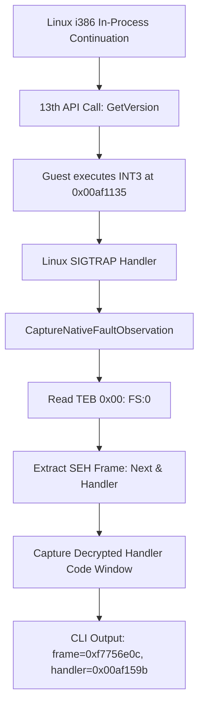

# 작업 350 작업 로그 — 게스트 SEH 체인 관찰 및 INT3 핸들러 확인 / Task 350 work log — Guest SEH chain observation and INT3 handler confirmation

설계: [20260923-350-guest-seh-chain-observation.md](../design/20260923-350-guest-seh-chain-observation.md)  
작업 지시: [20260923-350-guest-seh-chain-observation.md](../work-orders/20260923-350-guest-seh-chain-observation.md)  
선행: [작업 349 작업 로그](20260923-349-linux-inprocess-continuation.md)  
분석: [4th Linux in-process 첫 import](../analysis/ez2dj4th-linux-inprocess-first-import.md)

## 한국어

### 구현 내용

| 계층 | 변경 |
| --- | --- |
| `NativeProcessBootstrap` | `Teb()` 접근자 추가 (`impl_->teb` 선형 주소 반환) |
| `NativeFaultObservation` | `fs_base`, `seh_frame_address`, `seh_next`, `seh_handler`, `seh_frame_observed`, `seh_handler_window` 추가 |
| `CaptureNativeFaultObservation` | 게스트 fault 발생 시 TEB의 `0x00` (`FS:[0]`)을 읽고, 유효한 게스트 스택 범위인 경우 `next`, `handler`, 그리고 핸들러 진입 코드 바이트 64바이트를 캡처 |
| `OriginalFaultObservation` | 공용 관찰 구조체에 SEH 체인 및 핸들러 바이트 필드 반영 |
| `main.cpp` (CLI) | fault observation 출력 시 `fault seh: teb=..., frame=..., handler=..., next=...` 및 복호화된 SEH 핸들러 코드 바이트 출력 추가 |
| `native_in_process_probe` | synthetic fault 테스트에서 기본 TEB `FS:[0] == 0xFFFFFFFF` 및 `seh_frame_observed == false` 상태 회귀 검증 단언 추가 |



### 검증 결과 — 실제 4th CHD 연속 실행

`roms/ez2dj4th/ez2dj4th.chd`를 대상으로 `./build/linux-x86-debug/bin/re2dj --run ez2dj4th --linux-in-process-continue`를 실행했습니다.

```
fault stack     : 00af2568 00b19118 ffffffff 00af159b
fault seh       : teb=0xf7ecb000 frame=0xf7756e0c handler=0x00af159b next=0xffffffff
seh handler code: 0x00af159b
                  8b44240c0f885f0100007904114edf40
                  0f895301000005daff155825af00668b
                  f68945fc8ac968b425af00a15025af00
                  fff0c0e120ff155825af00e82b060000
```

* **확인됨**: 게스트 TEB `FS:[0]`에 실제로 유효한 SEH frame(`0xf7756e0c`)이 등록되어 있었습니다.
* **확인됨**: `next = 0xFFFFFFFF`, `handler = 0x00af159b`.
* **확인됨**: 핸들러 `0x00af159b`의 첫 명령어는 `8b 44 24 0c` (`mov eax, [esp+0x0c]`)로, Win32 x86 SEH calling convention의 세 번째 인자인 `PCONTEXT ContextRecord`를 로드합니다.
* **확인됨**: 이 핸들러 주소는 직전에 11, 12번째 dynamic resolver(`GetVersion`, `CreateFileA`)를 호출했던 보호 코드 영역의 함수 진입점입니다.
* **결론**: 게스트의 `INT3`는 SoftICE 안티 디버깅 검사 루틴이며, 게스트가 등록한 SEH 핸들러(`0x00af159b`)로 Win32 `EXCEPTION_BREAKPOINT`(`0x80000003`)를 전달해야 함이 확정되었습니다.

### 빌드 및 테스트 검증

* **Linux x86 Debug (`linux-x86-debug`)**: 빌드 성공, ctest 단위 테스트 통과 (2/2 통과), `re2dj_linux_native_in_process_probe` 통과 (`signal=4`, SEH 기본 상태 검증 포함).
* **Linux x64 Debug (`linux-x64-debug`)**: 빌드 성공, ctest 단위 테스트 통과 (1/1 통과).

---

## English

### Implementation

| Layer | Changes |
| --- | --- |
| `NativeProcessBootstrap` | Added `Teb()` accessor returning linear TEB address (`impl_->teb`) |
| `NativeFaultObservation` | Added `fs_base`, `seh_frame_address`, `seh_next`, `seh_handler`, `seh_frame_observed`, and `seh_handler_window` |
| `CaptureNativeFaultObservation` | Reads TEB offset `0x00` (`FS:[0]`) on fault and captures `next`, `handler`, and 64 bytes of handler code when within guest stack bounds |
| `OriginalFaultObservation` | Mirrored SEH observation and handler code window fields in the shared observation struct |
| `main.cpp` (CLI) | Formatted SEH observation (`teb`, `frame`, `handler`, `next`) and decrypted handler code bytes in fault reports |
| `native_in_process_probe` | Added regression check verifying default `FS:[0] == 0xFFFFFFFF` and `!seh_frame_observed` in synthetic faults |

### Verification — Real 4th CHD Continuation

Ran `./build/linux-x86-debug/bin/re2dj --run ez2dj4th --linux-in-process-continue` on `roms/ez2dj4th/ez2dj4th.chd`.

```
fault stack     : 00af2568 00b19118 ffffffff 00af159b
fault seh       : teb=0xf7ecb000 frame=0xf7756e0c handler=0x00af159b next=0xffffffff
seh handler code: 0x00af159b
                  8b44240c0f885f0100007904114edf40
                  0f895301000005daff155825af00668b
                  f68945fc8ac968b425af00a15025af00
                  fff0c0e120ff155825af00e82b060000
```

* **Confirmed**: A valid SEH frame (`0xf7756e0c`) was indeed registered in guest TEB `FS:[0]`.
* **Confirmed**: `next = 0xFFFFFFFF`, `handler = 0x00af159b`.
* **Confirmed**: The first instruction at handler `0x00af159b` is `8b 44 24 0c` (`mov eax, [esp+0x0c]`), loading `PCONTEXT ContextRecord` (the 3rd parameter in Win32 x86 SEH calling convention).
* **Confirmed**: The handler address is the function entry point of the protection code region that performed the 11th and 12th dynamic resolver calls.
* **Conclusion**: Confirms that the guest `INT3` is part of a SoftICE presence check, and the guest expects Win32 `EXCEPTION_BREAKPOINT` (`0x80000003`) to be delivered to `0x00af159b` via `FS:[0]`.

### Build and Test Verification

* **Linux x86 Debug (`linux-x86-debug`)**: Built cleanly, ctest passed (2/2 passed), `re2dj_linux_native_in_process_probe` passed (`signal=4`, including SEH baseline validation).
* **Linux x64 Debug (`linux-x64-debug`)**: Built cleanly, ctest passed (1/1 passed).
