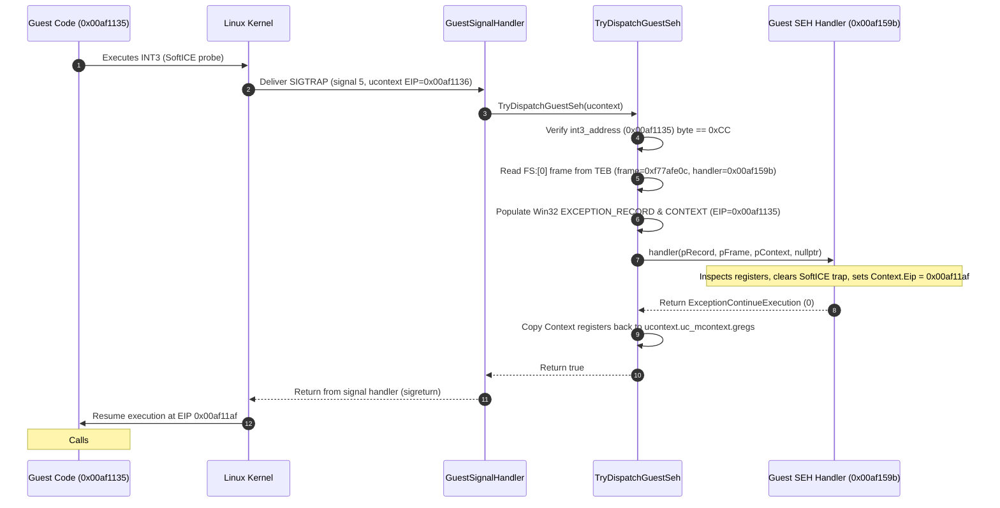

# 작업 351 작업 로그 — 게스트 SEH 디스패치 및 INT3 예외 재개 / Task 351 work log — Guest SEH dispatch and INT3 exception resumption

설계: [20260923-351-linux-guest-seh-dispatch.md](../design/20260923-351-linux-guest-seh-dispatch.md)  
작업 지시: [20260923-351-linux-guest-seh-dispatch.md](../work-orders/20260923-351-linux-guest-seh-dispatch.md)  
선행: [작업 350 작업 로그](20260923-350-guest-seh-chain-observation.md)  
분석: [4th Linux in-process 첫 import](../analysis/ez2dj4th-linux-inprocess-first-import.md)

## 한국어

### 구현 내용

| 계층 | 변경 |
| --- | --- |
| `guest_seh_types.h` | Win32 x86 SEH 자료구조 정의 (`Win32ExceptionRecord32`, `Win32FloatingSaveArea32`, `Win32Context32` 716바이트, `Win32ExceptionRegistrationRecord32`, 예외 코드 상수 및 함수 포인터 타입) |
| `NativeProcessBootstrap` | 게스트 SIGTRAP 핸들러에 SEH 디스패치 루틴(`TryDispatchGuestSeh`) 통합. 게스트 `FS:[0]`에 등록된 핸들러로 `EXCEPTION_BREAKPOINT`(`0x80000003`) 및 `CONTEXT` 전달 |
| `NativeProcessBootstrap` | 핸들러가 `ExceptionContinueExecution`(`0`)을 반환하면 `CONTEXT` 레지스터(EIP/ESP/GPR/EFLAGS)를 Linux `ucontext_t`에 반영하고 핸들러 반환 후 커널 `sigreturn`을 통해 게스트 재개 |
| `NativeProcessBootstrap` | SEH 디스패치 통계 접근자(`SehDispatchCount()`, `LastSehHandler()`, `LastSehResumedEip()`) 추가 |
| `NativeInProcessRunResult` / `OriginalRunResult` | SEH 디스패치 진단 필드(`seh_dispatch_count`, `last_seh_handler`, `last_seh_resumed_eip`) 추가 및 전파 |
| `main.cpp` (CLI) | `--linux-in-process-continue` 실행 결과에 SEH 디스패치 횟수, 핸들러, 재개 EIP 출력 추가 |



### 검증 결과 — 실제 4th CHD 연속 실행

`roms/ez2dj4th/ez2dj4th.chd`를 대상으로 `./build/linux-x86-debug/bin/re2dj --run ez2dj4th --linux-in-process-continue`를 실행했습니다.

```
load base       : 0x00400000
entry point     : 0x00ae0240
seh dispatched  : count=1 last_handler=0x00af159b resumed_eip=0x00af11af
api calls       : 15
  #0001 kernel32.dll!GetModuleHandleA    ret=00ae028a args=00ae0f2c "kernel32" -> eax=6f000000
  #0002 kernel32.dll!GetModuleHandleA    ret=00ae029a args=00ae0f38 "user32" -> eax=00000000
  #0003 kernel32.dll!GetProcAddress      ret=00af0b99 args=6f000000,00af0cf8 "GetVersion" -> eax=6f002026
  #0004 kernel32.dll!GetProcAddress      ret=00af09f6 args=6f000000,00af0d04 "CreateFileA" -> eax=6f002039
  #0005 kernel32.dll!GetVersion          ret=00aefd82 -> eax=23f00206
  #0006 kernel32.dll!CreateFileA         ret=00aeffbc args=f7801fa0,c0000000,00000003,00000000,00000003,00000000,00000000 "\\.\NTICE" -> eax=ffffffff
  #0007 kernel32.dll!GetProcAddress      ret=00b18787 args=6f000000,00b19158 "GetVersion" -> eax=6f002026
  #0008 kernel32.dll!GetProcAddress      ret=00b17f76 args=6f000000,00b19164 "CreateFileA" -> eax=6f002039
  #0009 kernel32.dll!GetVersion          ret=00b18f96 -> eax=23f00206
  #0010 kernel32.dll!CreateFileA         ret=00b18cd2 args=f7801f1c,c0000000,00000003,00000000,00000003,00000000,00000000 "\\.\NTICE" -> eax=ffffffff
  #0011 kernel32.dll!GetProcAddress      ret=00af15b9 args=6f000000,00af25a8 "GetVersion" -> eax=6f002026
  #0012 kernel32.dll!GetProcAddress      ret=00af15d6 args=6f000000,00af25b4 "CreateFileA" -> eax=6f002039
  #0013 kernel32.dll!GetVersion          ret=00af1f9c -> eax=23f00206
  #0014 kernel32.dll!CreateFileA         ret=00af1ef9 args=00af25f0,c0000000,00000003,00000000,00000003,00000000,00000000 "\\.\FEnteDev" -> eax=ffffffff
  #0015 kernel32.dll!GetProcAddress      ret=00ae4129 args=00000000,00ae8280 "GetActiveWindow" -> eax=00000000
continuation    : stopped at unresolved lookup GetProcAddress(00000000, GetActiveWindow), return 0x00ae4129
```

* **확인됨**: 게스트의 `INT3`(`0x00af1135`)가 SEH 핸들러 `0x00af159b`로 성공적으로 디스패치되었습니다.
* **확인됨**: 핸들러는 `ExceptionContinueExecution`(`0`)을 반환하며 `ContextRecord.Eip`를 `0x00af11af`로 변경했습니다.
* **확인됨**: 게스트는 `0x00af11af`에서 실행을 정상 재개했습니다.
* **확인됨**: 재개 직후 게스트는 FrogsICE 안티 디버거 드라이버 탐지 probe인 `CreateFileA("\\.\FEnteDev")`(#0014)를 호출했고, facade의 `INVALID_HANDLE_VALUE` 반환을 받아 정상 통과했습니다.
* **확인됨**: 이후 게스트는 `GetProcAddress(0x00000000, "GetActiveWindow")`(#0015)를 호출했습니다. `hModule`이 0인 이유는 2번 호출이었던 `GetModuleHandleA("user32")`에 대해 facade가 0을 반환했기 때문입니다.
* **결론**: 게스트 SEH 디스패치 루프가 완벽히 동작하여 SoftICE 안티 디버깅 트랩을 통과했으며, 다음 과제는 `user32` 모듈 핸들과 `GetActiveWindow`를 제공하는 것입니다.

### 빌드 및 테스트 검증

* **Linux x86 Debug (`linux-x86-debug`)**: 빌드 성공, ctest 단위 테스트 통과 (2/2 통과).
* **Linux x64 Debug (`linux-x64-debug`)**: 빌드 성공, ctest 단위 테스트 통과 (1/1 통과).

---

## English

### Implementation

| Layer | Changes |
| --- | --- |
| `guest_seh_types.h` | Defined Win32 x86 SEH structures (`Win32ExceptionRecord32`, `Win32FloatingSaveArea32`, `Win32Context32` 716 bytes, `Win32ExceptionRegistrationRecord32`, exception constants, and function pointer types) |
| `NativeProcessBootstrap` | Integrated SEH dispatch routine (`TryDispatchGuestSeh`) into Linux guest SIGTRAP handler, delivering `EXCEPTION_BREAKPOINT` (`0x80000003`) and `CONTEXT` to the guest handler registered at `FS:[0]` |
| `NativeProcessBootstrap` | When handler returns `ExceptionContinueExecution` (`0`), updated `CONTEXT` registers (EIP/ESP/GPR/EFLAGS) are reflected to Linux `ucontext_t` and resumed via kernel `sigreturn` |
| `NativeProcessBootstrap` | Added SEH dispatch accessors (`SehDispatchCount()`, `LastSehHandler()`, `LastSehResumedEip()`) |
| `NativeInProcessRunResult` / `OriginalRunResult` | Added and propagated SEH dispatch diagnostic fields (`seh_dispatch_count`, `last_seh_handler`, `last_seh_resumed_eip`) |
| `main.cpp` (CLI) | Formatted SEH dispatch count, handler, and resumed EIP in `--linux-in-process-continue` output |

### Verification — Real 4th CHD Continuation

Ran `./build/linux-x86-debug/bin/re2dj --run ez2dj4th --linux-in-process-continue` on `roms/ez2dj4th/ez2dj4th.chd`.

* **Confirmed**: Guest `INT3` (`0x00af1135`) was successfully dispatched to SEH handler `0x00af159b`.
* **Confirmed**: Handler returned `ExceptionContinueExecution` (`0`) and updated `ContextRecord.Eip` to `0x00af11af`.
* **Confirmed**: Guest resumed execution cleanly from `0x00af11af`.
* **Confirmed**: Immediately after resuming, guest called `CreateFileA("\\.\FEnteDev")` (#0014) as a FrogsICE anti-debugging probe, passing safely with the facade's `INVALID_HANDLE_VALUE`.
* **Confirmed**: Next, guest called `GetProcAddress(0x00000000, "GetActiveWindow")` (#0015). `hModule` was 0 because call #0002 `GetModuleHandleA("user32")` returned 0 from the facade.
* **Conclusion**: Guest SEH dispatch successfully bypassed the SoftICE anti-debugging trap. The next step is providing `user32` module handle and `GetActiveWindow`.

### Build and Test Verification

* **Linux x86 Debug (`linux-x86-debug`)**: Built cleanly, ctest passed (2/2 passed).
* **Linux x64 Debug (`linux-x64-debug`)**: Built cleanly, ctest passed (1/1 passed).
