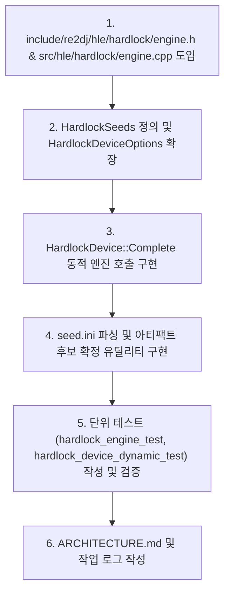

# 클린룸 Hardlock 엔진 통합 및 동적 HLE 구현

## 목표

`reSoftlock`에서 클린룸 C++20으로 구현된 Hardlock 암호화 엔진을 `re2DJ`의 HLE 계층(`re2dj::hle::hardlock`)으로 도입하고, `HardlockDevice`가 시드 설정 시 정적 테이블 없이 실시간 동적 응답을 생성하도록 구현한다.
또한 `reSoftlock` 아티팩트를 읽어 유효 시드를 확정하고 `seed.ini`를 생성하는 도구 기능을 추가하고 단위 테스트로 검증한다.

## Goals

Integrate the clean-room C++20 Hardlock cryptographic engine from `reSoftlock` into `re2DJ`'s HLE layer (`re2dj::hle::hardlock`), enabling `HardlockDevice` to dynamically generate real-time responses using seed configuration without static response tables.
Additionally implement tooling to confirm valid seeds from `reSoftlock` artifacts and emit `seed.ini`, verifying the implementation through unit tests.

---

## 작업 계획

### 한국어

1. `include/re2dj/hle/hardlock/engine.h` 및 `src/hle/hardlock/engine.cpp` 추가 (클린룸 C++20 엔진).
2. `include/re2dj/hle/hardlock/device.h`에 `HardlockSeeds` 구조체 정의 및 `HardlockDeviceOptions::seeds` 필드 추가.
3. `src/hle/hardlock/device.cpp`에서 시드가 활성화된 경우 `HardlockEngine`을 통해 8바이트 블록 및 0x38바이트 페이로드를 실시간 동적 계산하도록 구현.
4. `include/re2dj/hle/hardlock/seed_config.h` 및 `src/hle/hardlock/seed_config.cpp` 작성: `seed.ini` 읽기/쓰기 및 아티팩트 후보 검증/확정 지원.
5. 단위 테스트 작성 및 기존 테스트 회귀 검증.
6. `ARCHITECTURE.md` 및 작업 로그 작성.

### English

1. Add `include/re2dj/hle/hardlock/engine.h` and `src/hle/hardlock/engine.cpp` (clean-room C++20 engine).
2. Define `HardlockSeeds` struct in `include/re2dj/hle/hardlock/device.h` and add `HardlockDeviceOptions::seeds` field.
3. Update `src/hle/hardlock/device.cpp` to dynamically compute 8-byte blocks and 0x38-byte payloads using `HardlockEngine` when seeds are configured.
4. Implement `include/re2dj/hle/hardlock/seed_config.h` and `src/hle/hardlock/seed_config.cpp` supporting `seed.ini` parsing/emission and candidate verification.
5. Write unit tests and verify regression against existing tests.
6. Update `ARCHITECTURE.md` and document the work log.
