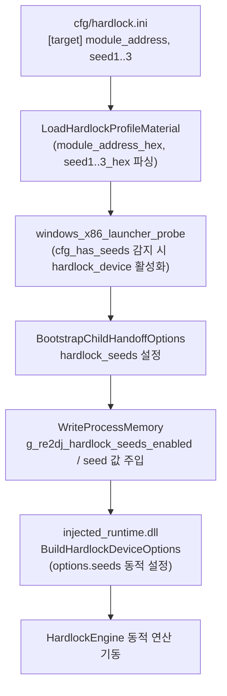

# hardlock.ini 시드 설정 지원 및 런타임 프로세스 주입 연동

## 목표

`hardlock.ini`의 프로필 섹션에 지정된 `module_address`, `seed1`, `seed2`, `seed3` 설정을 허용하도록 `HardlockSecretMaterial` 로더를 확장하고, 정적 `.map` 파일 없이도 시드만으로 `hardlock_device` 에뮬레이션을 켜고 게스트 프로세스 메모리로 시드 정보를 주입할 수 있도록 런타임 런처와 주입 모듈을 연동한다.

## Goals

Extend the `HardlockSecretMaterial` loader to accept `module_address`, `seed1`, `seed2`, and `seed3` keys in `hardlock.ini` profile sections, and update the launcher and injected runtime to enable `hardlock_device` emulation and inject seed data into child process memory even when static `.map` files are absent.

---

## 작업 계획

### 한국어

1. `include/re2dj/config/hardlock_secret_config.h` 및 `src/config/hardlock_secret_config.cpp`:
   - `HardlockSecretMaterial`에 시드 16진수 문자열 필드(`module_address_hex`, `seed1_hex`, `seed2_hex`, `seed3_hex`) 추가.
   - INI 파싱 시 알 수 없는 키 에러 대신 시드 키들을 정상 수용하도록 허용.
2. `tests/unit/hardlock_material_config_test.cpp`:
   - `hardlock.ini`에서 시드 키들이 올바르게 로드되는지 단위 테스트 추가.
3. `src/platform/windows/injected_runtime.cpp`:
   - 시드 전달을 위한 export 전역 변수(`g_re2dj_hardlock_seeds_enabled`, `g_re2dj_hardlock_seed_module_address`, `g_re2dj_hardlock_seed1..3`) 정의.
   - `BuildHardlockDeviceOptions()`에서 시드가 켜져 있을 때 `options.seeds`를 구성하도록 연동.
4. `src/tools/windows_x86_launcher_probe/child_process_handoff.h` 및 `.cpp`:
   - `BootstrapChildHandoffOptions`에 `std::optional<HardlockSeeds>` 필드 추가 및 자식 프로세스 export 변수에 메모리 쓰기 구현.
5. `src/tools/windows_x86_launcher_probe/main.cpp`:
   - 프로필 INI에 시드가 구성되어 있으면 `hardlock_device = true`를 켜고 자식 프로세스로 시드 핸드오프를 전달.
6. 빌드 및 `ez2dj1st` 실제 실행 검증.

### English

1. `include/re2dj/config/hardlock_secret_config.h` & `src/config/hardlock_secret_config.cpp`:
   - Add hex string fields (`module_address_hex`, `seed1_hex`, `seed2_hex`, `seed3_hex`) to `HardlockSecretMaterial`.
   - Accept seed keys without throwing "unknown Hardlock configuration key".
2. `tests/unit/hardlock_material_config_test.cpp`:
   - Add unit tests verifying parsing of seed keys from `hardlock.ini`.
3. `src/platform/windows/injected_runtime.cpp`:
   - Export global variables (`g_re2dj_hardlock_seeds_enabled`, `g_re2dj_hardlock_seed_module_address`, `g_re2dj_hardlock_seed1..3`).
   - Populate `options.seeds` in `BuildHardlockDeviceOptions()` when seeds are enabled.
4. `src/tools/windows_x86_launcher_probe/child_process_handoff.h` & `.cpp`:
   - Add `std::optional<HardlockSeeds>` to `BootstrapChildHandoffOptions` and write seed data into child process memory.
5. `src/tools/windows_x86_launcher_probe/main.cpp`:
   - Enable `hardlock_device = true` when seeds are configured in INI and forward seeds to child process handoff.
6. Build and verify execution with `ez2dj1st`.
