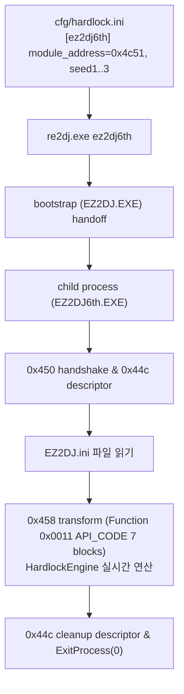

# ez2dj6th Hardlock 시드 설정 및 실행 검증

## 목표

`reSoftlock`에서 도출된 `ez2dj6th`의 시드(`candidate-140`)를 `cfg/hardlock.ini`에 설정하고, `re2DJ`의 child-follow 런처 프로브 및 `HardlockEngine` 동적 HLE 계층을 통해 6th의 Function `0x0011` (API_CODE) 변환 및 `EZ2DJ.ini` 로드 후 정상 종료(`0x00000000`)에 도달하는지 실제 실행으로 검증한다.

## Goals

Configure `ez2dj6th`'s seed (`candidate-140`) from `reSoftlock` into `cfg/hardlock.ini`, and verify via `re2DJ`'s child-follow launcher probe and `HardlockEngine` dynamic HLE that 6th completes Function `0x0011` (API_CODE) transform, loads `EZ2DJ.ini`, and reaches clean exit (`0x00000000`).

---

## 작업 계획

### 한국어

1. `cfg/hardlock.ini`에 `[ez2dj6th]` 시드 설정(`module_address=0x4c51`, `seed1=0xbe03`, `seed2=0xa335`, `seed3=0x9a2b`) 등록.
2. `re2dj ez2dj6th` 실행 및 진단 로그 분석:
   - bootstrap -> child process handoff 확인
   - `0x9c402450` handshake 2회 통과
   - `0x9c40244c` descriptor (function 0) 통과
   - `EZ2DJ.ini` 읽기 성공
   - `0x9c402458` transform (function 0x0011, 7 blocks) 동적 연산 완료
   - `0x9c40244c` cleanup descriptor (function 1) 통과 및 종료 코드 `0x00000000` 확인
3. 작업 로그 기록 및 Git 커밋.

### English

1. Add `[ez2dj6th]` seed configuration (`module_address=0x4c51`, `seed1=0xbe03`, `seed2=0xa335`, `seed3=0x9a2b`) to `cfg/hardlock.ini`.
2. Run `re2dj ez2dj6th` and analyze diagnostic logs:
   - Confirm bootstrap to child process handoff
   - Verify two `0x9c402450` handshakes pass
   - Verify `0x9c40244c` descriptor (function 0) passes
   - Verify `EZ2DJ.ini` is read via VFS
   - Verify `0x9c402458` transform (function 0x0011, 7 blocks) dynamically calculated
   - Verify `0x9c40244c` cleanup descriptor (function 1) passes and exits with `0x00000000`
3. Record work log and commit to Git.
